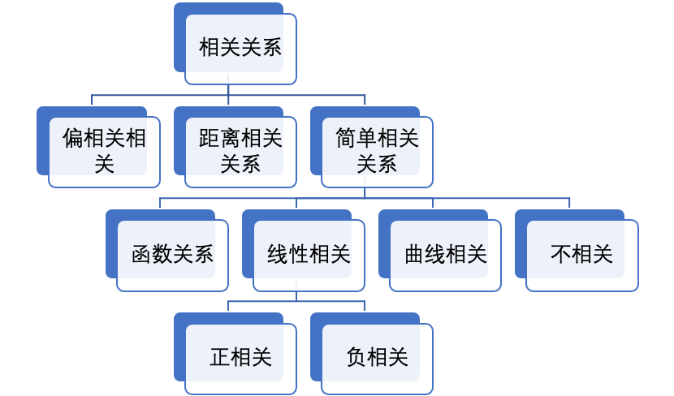

<link rel="stylesheet" type="text/css" href="auto-number-title.css" />

# 第1章 特征相关性分析


## 1.1 特征相关性分析方法概述

常见的特征之间的关系如下图：



常见的分析方法如下图：


## 常用特征相关性分析方法

### 1.1.1 信息增益

#### 熵及信息增益
熵在信息论和概率论中对信息不确定性的度量，记作：

$$H(X) = \sum_{i=1}^np(x_i)I(x_i) = - \sum_{i=1}^np(x_i)log_bp(x_i)$$

熵只依赖于X的分布，和X的取值没有关系，熵越大，代表X=x(i)的不确定性越大。

条件熵定义为随机变量X在给定条件下随机变量Y的条件熵：

$$H(Y|X) = \sum_xp(x)H(Y|X=x)$$

信息增益是在决策树算法中用来选择特征的指标，信息增益越大，则这个特征的选择性越好。

$$IG(Y|X) = H(Y) - H(Y|X)$$

#### 信息增益算法

对于分类模型的训练集合D, |D|为样本数量，类别总数为K，$C_k$为类别为k的样本数量，另有特征A，有n个取值，并将训练集D划分为n个子集。

D的经验熵为：

$$H(D) = -\sum_{k=1}^K\frac{|C_k|}{|D|}log_2\frac{|C_k|}{|D|}$$

选定特征A的经验条件熵为：

$$H(D|A) = \sum_{i=1}^{n}\frac{|D_i|}{|D|}H(D_i) = -\sum_{i=1}^n\frac{|D_i|}{|D|}\sum_{k=1}^K\frac{|D_{ik}|}{|D_i|}log_2\frac{|D_{ik}|}{D_i}$$

信息增益的计算方式仍然如下：

$$g(D, A) = H(D) - H(D|A)$$

#### 连续值的信息增益计算

参考：https://blog.csdn.net/u012328159/article/details/79413610

现实中经常遇到连续值的特征，对这类特征计算信息增益的时候，可以先将连续值划分成离散值，再进行计算。

也许还有其他的方法，大家可以挖掘一下。

#### 缺失值的处理
参考：https://blog.csdn.net/u012328159/article/details/79413610

C4.5中采用的方法是：测试样本在该属性值上有缺失值，那么就同时探查（计算）所有分支，然后算每个类别的概率，取概率最大的类别赋值给该样本。


注意，编号12的样本属性outlook上有缺失值，我们基于上面介绍的构造决策树的方法来构造一颗决策树（C4.5用信息增益率，除此之外，构造方法与上述方法一致），构造出来的决策树为：


上图中，红色数字表示样本编号，括号内的值表示样本12的权重。叶结点中的数值（N/E），比如no(3.38/0.38)表示这个叶子节点被标记为no也就是don't play，3.38=1+1+0.38，编号1,2的样本没有缺失值，权重为1进来的，编号12进入到这个叶结点时权重为0.38。

如果，此时我们有一条样本：outlook=sunny, temperature=70, humidity=?, windy=false  能够看出这条样本的属性humidity是缺失的，那么构建好的决策怎么对这个样本分类？

首先这个样本的outlook为sunny，肯定会进入到“humidity”这个节点里，因为该样本humidity属性值缺失，两个分支都有可能进入：

    如果humidity<=75，则类别为play。
    如果humidity>75，don't play的概率为3/3.38=88.7%，play的概率为0.38/3.38=11.3%。

大家肯定有一点疑惑，就是上面humidity>75里，明明叶结点的label为no啊，那应该是don't play啊，怎么还有don't play和paly的概率，这是Quinlan的定义，上面的（N/E）中，N，E的定义分别是：

    N表示该叶节点中所包含的总样本数（总权重更恰当点）
    E表示与该叶节点的类别不同的样本数（权重），比如上面第二个叶结点的label为no（dont play），包含的样本数为1,2,8,12(0.38)，这里编号12的样本类别为play，因此与该叶结点的类别不同，所以这叶结点会产生11.3%的概率为play。

那么根据上面介绍的，此时同时探查（计算）所有分支，然后算每个类别的概率，取概率最大的类别赋值给该样本。这里humidity下就有两个分支，<=75 => yes 和 >75 =>no。下面分别计算这两个类别的概率：

yes（play）：2.0/5.38 * 100% + 3.38/5.38 * 11.3% = 44.27%

no（don't play）: 3.38/5.38 * 88.7% = 55.73%

因此no的概率更大，所以该测试样本的类别被指派为no，即don't play。


### 1.2 Pearson相关系数

https://blog.csdn.net/qq_30142403/article/details/82350628

皮尔逊相关也称为积差相关（或积矩相关）是英国统计学家皮尔逊于20世纪提出的一种计算直线相关的方法。

Pearson相关系数：对定距连续变量的数据进行计算。是介于-1和1之间的值，用于描述两组线性的数据一同变化移动的趋势

Pearson相关系数依赖于以下五个假设：
- 假设1：两个变量都是连续变量。
- 假设2：两个连续变量应当是配对的，即来源于同一个个体。
- 假设3：两个连续变量之间存在线性关系，通常做散点图检验该假设。
- 假设4：两个变量均没有明显的异常值。Pearson相关系数易受异常值影响。
- 假设5：两个变量符合双变量正态分布。

Pearson相关系数有四个等价的公式：

公式一：
$$\rho_{X,Y}=\frac{conv(X,Y)}{\sigma_X\sigma_Y}=\frac{E((X-\mu_X)(Y-\mu_Y))}{\sigma_X\sigma_Y}=\frac{E(XY)-E(X)E(Y)}{\sqrt{E(X^2)-E^2(X)}\sqrt{E(Y^2)-E^2(Y)}}$$

从这个式子可以看出，如果X,Y正相关，相关系数应该是正的，而且相关性越高，相关系数绝对值也越大。

公式二：
$$\rho_{X,Y}=\frac{N\sum{XY}-\sum{X}\sum{Y}}{\sqrt{N\sum{X^2}-(\sum{X})^2}\sqrt{N\sum{Y^2}-(\sum{Y})^2}}$$
这里N是变量取值的数量

公式三：
$$\rho_{X,Y}=\frac{\sum(X-\overline{X})(Y-\overline{Y})}{\sqrt{(\sum(X-\overline{X})^2\sum{(Y-\overline{Y})^2}}}$$

公式四：
$$\rho_{X,Y}=\frac{\sum{XY}-\frac{1}{N}\sum{X}\sum{Y}}{\sqrt{(\sum{X^2}-\frac{1}{N}(\sum{X})^2)(\sum{Y^2}-\frac{1}{N}(\sum{Y})^2)}}$$
很明显公式四和公式二基本是一样的形式。


Pearson相关系数有以下几个特点：
- 当两个变量的线性关系增强时，相关系数趋于1或-1；
- 当其中一个变量增大时，另一个变量也跟着增大，则两个变量正相关 ，相关系数大于0；
- 当其中一个变量增大时，另一个变量却跟着减小，则两个变量负相关，则相关系数小于0；
- 当两个变量的相关系数等于0时，则表明两个变量之间不存在线性相关关系）


### 1.2 Spearman秩相关系数

https://blog.csdn.net/limiyudianzi/article/details/103614869

当数据不满足于正态分布，或有一些量无法用数据表达（优秀、良好、合格）时，可以在相关分析中引入秩分（秩分可以理解成等级排序，例如优秀、良好、合格降序排序后用等级1、2、3来代替）。即将两个变量先排序得到相应等级数字，并用等级数字代替原始数据，随后带入到Pearson相关系数公式，得到Spearman相关系数。

斯皮尔曼相关系数计算

我们举一个身高和睡眠时间的例子来说明斯皮尔曼相关系数的计算方法，第一步我们需要将数据从小打到大的排列顺序并给出所属的等级，当两个数据的数值相等的时候，我们计算数值等级的平均值作为等级数，比如身高栏中，身高栏的160有两个，应该排第三名和第四名，平均下来的等级应该是3.5。同理，我们也将睡眠时间的等级进行排序，得到等级大小。之后我们计算两组数据的等级差记为d用于计算斯皮尔曼相关系数


斯皮尔曼相关系数的具体计算方法如下：

$$\rho=\frac{\sum_{i=1}^n(R(x_i)-\overline{R(x)})(R(y_i)-\overline{R(y)})}{\sqrt{\sum_{i=1}^n(R(x_i)-\overline{R(x)})^2\sum_{i=1}^n(R(y_i)-\overline{R(y)})^2}}=1-\frac{6\sum_{i}^{n}(d_i)^2}{n(n^2-1)}$$

其中$d_i$代表数据中X、Y的等级差

Spearman秩相关系数：是度量两个变量之间的统计相关性的指标，用来评估当前单调函数来描述俩个变量之间的关系有多好。
- 在没有重复数据的情况下，如果一个变量是另一个变量的严格单调函数，二者之间的spearman秩相关系数就是1或+1 ，称为完全soearman相关
- 如果其中一个变量增大时，另一个变量也跟着增大时，则spearman秩相关系数时正的
- 如果其中一个变量增大时，另一个变量却跟着减少时，则spearman秩相关系数时负的
- 如果其中一个变量变化时候，另一个变量没有变化，spearman秩相关系为0

随着两个变量越来越接近严格单调函数时，spearman秩相关系数在数值上越来越大。


### 1.2 Kendall相关系数

https://zhuanlan.zhihu.com/p/33465271

Kendall（肯德尔等级）相关系数：肯德尔相关系数是一个用来测量两个随机变量相关性的统计值。

首先说Kendall相关系数是对于定类变量的统计，之前讲pearson是对定距变量的统计，而spearman是对定序变量的统计。

比如10个病人做检查，检查结果数据如下：


a身高与体重的相关性，pearson相关系数
b身高与病情程度的相关性，spearman或者kendall相关系数
c性别与身高的相关性，Kendall相关系数
d性别与病情程度的相关性，Kendall相关系数

一个肯德尔检验是一个无参数假设检验，它使用计算而得的相关系数去检验两个随机变量的统计依赖性。肯德尔相关系数的取值范围在-1到1之间，

- 当τ为1时，表示两个随机变量拥有一致的等级相关性；
- 当τ为-1时，表示两个随机变量拥有完全相反的等级相关性；
- 当τ为0时，表示两个随机变量是相互独立的。 

https://www.jianshu.com/p/9dec47bac5b9

假设两个随机变量分别为$x$,$y$（也可以看做两个集合），它们的元素个数均为$N$，两个随机变量取的第 $i（1<=i<=N）$个值分别用$x_{i}$、$y_{i}$表示。$x$与y中的对应元素组成一个元素对集合$xy$，其包含的元素为$(x_{i}$, $y_{i}$)$（1<=i<=N）$。

当集合xy中任意两个元素($x_{i}$, $y_{i}$)与($x_{i}$, $y_{j}$)的排行相同时（也就是说当出现情况1或2时；情况1：$x_{i}>x_{j}$且$y_{i}>y_{j}$，情况2：$x_{i}<x_{j}$且$y_{i}<y_{j}$），这两个元素就被认为是一致的。

当出现情况3或4时（情况3：$x_{i}>x_{j}$且$y_{i}<y_{j}$，情况4：$x_{i}<x_{j}$且$y_{i}>y_{j}$），这两个元素被认为是不一致的。

当出现情况5或6时（情况5：$x_{i}=x_{j}$，情况6：$y_{i}=x_{j}$），这两个元素既不是一致的也不是不一致的。

公式一：
$$T a u-a=\frac{C-D}{\frac{1}{2} N(N-1)}$$

其中C表示xy中拥有一致性的元素对数（两个元素为一对）；D表示XY中拥有不一致性的元素对数。

注意：这一公式仅适用于集合x与y中均不存在相同元素的情况（集合中各个元素唯一）。

公式二：
$$T a u-b=\frac{C-D}{\sqrt{(N 3-N 1)(N 3-N 2)}}$$

注意：这一公式适用于集合x或y中存在相同元素的情况（当然，如果x或y中均不存在相同的元素时，公式二便等同于公式一）。

其中C、D与公式一中相同；
$N 3=\frac{1}{2} N(N-1) \quad N 1=\sum_{i=1}^{s} \frac{1}{2} U_{i}\left(U_{i}-1\right) \quad N 2=\sum_{i=1}^{t} \frac{1}{2} V_{i}\left(V_{i}-1\right)$

$N1$、$N2$分别是针对集合$x$、$y$计算的，现在以计算N$1$为例，给出$N1$的由来（$N2$的计算可以类推）：

将$x$中的相同元素分别组合成小集合，$s$表示集合$x$中拥有的小集合数（例如$x$包含元素：1 2 3 4 3 3 2，那么这里得到的$s$则为2，因为只有2、3有相同元素），Ui表示第i个小集合所包含的元素数。$N2$在集合$y$的基础上计算而得。

公式三：

$$T a u-c=\frac{C-D}{\frac{1}{2} N^{2} \frac{M-1}{M}}$$

注意：这一公式中没有再考虑集合$X$、或$Y$中存在相同元素给最后的统计值带来的影响。公式三的这一计算形式仅适用于用表格表示的随机变量$X$、$Y$之间相关系数的计算。


### 一些Tips
1.两个连续变量间呈线性相关时，使用Pearson积差相关系数，
2. 不满足积差相关分析的适用条件时，使用Spearman秩相关系数来描述.
3.Kendall’s tau-b等级相关系数：用于反映分类变量相关性的指标，适用于两个分类变量均为有序分类的情况。对相关的有序变量进行非参数相关检验；取值范围在-1-1之间，此检验适合于正方形表格；
4.计算积距pearson相关系数，连续性变量才可采用;
5. 计算Spearman秩相关系数，适合于定序变量或不满足正态分布假设的等间隔数据;
6.计算Kendall秩相关系数，适合于定序变量或不满足正态分布假设的等间隔数据。
7. 计算相关系数：当资料不服从双变量正态分布或总体分布未知，或原始数据用等级表示时，宜用 spearman或kendall相关
8.Pearson 相关复选项 积差相关计算连续变量或是等间距测度的变量间的相关分析
9. Kendall 复选项 等级相关 计算分类变量间的秩相关，适用于合并等级资料
10.Spearman 复选项 等级相关计算斯皮尔曼相关，适用于连续等级资料


## 相关性分析方法的比较

### Pearson相关与Spearman和Kendall相关

非参数相关（指 spearman和hendall）的表达能力相对较弱，因为它们在计算中使用的信息较少。在Pearson的情况下，相关性使用有关均值和均值偏差的信息，而非参数相关性仅使用序数信息和成对分数。

在非参数相关的情况下，X和Y值可能是连续的或有序的，并且不需要X和Y的近似正态分布。但在皮尔逊相关的情况下，它假定X和Y的分布应该是正态分布，并且也应该是连续的（因此做spearman之前要做一些对数变换之类的尽量接近正态分布）。

###Spearman相关与Kendall相关

在正常情况下，Kendall相关性比Spearman相关性更强健和有效。这意味着当样本量较小或存在一些异常值时，首选Kendall相关。

相关系数是测量线性（皮尔逊）或 单调（Spearman和Kendall）关系。


在线性关系中，所有相关系数均为1。
在指数关系中，只有两个非参数相关系数为1或-1。 在对数关系中，结果与指数关系相同。
在对称的U形关系中，所有相关系数均为零


在所有情况下，Kendall相关系数的绝对值均小于其他绝对值。 可以看出，肯德尔相关性比其他相关性更为保守。

## 特征相关性的工具及实践

### 在Hive中计算信息增益

网上说用cube可以计算信息增益，不过没看懂，在我们的平台上好像也跑不了
参考 https://zhuanlan.zhihu.com/p/26461634

待确认。

从逻辑上看，某个特征的信息增益计算应该不是很复杂，但是在sql里运行还是挺麻烦的。
- 计算某个特征的值 用distinct
- 计算label的值 用distinct
- 对于所有的特征值，分别执行下列计算
    - 取出该特征值下所有的label
    - 按label的值进行分组，

```sql

````

### 使用sweetviz


```python
def gen_feature_report_pairwise(df, label=None, skip_feature="user_pin", filepath='./SWEETVIZ_REPORT.html', pairwise_analysis="off"):
    feature_config = sv.FeatureConfig(skip=skip_feature)

    #report = sv.analyze(df, target_feat=label, feat_cfg=feature_config, pairwise_analysis=pairwise_analysis)
    report = sv.analyze(df, target_feat=label, feat_cfg=feature_config)
    report.show_html(filepath=filepath, open_browser=False, layout='widescreen', scale=None)

features=[...]

 report = gen_feature_report_pairwise(df_audited, skip_feature = skip_feature, filepath='./report/report_audited_pairwise.html', pairwise_analysis="on")

report.show_notebook()
```


