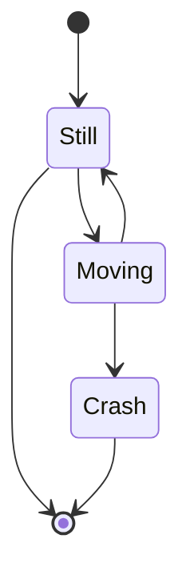

# 时间序列模型

## 时间序列的基本特征

时间序列基本特征包括：趋势性，序列相关性，随机性。
趋势性是指序列整体上呈现单调性，如平稳、上涨或下跌。
序列相关性是指当期的序列值和前期某个或某些序列值线性相关。
随机性是指序列在一定程度上呈现不确定性，由于模型并不能捕捉到现实世界中的所有特征，总会有一些噪声的存在，这些噪声我们称之为白噪声。

时间序列模型预测方法包括算数平均法，移动平均法，加权移动平均，指数平滑法，自回归和移动平均法（ARIMA）。

以月度指标预测为例，下面是几个主要的时间序列模型：
算数平均法就是使用前12个月的算数平均数作为13期的预测值。
移动平均法认为远期的数据对于预测未来的数值价值不大，因此选用最近m个月的算数平均数作为预测值。
加权移动平均法在移动平均法的基础上，为每一期的数值加上了权重。
指数平滑法则对每一期的权重进行平滑处理，

## 时间序列的差分
T时刻的时间序列值表示为$X_T$。一个时间序列可以表述为$\{X_T|t=1,2,3...n\}$ 。T-1时刻的序列值表述为$X_{T-1}$,或者$X[t-1]$。

时间序列的差分：
一阶差分：$\nabla X_T =  X_{T} - X_{T-1}$
二阶差分：$\nabla X_T - \nabla X_{T-1} = (X_{T} - X_{T-1}) - (X_{T-1} - X_{T-2})$ 
K步差分：$ X_{T} - X_{T-K}$

阶次差分可以剔除趋势性影响，而步长差分可以剔除季节性的影响。

## 序列相关性的衡量

我们使用自相关系数和偏自相关系数来衡量序列之间的相关惯性。

自相关系数（ACF）又称全相关系数，用于度量同一事件在不同时期的相关程度。
$$ \rho_h = \frac{r(h)}{r(0)} $$

其中$r(h)$为h期的协方差函数，$r(0)$为方差。

偏自相关系数（PACF）又称条件相关系数，用于度量去除中间变量影响后的相关程度，假设
和 通过 产生关联，PACF即为去除 的关联后两者的相关程度。滞后K阶偏自相关系数是指在给定中间K-1个随机变量 的条件下（剔除了中间K-1个随机变量的干扰后）， 对

影响的相关度量。经过推导，ARMA(p,q)序列的偏自相关系数为:

， 

## 自回归和移动平均（ARIMA）
ARMA模型是平稳的时间序列模型，在建模前必须去除趋势性。

## 参考
- https://zhuanlan.zhihu.com/p/127981316