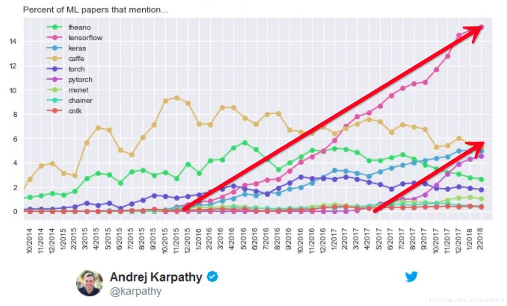

# 第1章 PyTorch程序的基本结构

## 主要内容

- PyTorch介绍
- 


&emsp;&emsp;下面是一个非常简单的PyTorch训练代码


```python

import os
import time

import torch
import torch.nn as nn
import torch.nn.functional as F
import torch.optim as optim
from torch.autograd import Variable

from torch.utils.data import DataLoader
from torchvision import datasets, transforms

from collections import OrderedDict
import torch.utils.model_zoo as model_zoo
from torchvision import models

def get_dataset(batch_size, data_root='/tmp/public_dataset/pytorch', train=True, val=True, **kwargs):
    data_root = os.path.expanduser(os.path.join(data_root, 'mnist-data'))
    
    ds = []    
    if train:
        train_loader = torch.utils.data.DataLoader(
            datasets.MNIST(root=data_root, train=True, download=True,
                           transform=transforms.Compose([
                               transforms.Resize((224, 224)),
                               transforms.Grayscale(3),
                               transforms.ToTensor(),
                               transforms.Normalize((0.1307,), (0.3081,))
                           ])),
            batch_size=batch_size, shuffle=True, **kwargs)
        ds.append(train_loader)
    if val:
        test_loader = torch.utils.data.DataLoader(
            datasets.MNIST(root=data_root, train=False, download=True,
                           transform=transforms.Compose([
                                transforms.Resize((224, 224)),
                                transforms.Grayscale(3),
                                transforms.ToTensor(),
                                transforms.Normalize((0.1307,), (0.3081,))
                            ])),
            batch_size=batch_size, shuffle=True, **kwargs)
        ds.append(test_loader)
    ds = ds[0] if len(ds) == 1 else ds
    return ds


epochs = 10
test_interval = 1
data_root = 'data'

use_cuda = torch.cuda.is_available()

# data loader
train_loader, test_loader = get_dataset(batch_size=200, data_root='./data', num_workers=1)

# model
model = models.resnet18(pretrained=True)
in_features = model.fc.in_features
model.fc = nn.Linear(in_features, 10)
if use_cuda:
    model.cuda()

# optimizer
optimizer = optim.SGD(model.parameters(), lr=0.01, weight_decay=0.0001, momentum=0.9)

t_begin = time.time()

for epoch in range(epochs):
    model.train()
    
    total = 0
    for batch_idx, (data, target) in enumerate(train_loader):
        indx_target = target.clone()
        if use_cuda:
            data, target = data.cuda(), target.cuda()

        optimizer.zero_grad()
        output = model(data)
        loss = F.cross_entropy(output, target)
        loss.backward()
        optimizer.step()

        total += len(data)
        elapse_time = time.time() - t_begin
        t_begin = elapse_time
        print("samples {}, time {}s".format(total, int(elapse_time)))

    if epoch % test_interval == 0:
        model.eval()
        test_loss = 0
        correct = 0
        for data, target in test_loader:
            indx_target = target.clone()
            if use_cuda:
                data, target = data.cuda(), target.cuda()
            output = model(data)
            test_loss += F.cross_entropy(output, target).data
            pred = output.data.max(1)[1]  # get the index of the max log-probability
            correct += pred.cpu().eq(indx_target).sum()

        test_loss = test_loss / len(test_loader) # average over number of mini-batch
        acc = 100. * correct / len(test_loader.dataset)
        print('Test set: Average loss: {:.4f}, Accuracy: {}/{} ({:.0f}%)'.format(
            test_loss, correct, len(test_loader.dataset), acc))
```

从这段代码可以看到，一般模型训练的代码包括几个部分：
* 数据集的处理和加载
* 神经网络结构的构建、初始化
* 优化器的配置
* 损失函数的选择，见line 79，这里用的是交叉熵
* 迭代训练并定期在验证集上测试验证其准确率
* 保存合适的模型文件，这里没有做这一步


