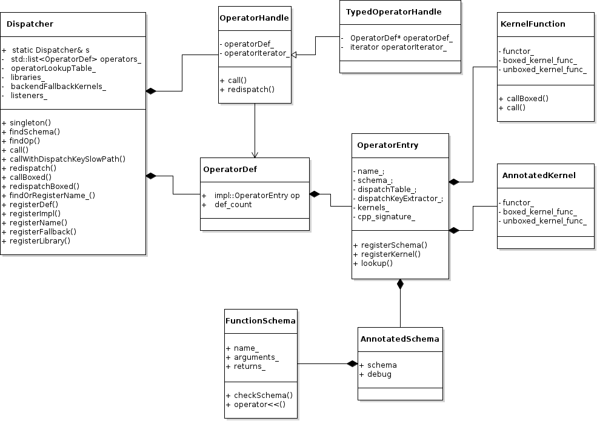

# PyTorch的运行时架构

## 主要内容

- [PyTorch的核心数据结构][#PyTorch的核心数据结构]
- [PyTorch的核心模块](#PyTorch的核心模块)
- [PyTorch的C++扩展模块初始化](#PyTorch的C++扩展模块初始化)
- [Torch函数库的初始化](#Torch函数库的初始化)
- [算子注册过程](#算子注册过程)
- [算子调用的过程](#算子调用的过程)
- [Torch函数库的初始化](#Torch函数库的初始化)


本章对PyTorch的整体架构做了初步的分析，这部分也是理解PyTorch核心引擎工作机制的关键部分，在这里我们力图回答以下几个问题：
<ol>
<li>PyTorch从上层到C++的底层包括哪些重要的模块</li>
<li>这些模块是如何初始化的</li>
<li>从设计上看，这些模块是如何配合的</li>
</ol>

## PyTorch的核心数据结构
### Tensor

在Pytorch的早期版本中，Tensor被定义在TH模块中的THTensor类中，后来TH模块被移除了，也就有了更直观的Tensor类。

当前Tensor的定义在TensorBody.h中，

```C++
// torch/include/ATen/core/TensorBody.h

class TORCH_API Tensor: public TensorBase {
 public:
  Tensor(const Tensor &tensor) = default;
  Tensor(Tensor &&tensor) = default;

  using TensorBase::size;
  using TensorBase::stride;

  Tensor cpu() const {
    return to(options().device(DeviceType::CPU), /*non_blocking*/ false, /*copy*/ false);
  }

  // TODO: The Python version also accepts arguments
  Tensor cuda() const {
    return to(options().device(DeviceType::CUDA), /*non_blocking*/ false, /*copy*/ false);
  }

  void backward(const Tensor & gradient={}, ...) const {
    ...
  }
}
```

我们还可以看到，Tensor类本身的实现很少，大部分功能来自于其父类TensorBase。根据文档注释我们可以了解到，这样做的初衷是为了避免修改算子签名的时候造成太多模块的重新编译，因为Tensor是一个核心数据结构，几乎所有的模块都会依赖于Tensor。

```C++
// torch/include/ATen/core/TensorBase.h

class TORCH_API TensorBase {

  int64_t dim() const {
    return impl_->dim();
  }
  int64_t storage_offset() const {
    return impl_->storage_offset();
  }

  // ...

  bool requires_grad() const {
    return impl_->requires_grad();
  }
  bool is_leaf() const;
  TensorBase data() const;

  c10::intrusive_ptr<TensorImpl, UndefinedTensorImpl> impl_;
}
```

> https://blog.csdn.net/Chris_zhangrx/article/details/119086815
> c10::intrusive_ptr是PyTorch的内部智能指针实现，其工作方式如下：
> 首先完美转发所有的参数来构建 intrusive_ptr
> 用这些参数 new 一个新的 TTarget 类型的对象
> 用新的 TTarget 对象构造一个 intrusive_ptr
> 构造 intrusive_ptr 的同时对 refcount_ 和 weakcount_ 都加 1，
> 如果是默认构造，则两个引用计数都默认为 0，根据这个可以将通过 make_intrusive 构造的指针与堆栈上的会被自动析构的情况分开, 用来确保内存是我们自己分配的。

以后有机会我们再研究一下intrusive_ptr的实现，在此之前，我们主要关注impl_这个成员变量，也就是TensorImpl这个类的实现。

```C++
// c10/core/TensorImpl.h

struct C10_API TensorImpl : public c10::intrusive_ptr_target {

TensorImpl(
      Storage&& storage,
      DispatchKeySet,
      const caffe2::TypeMeta data_type);

 public:
  TensorImpl(const TensorImpl&) = delete;
  TensorImpl& operator=(const TensorImpl&) = delete;
  TensorImpl(TensorImpl&&) = delete;
  TensorImpl& operator=(TensorImpl&&) = delete;

  DispatchKeySet key_set() const {
    return key_set_;
  }

  int64_t dim() const {
    //...
  }
  bool is_contiguous(
    //...
  } 

  Storage storage_;

private:
  std::unique_ptr<c10::AutogradMetaInterface> autograd_meta_ = nullptr;

 protected:
  std::unique_ptr<c10::NamedTensorMetaInterface> named_tensor_meta_ = nullptr;

  c10::VariableVersion version_counter_;

  std::atomic<impl::PyInterpreter*> pyobj_interpreter_;
  PyObject* pyobj_;

  c10::impl::SizesAndStrides sizes_and_strides_;

  int64_t storage_offset_ = 0;
  int64_t numel_ = 1;

  caffe2::TypeMeta data_type_;
  c10::optional<c10::Device> device_opt_;

  bool is_contiguous_ : 1;

  bool storage_access_should_throw_ : 1;

  bool is_channels_last_ : 1;
  bool is_channels_last_contiguous_ : 1;
  bool is_channels_last_3d_ : 1;

  bool is_channels_last_3d_contiguous_ : 1;

  bool is_non_overlapping_and_dense_ : 1;

  bool is_wrapped_number_ : 1;

  bool allow_tensor_metadata_change_ : 1;

  bool reserved_ : 1;
  uint8_t sizes_strides_policy_ : 2;

  DispatchKeySet key_set_;

}

```

对于TensorImpl类来说，比较重要的成员变量有以下几个：
- storage_。这个变量存储了真正的张量数据
- autograd_meta_。存储反向传播所需要的元信息，如梯度计算函数和梯度等。
- pyobj_。Tensor所对应的Python Object
- data_type_。Tensor内的数据类型。
- device_opt_。存放Tensor的设备。
- 

下面我们看一下Tensor的存储，因为Tensor的存储方式和算子的计算息息相关，对性能的影响也非常的关键。
```C++
// c10/core/Storage.h

struct C10_API Storage {
  //...

 protected:
  c10::intrusive_ptr<StorageImpl> storage_impl_;
}

```
和Tensor的定义类似，Storage也是使用StorageImpl类来隐藏其复杂的实现。因此我们主要关注StorageImpl的实现。

```C++
// c10/core/StorageImpl.h

struct C10_API StorageImpl : public c10::intrusive_ptr_target {
 public:
  struct use_byte_size_t {};

  StorageImpl(
      use_byte_size_t /*use_byte_size*/,
      size_t size_bytes,
      at::DataPtr data_ptr,
      at::Allocator* allocator,
      bool resizable)
      : data_ptr_(std::move(data_ptr)),
        size_bytes_(size_bytes),
        resizable_(resizable),
        received_cuda_(false),
        allocator_(allocator) {
    if (resizable) {
      TORCH_INTERNAL_ASSERT(
          allocator_, "For resizable storage, allocator must be provided");
    }
  }

  void* data() {
    return data_ptr_.get();
  }
  at::DeviceType device_type() const {
    return data_ptr_.device().type();
  }

private:
  DataPtr data_ptr_;
  size_t size_bytes_;
  bool resizable_;
  // Identifies that Storage was received from another process and doesn't have
  // local to process cuda memory allocation
  bool received_cuda_;
  Allocator* allocator_;
}
```

StorageImpl的关键成员是data_ptr_, 其定义在这里：

```C++
// c10/core/Allocator.h

class C10_API DataPtr {
 private:
  c10::detail::UniqueVoidPtr ptr_;
  Device device_;

  
}

// c10/util/UniqueVoidPtr.h

class UniqueVoidPtr {
 private:
  // Lifetime tied to ctx_
  void* data_;
  std::unique_ptr<void, DeleterFnPtr> ctx_;

  // ...
}
```

现在我们知道，在C++的层面，张量被Tensor类型所表示，但是我们平时是使用Python语言来训练推理模型的，使用的自然是Python中的Tensor类型，那么在PyTorch中是如何实现从Python语言中的Tensor对象到C++中的Tensor对象的转换呢？

详细的过程我们留到后面的章节解释，不过机制并不复杂，PyTorch使用了THPVariable这个类型作为过渡，Python中的Tensor类

在前面初始化_C模块的时候，调用了THPVariable_initModule()这个函数，将Python中_TensorBase这个类型映射到THPVariableType这个C++类型上，

```C++
// torch/csrc/autograd/python_variable.cpp

bool THPVariable_initModule(PyObject *module)
{
  // ...
  PyModule_AddObject(module, "_TensorBase",   (PyObject *)&THPVariableType);
  torch::autograd::initTorchFunctions(module);
  // ...
  return true;
}

PyTypeObject THPVariableType = {
    PyVarObject_HEAD_INIT(
        &THPVariableMetaType,
        0) "torch._C._TensorBase", /* tp_name */
    // ...
    THPVariable_pynew, /* tp_new */
};

PyObject *THPVariable_pynew(PyTypeObject *type, PyObject *args, PyObject *kwargs)
{
  HANDLE_TH_ERRORS
  TORCH_CHECK(type != &THPVariableType, "Cannot directly construct _TensorBase; subclass it and then construct that");
  jit::tracer::warn("torch.Tensor", jit::tracer::WARN_CONSTRUCTOR);
  auto tensor = torch::utils::base_tensor_ctor(args, kwargs);
  // WARNING: tensor is NOT guaranteed to be a fresh tensor; e.g., if it was
  // given a raw pointer that will refcount bump
  return THPVariable_NewWithVar(
      type,
      std::move(tensor),
      c10::impl::PyInterpreterStatus::MAYBE_UNINITIALIZED);
  END_HANDLE_TH_ERRORS
}

static PyObject* THPVariable_NewWithVar(
    PyTypeObject* type,
    Variable _var,
    c10::impl::PyInterpreterStatus status) {
 
  PyObject* obj = type->tp_alloc(type, 0);
  if (obj) {
    auto v = (THPVariable*) obj;
    // TODO: named constructor to avoid default initialization
    new (&v->cdata) MaybeOwned<Variable>();
    v->cdata = MaybeOwned<Variable>::owned(std::move(_var));
    const auto& var = THPVariable_Unpack(v);
    var.unsafeGetTensorImpl()->init_pyobj(self_interpreter.get(), obj, status);
    if (check_has_torch_dispatch(obj)) {
      var.unsafeGetTensorImpl()->set_python_dispatch(true);
    }
  }
  return obj;
}

// torch/csrc/autograd/python_variable.h
struct THPVariable {
  PyObject_HEAD;
  c10::MaybeOwned<at::Tensor> cdata;
  PyObject* backward_hooks = nullptr;
};
```


### TensorOption

Note: 参考注释吧

TensorOption是设计用来构造Tensor的工具。

在C++中没有python中的keyword参数机制，比如这段代码：
```python
torch.zeros(2, 3, dtype=torch.int32)
```
在keyword参数机制下，参数的顺序和定义的可能不一样。因此在C++中实现这些函数时，将TensorOptions作为最后一个参数附在函数末尾，可以协助对参数的解析。

实际使用时，at::zeros()系列函数隐式的使用TensorOptions。 TensorOptions可以看作是一个字典。


### Node
Node的定义在torch/csrc/autograd/function.h中。

从名称上不难看出，Node代表计算图中的节点。计算图除了节点之外，还会有边，也就是Edge.

Tensor中方法grad_fn()返回的就是一个Node

### Edge
Node的定义在torch/csrc/autograd/edge.h中。


### VariableHooks
获取Tensor的grad_fn()时，使用VariableHooks这个类来返回的，而且逻辑很复杂，还没看懂

https://blog.csdn.net/u012436149/article/details/69230136

这里要注意的是，hook 只能注册到 Module 上，即，仅仅是简单的 op 包装的 Module，而不是我们继承 Module时写的那个类，我们继承 Module写的类叫做 Container。
每次调用forward()计算输出的时候，这个hook就会被调用。它应该拥有以下签名：

可以看到，当我们执行model(x)的时候，底层干了以下几件事：

    调用 forward 方法计算结果

    判断有没有注册 forward_hook，有的话，就将 forward 的输入及结果作为hook的实参。然后让hook自己干一些不可告人的事情。

### register_backward_hook

在module上注册一个bachward hook。此方法目前只能用在Module上，不能用在Container上，当Module的forward函数中只有一个Function的时候，称为Module，如果Module包含其它Module，称之为Container

每次计算module的inputs的梯度的时候，这个hook会被调用。hook应该拥有下面的signature。

hook(module, grad_input, grad_output) -> Tensor or None

如果module有多个输入输出的话，那么grad_input grad_output将会是个tuple。
hook不应该修改它的arguments，但是它可以选择性的返回关于输入的梯度，这个返回的梯度在后续的计算中会替代grad_input。

这个函数返回一个 句柄(handle)。它有一个方法 handle.remove()，可以用这个方法将hook从module移除。

从上边描述来看，backward hook似乎可以帮助我们处理一下计算完的梯度。看下面nn.Module中register_backward_hook方法的实现，和register_forward_hook方法的实现几乎一样，都是用字典把注册的hook保存起来。

## PyTorch的核心模块

- PythonAPI
- C++部分Engine 
- THP
- ATen
- JITwdq

```bash

src
!--- ATen       # Tensor相关操作的C++接口
|--- TH         # Tensor的CPU实现
|--- THC        # Tensor的CUDA实现
|--- THCUNN     # 神经网络的CUDA实现
|--- THNN       # 神经网络的CPU实现

torch
|--- csrc       # Torch C++ 扩展模块的实现代码
      |--- module.cpp       # Torch C++ 扩展模块的初始化及入口代码

```


&emsp;&emsp;下面是一个非常简单的PyTorch训练代码


```python

import os
import time

import torch
import torch.nn as nn
import torch.nn.functional as F
import torch.optim as optim
from torch.autograd import Variable

from torch.utils.data import DataLoader
from torchvision import datasets, transforms

from collections import OrderedDict
import torch.utils.model_zoo as model_zoo
from torchvision import models

def get_dataset(batch_size, data_root='/tmp/public_dataset/pytorch', train=True, val=True, **kwargs):
    data_root = os.path.expanduser(os.path.join(data_root, 'mnist-data'))
    
    ds = []    
    if train:
        train_loader = torch.utils.data.DataLoader(
            datasets.MNIST(root=data_root, train=True, download=True,
                           transform=transforms.Compose([
                               transforms.Resize((224, 224)),
                               transforms.Grayscale(3),
                               transforms.ToTensor(),
                               transforms.Normalize((0.1307,), (0.3081,))
                           ])),
            batch_size=batch_size, shuffle=True, **kwargs)
        ds.append(train_loader)
    if val:
        test_loader = torch.utils.data.DataLoader(
            datasets.MNIST(root=data_root, train=False, download=True,
                           transform=transforms.Compose([
                                transforms.Resize((224, 224)),
                                transforms.Grayscale(3),
                                transforms.ToTensor(),
                                transforms.Normalize((0.1307,), (0.3081,))
                            ])),
            batch_size=batch_size, shuffle=True, **kwargs)
        ds.append(test_loader)
    ds = ds[0] if len(ds) == 1 else ds
    return ds


epochs = 10
test_interval = 1
data_root = 'data'

use_cuda = torch.cuda.is_available()

# data loader
train_loader, test_loader = get_dataset(batch_size=200, data_root='./data', num_workers=1)

# model
model = models.resnet18(pretrained=True)
in_features = model.fc.in_features
model.fc = nn.Linear(in_features, 10)
if use_cuda:
    model.cuda()

# optimizer
optimizer = optim.SGD(model.parameters(), lr=0.01, weight_decay=0.0001, momentum=0.9)

t_begin = time.time()

for epoch in range(epochs):
    model.train()
    
    total = 0
    for batch_idx, (data, target) in enumerate(train_loader):
        indx_target = target.clone()
        if use_cuda:
            data, target = data.cuda(), target.cuda()

        optimizer.zero_grad()
        output = model(data)
        loss = F.cross_entropy(output, target)
        loss.backward()
        optimizer.step()

        total += len(data)
        elapse_time = time.time() - t_begin
        t_begin = elapse_time
        print("samples {}, time {}s".format(total, int(elapse_time)))

    if epoch % test_interval == 0:
        model.eval()
        test_loss = 0
        correct = 0
        for data, target in test_loader:
            indx_target = target.clone()
            if use_cuda:
                data, target = data.cuda(), target.cuda()
            output = model(data)
            test_loss += F.cross_entropy(output, target).data
            pred = output.data.max(1)[1]  # get the index of the max log-probability
            correct += pred.cpu().eq(indx_target).sum()

        test_loss = test_loss / len(test_loader) # average over number of mini-batch
        acc = 100. * correct / len(test_loader.dataset)
        print('Test set: Average loss: {:.4f}, Accuracy: {}/{} ({:.0f}%)'.format(
            test_loss, correct, len(test_loader.dataset), acc))
```

从这段代码可以看到，一般模型训练的代码包括几个部分：
* 数据集的处理和加载
* 神经网络结构的构建、初始化
* 优化器的配置
* 损失函数的选择，见line 79，这里用的是交叉熵
* 迭代训练并定期在验证集上测试验证其准确率
* 保存合适的模型文件，这里没有做这一步


## PyTorch的C++扩展模块初始化
C++扩展模块_C可以说是PyTorch的核心，是PyTorch代码量最大最复杂的部分，下面我们来看看这个模块是如何加载及初始化的。

### C++扩展模块的加载
在加载torch模块的时候，python会执行torch/__init__.py. 其中会加载_C模块，根据Python3的规范，如果某个模块是C++实现的动态库，该库的名称应该为<Module>.cpython-<python version>-<arch>-<os>.so，在linux环境下，对应的就是_C.cpython-37m-x86_64-linux-gnu.so。

加载这个动态库后，会调用其中的initModule()函数。
在这个函数中，进行了一系列的初始化工作

```C++
// torch/csrc/Module.cpp

PyObject* initModule() {

  // ...

  // 这里收集_C模块所需要的方法
  THPUtils_addPyMethodDefs(methods, TorchMethods);
  THPUtils_addPyMethodDefs(methods, DataLoaderMethods);
  THPUtils_addPyMethodDefs(methods, torch::autograd::python_functions());
  THPUtils_addPyMethodDefs(methods, torch::multiprocessing::python_functions());

  THPUtils_addPyMethodDefs(methods, THCPModule_methods());

  THPUtils_addPyMethodDefs(methods, torch::distributed::c10d::python_functions());

  THPUtils_addPyMethodDefs(methods, torch::distributed::rpc::python_functions());
  THPUtils_addPyMethodDefs(
      methods, torch::distributed::autograd::python_functions());
  THPUtils_addPyMethodDefs(methods, torch::distributed::rpc::testing::python_functions());

  // 下面开始创建_C模块
  static struct PyModuleDef torchmodule = {
     PyModuleDef_HEAD_INIT,
     "torch._C",
     nullptr,
     -1,
     methods.data()
  };
  ASSERT_TRUE(module = PyModule_Create(&torchmodule));
  ASSERT_TRUE(THPGenerator_init(module));
  ASSERT_TRUE(THPException_init(module));
  THPSize_init(module);
  THPDtype_init(module);
  THPDTypeInfo_init(module);
  THPLayout_init(module);
  THPMemoryFormat_init(module);
  THPQScheme_init(module);
  THPDevice_init(module);
  THPStream_init(module);

  // 初始化Tensor类型
  ASSERT_TRUE(THPVariable_initModule(module));
  ASSERT_TRUE(THPFunction_initModule(module));
  ASSERT_TRUE(THPEngine_initModule(module));
  // NOTE: We need to be able to access OperatorExportTypes from ONNX for use in
  // the export side of JIT, so this ONNX init needs to appear before the JIT
  // init.
  torch::onnx::initONNXBindings(module);
  torch::jit::initJITBindings(module);
  torch::monitor::initMonitorBindings(module);
  torch::impl::dispatch::initDispatchBindings(module);
  torch::throughput_benchmark::initThroughputBenchmarkBindings(module);
  torch::autograd::initReturnTypes(module);
  torch::autograd::initNNFunctions(module);
  torch::autograd::initFFTFunctions(module);
  torch::autograd::initLinalgFunctions(module);
  torch::autograd::initSparseFunctions(module);
  torch::autograd::initSpecialFunctions(module);
  torch::autograd::init_legacy_variable(module);
  torch::python::init_bindings(module);
  torch::lazy::initLazyBindings(module);
#ifdef USE_CUDA
  torch::cuda::initModule(module);
#endif
  ASSERT_TRUE(THPStorage_init(module));

#ifdef USE_CUDA
  // This will only initialise base classes and attach them to library namespace
  // They won't be ready for real usage until importing cuda module, that will
  // complete the process (but it defines Python classes before calling back into
  // C, so these lines have to execute first)..
  THCPStream_init(module);
  THCPEvent_init(module);
  THCPGraph_init(module);
#endif

  auto set_module_attr = [&](const char* name, PyObject* v, bool incref = true) {
    // PyModule_AddObject steals reference
    if (incref) {
      Py_INCREF(v);
    }
    return PyModule_AddObject(module, name, v) == 0;
  };

  // ...

  ASSERT_TRUE(set_module_attr("has_openmp", at::hasOpenMP() ? Py_True : Py_False));
  ASSERT_TRUE(set_module_attr("has_mkl", at::hasMKL() ? Py_True : Py_False));
  ASSERT_TRUE(set_module_attr("has_lapack", at::hasLAPACK() ? Py_True : Py_False));

  // ...

  py::enum_<at::native::ConvBackend>(py_module, "_ConvBackend")
    .value("CudaDepthwise2d", at::native::ConvBackend::CudaDepthwise2d)
    .value("CudaDepthwise3d", at::native::ConvBackend::CudaDepthwise3d)
    .value("Cudnn", at::native::ConvBackend::Cudnn)
    .value("CudnnTranspose", at::native::ConvBackend::CudnnTranspose)
    .value("Empty", at::native::ConvBackend::Empty)
    .value("Miopen", at::native::ConvBackend::Miopen)
    .value("MiopenDepthwise", at::native::ConvBackend::MiopenDepthwise)
    .value("MiopenTranspose", at::native::ConvBackend::MiopenTranspose)
    .value("Mkldnn", at::native::ConvBackend::Mkldnn)
    .value("MkldnnEmpty", at::native::ConvBackend::MkldnnEmpty)
    .value("NnpackSpatial", at::native::ConvBackend::NnpackSpatial)
    .value("Overrideable", at::native::ConvBackend::Overrideable)
    .value("Slow2d", at::native::ConvBackend::Slow2d)
    .value("Slow3d", at::native::ConvBackend::Slow3d)
    .value("SlowDilated2d", at::native::ConvBackend::SlowDilated2d)
    .value("SlowDilated3d", at::native::ConvBackend::SlowDilated3d)
    .value("SlowTranspose2d", at::native::ConvBackend::SlowTranspose2d)
    .value("SlowTranspose3d", at::native::ConvBackend::SlowTranspose3d)
    .value("Winograd3x3Depthwise", at::native::ConvBackend::Winograd3x3Depthwise)
    .value("Xnnpack2d", at::native::ConvBackend::Xnnpack2d);

  py_module.def("_select_conv_backend", [](
        const at::Tensor& input, const at::Tensor& weight, const c10::optional<at::Tensor>& bias_opt,
        at::IntArrayRef stride_, at::IntArrayRef padding_, at::IntArrayRef dilation_,
        bool transposed_, at::IntArrayRef output_padding_, int64_t groups_) {
      return at::native::select_conv_backend(
          input, weight, bias_opt, stride_, padding_, dilation_, transposed_, output_padding_, groups_);
  });

  py::enum_<at::LinalgBackend>(py_module, "_LinalgBackend")
    .value("Default", at::LinalgBackend::Default)
    .value("Cusolver", at::LinalgBackend::Cusolver)
    .value("Magma", at::LinalgBackend::Magma);

  py_module.def("_set_linalg_preferred_backend", [](at::LinalgBackend b) {
    at::globalContext().setLinalgPreferredBackend(b);
  });
  py_module.def("_get_linalg_preferred_backend", []() {
    return at::globalContext().linalgPreferredBackend();
  });

  // ...  

  return module;
  END_HANDLE_TH_ERRORS
}
```

## Torch函数库的初始化

在Python层面，模块torch提供了非常多的函数，比如torch.abs()，torch.randn()， torch.ones()等等，在初始化_C模块的时候，这些函数也被注册到_C模块中。

```C++
// torch/csrc/autograd/python_variable.cpp

bool THPVariable_initModule(PyObject *module)
{
  // ...
  PyModule_AddObject(module, "_TensorBase",   (PyObject *)&THPVariableType);
  torch::autograd::initTorchFunctions(module);
  // ...
  return true;
}
```
在下面的代码中，我们可以看到，相关的函数被收集到torch_functions中，同时这个函数列表也被注册到_C的_VariableFunctions这个子模块中。
```C++
// torch/csrc/autograd/python_torch_functions_manual.cpp

void initTorchFunctions(PyObject *module) {
  static std::vector<PyMethodDef> torch_functions;
  gatherTorchFunctions(torch_functions);
  THPVariableFunctions.tp_methods = torch_functions.data();
  
  //...
  if (PyModule_AddObject(module, "_VariableFunctionsClass",
                         reinterpret_cast<PyObject*>(&THPVariableFunctions)) < 0) {
    throw python_error();
  }
  // PyType_GenericNew returns a new reference
  THPVariableFunctionsModule = PyType_GenericNew(&THPVariableFunctions, Py_None, Py_None);
  // PyModule_AddObject steals a reference
  if (PyModule_AddObject(module, "_VariableFunctions", THPVariableFunctionsModule) < 0) {
    throw python_error();
  }
}
```

在torch模块的初始化过程中，_C模块的子模块_VariableFunctions中的所有属性都被注册到torch模块中，当然也包括所有的函数。
```Python
# torch/__init__.py

for name in dir(_C._VariableFunctions):
    if name.startswith('__') or name in PRIVATE_OPS:
        continue
    obj = getattr(_C._VariableFunctions, name)
    obj.__module__ = 'torch'
    globals()[name] = obj
    if not name.startswith("_"):
        __all__.append(name)
```

下面我们看看具体有哪些函数被注册了。函数列表是通过gatherTorchFunctions()来收集的，这个函数又调用了gatherTorchFunctions_0(), gatherTorchFunctions_1(), gatherTorchFunctions_2()这几个函数。

```C++
// torch/csrc/autograd/python_torch_functions_manual.cpp

void gatherTorchFunctions(std::vector<PyMethodDef> &torch_functions) {
  constexpr size_t num_functions = sizeof(torch_functions_manual) / sizeof(torch_functions_manual[0]);
  torch_functions.assign(torch_functions_manual,
                         torch_functions_manual + num_functions);
  // NOTE: Must be synced with num_shards in tools/autograd/gen_python_functions.py
  gatherTorchFunctions_0(torch_functions);
  gatherTorchFunctions_1(torch_functions);
  gatherTorchFunctions_2(torch_functions);

  //...

```
为什么这样设计呢？大概有两个原因：
- 函数的数量很多，而且在不断的增加，需要方便扩展
- 函数大多是算子，算子和平台相关，每个算子有多种实现，同样为了在不同平台迁移扩展，PyTorch设计了代码生成机制来屏蔽通用的、繁琐的功能，这个生成机制也需要解耦。

gatherTorchFunctions_N()这几个函数是通过模板生成的，完成编译后，可以在下面的文件中找到：

```C++
// torch/csrc/autograd/generated/python_torch_functions_0.cpp

static PyMethodDef torch_functions_shard[] = {
  {"_cast_Byte", castPyCFunctionWithKeywords(THPVariable__cast_Byte), METH_VARARGS | METH_KEYWORDS | METH_STATIC, NULL},
  //...
  {"eye", castPyCFunctionWithKeywords(THPVariable_eye), METH_VARARGS | METH_KEYWORDS | METH_STATIC, NULL},
  {"rand", castPyCFunctionWithKeywords(THPVariable_rand), METH_VARARGS | METH_KEYWORDS | METH_STATIC, NULL},
  //...
};

void gatherTorchFunctions_0(std::vector<PyMethodDef> &torch_functions) {
  constexpr size_t num_functions = sizeof(torch_functions_shard) / sizeof(torch_functions_shard[0]);
  torch_functions.insert(
    torch_functions.end(),
    torch_functions_shard,
    torch_functions_shard + num_functions);
}


```


## Backward函数注册流程

```C++
initialize_autogenerated_functionsEverything();
   addClass<AddBackward0>(AddBackward0Class,"AddBackward0", AddBackward0_properties);
        _initFunctionPyTypeObject();
            
        registerCppFunction();
            cpp_function_types[idx] = type
```


## 参考
- https://blog.csdn.net/Xixo0628/article/details/112603174
- https://blog.csdn.net/Xixo0628/article/details/112603174
- https://pytorch.org/blog/a-tour-of-pytorch-internals-1/#the-thptensor-type
- PyTorch源码浅析(1)：THTensor https://blog.csdn.net/Xixo0628/article/details/112603174
- PyTorch源码浅析(1)：THTensor https://www.52coding.com.cn/2019/05/05/PyTorch1/


## PyTorch的算子体系

我们先从一个简单的例子出发，看看PyTorch中Python和C++是怎样一起工作的。

```python
import torch

x = torch.ones(2, 2, requires_grad=True)
y = x + 2
```

在_C模块初始化的时候，THPVariable这个类型绑定了相应的方法，可以在执行加法操作的时候，调用的是THPVariable_add()这个函数。


```C++
PyMethodDef variable_methods[] = {
  // These magic methods are all implemented on python object to wrap NotImplementedError
  {"__add__", castPyCFunctionWithKeywords(TypeError_to_NotImplemented_<THPVariable_add>), METH_VARARGS | METH_KEYWORDS, NULL},
  {"__radd__", castPyCFunctionWithKeywords(TypeError_to_NotImplemented_<THPVariable_add>), METH_VARARGS | METH_KEYWORDS, NULL},
  {"__iadd__", castPyCFunctionWithKeywords(TypeError_to_NotImplemented_<THPVariable_add_>), METH_VARARGS | METH_KEYWORDS, NULL},

  ...
}
```

THPVariable_add()方法的具体实现代码是生成的，因此我们在原始的模板文件中可以找到使用这个函数，真正的实现有多个，对应不同的调用方式。在这个例子里，对应调用的是下面这个实现：

```C++
// torch/csrc/autograd/generated/python_variable_methods.cpp [generated file]

static PyObject * THPVariable_add(PyObject* self_, PyObject* args, PyObject* kwargs)
{
  HANDLE_TH_ERRORS
  const Tensor& self = THPVariable_Unpack(self_);
  static PythonArgParser parser({
    "add(Scalar alpha, Tensor other)|deprecated",
    "add(Tensor other, *, Scalar alpha=1)",
  }, /*traceable=*/true);

  ParsedArgs<2> parsed_args;
  auto _r = parser.parse(self_, args, kwargs, parsed_args);
  if(_r.has_torch_function()) {
    return handle_torch_function(_r, self_, args, kwargs, THPVariableClass, "torch.Tensor");
  }
  switch (_r.idx) {
    case 0: {
      // [deprecated] aten::add.Tensor(Tensor self, Tensor other, *, Scalar alpha=1) -> Tensor

      auto dispatch_add = [](const at::Tensor & self, const at::Scalar & alpha, const at::Tensor & other) -> at::Tensor {
        pybind11::gil_scoped_release no_gil;
        return self.add(other, alpha);
      };
      return wrap(dispatch_add(self, _r.scalar(0), _r.tensor(1)));
    }
    case 1: {
      // aten::add.Tensor(Tensor self, Tensor other, *, Scalar alpha=1) -> Tensor

      auto dispatch_add = [](const at::Tensor & self, const at::Tensor & other, const at::Scalar & alpha) -> at::Tensor {
        pybind11::gil_scoped_release no_gil;
        return self.add(other, alpha);
      };
      return wrap(dispatch_add(self, _r.tensor(0), _r.scalar(1)));
    }
  }
  Py_RETURN_NONE;
  END_HANDLE_TH_ERRORS
}
```
其中 PythonArgParser 定义了这个函数的几类参数，并将Python调用的参数转换成对应的C++类型，在这个例子里，调用的参数符合第二组定义，因此_r.index为1，最后调用的是下面这个方法：


```C++
// aten/src/ATen/core/TensorBody.h

// aten::add.Tensor(Tensor self, Tensor other, *, Scalar alpha=1) -> Tensor
inline at::Tensor Tensor::add(const at::Tensor & other, const at::Scalar & alpha) const {
    return at::_ops::add_Tensor::call(const_cast<Tensor&>(*this), other, alpha);
}
```

```C++
// ./build/aten/src/ATen/Operators_2.cpp [generated file]

STATIC_CONST_STR_OUT_OF_LINE_FOR_WIN_CUDA(add_Tensor, name, "aten::add")
STATIC_CONST_STR_OUT_OF_LINE_FOR_WIN_CUDA(add_Tensor, overload_name, "Tensor")
STATIC_CONST_STR_OUT_OF_LINE_FOR_WIN_CUDA(add_Tensor, schema_str, "add.Tensor(Tensor self, Tensor other, *, Scalar alpha=1) -> Tensor")

// aten::add.Tensor(Tensor self, Tensor other, *, Scalar alpha=1) -> Tensor
static C10_NOINLINE c10::TypedOperatorHandle<add_Tensor::schema> create_add_Tensor_typed_handle() {
  return c10::Dispatcher::singleton()
      .findSchemaOrThrow(add_Tensor::name, add_Tensor::overload_name)
      .typed<add_Tensor::schema>();
}

// aten::add.Tensor(Tensor self, Tensor other, *, Scalar alpha=1) -> Tensor
at::Tensor add_Tensor::call(const at::Tensor & self, const at::Tensor & other, const at::Scalar & alpha) {
    
    static auto op = create_add_Tensor_typed_handle();
    return op.call(self, other, alpha);
}
```

这里创建的op的类型是c10::OperatorHandle


## 算子分发的基本概念
增加新的算子时，需要先使用TORCH_LIBRARY定义算子的schema，然后使用宏 TORCH_LIBRARY_IMPL来注册该算子在cpu、cuda、XLA等上的实现。注册的时候，需要指定namespace及该namespace下的dispatch_key，如果注册的是fallback实现（缺省实现）,namespace可以使用“_”。

参考官方文档 https://pytorch.org/tutorials/advanced/dispatcher.html

在了解Dispatch的机制之前，我们先了解一下算子的类型。

### BackendComponent

每一种"backend"可以看做是一种设备。

```C++
// c10/core/DispatchKey.h

enum class BackendComponent : uint8_t {
  InvalidBit = 0,
  CPUBit,
  CUDABit,
  HIPBit,
  XLABit,
  MPSBit,
  IPUBit,
  XPUBit,
  HPUBit,
  VEBit,
  LazyBit,
  PrivateUse1Bit,
  PrivateUse2Bit,
  PrivateUse3Bit,
  // Define an alias to represent end of backend dispatch keys.
  // If you add new backend keys after PrivateUse3, please also update it here.
  // (But you shouldn't: private use keys should have higher precedence than
  // all built-in keys)
  EndOfBackendKeys = PrivateUse3Bit,
};
```

### DispatchKey

```C++
// c10/core/DispatchKey.h

enum class DispatchKey : uint16_t {

  Undefined = 0,

  CatchAll = Undefined,

  // ~~~~~~~~~~~~~~~~~~~~~~~~~~ Functionality Keys ~~~~~~~~~~~~~~~~~~~~~~ //
  Dense,

  // Below are non-extensible backends.
  // These are backends that currently don't have their own overrides for
  // Autograd/Sparse/Quantized kernels,
  // and we therefore don't waste space in the runtime operator table allocating
  // space for them.
  // If any of these backends ever need to customize, e.g., Autograd, then we'll
  // need to add a DispatchKey::*Bit for them.

  FPGA, // Xilinx support lives out of tree at
  // https://gitlab.com/pytorch-complex/vitis_kernels

  // ONNX Runtime, lives out of tree at https://github.com/pytorch/ort and
  // https://github.com/microsoft/onnxruntime, and is also used to test general
  // backend/extension machinery in the core. cf:
  // - test/cpp_extensions/ort_extension.cpp
  // - test/test_torch.py
  // - aten/src/ATen/test/extension_backend_test.cpp
  ORT,

  Vulkan,
  Metal,

  // A meta tensor is a tensor without any data associated with it.  (They
  // have also colloquially been referred to as tensors on the "null" device).
  // A meta tensor can be used to dry run operators without actually doing any
  // computation, e.g., add on two meta tensors would give you another meta
  // tensor with the output shape and dtype, but wouldn't actually add anything.
  Meta,

  // See [Note: Per-Backend Functionality Dispatch Keys]
  Quantized,

  // This backend is to support custom RNGs; it lets you go
  // to a different kernel if you pass in a generator that is not a
  // traditional CPUGeneratorImpl/CUDAGeneratorImpl.  To make use of this
  // key:
  //  1) set it as a second parameter of at::Generator constructor call in
  //     the user-defined PRNG class.
  //  2) use it as a dispatch key while registering custom kernels
  //     (templatized kernels specialized for user-defined PRNG class)
  // intended for out of tree use; tested by aten/src/ATen/test/rng_test.cpp
  CustomRNGKeyId,

  // Here are backends which specify more specialized operators
  // based on the layout of the tensor.  Note that the sparse backends
  // are one case where ordering matters: sparse multi-dispatches with
  // the corresponding dense tensors, and must be handled before them.
  MkldnnCPU, // registered at build/aten/src/ATen/RegisterMkldnnCPU.cpp
  // NB: not to be confused with MKLDNN, which is Caffe2 only

  // See [Note: Per-Backend Functionality Dispatch Keys]
  Sparse,

  SparseCsrCPU,
  SparseCsrCUDA,

  // Note [Non-Customizable Backend Keys]
  // Every key above here is considered a "non-customizable backend".
  // These are backends that will work correctly with autograd, but
  // but currently don't require separate implementations
  // for autograd sparse or quantized kernels.
  // Any new backends that don't need to be customized should go above here.
  // If an existing backend needs to e.g. override autograd, then we can
  // consider promoting it into the "BackendComponent" enum
  //
  // For all intents and purposes from the perspective of DispatchKeySet,
  // "non-customizable backend" keys are treated the same way
  // as other functionality keys
  EndOfNonCustomizableBackends = SparseCsrCUDA,

  NestedTensor,

  // In some situations, it is not immediately obvious what the correct
  // backend for function is, because the function in question doesn't
  // have any "tensor" arguments.  In this case, a BackendSelect function
  // can be registered to implement the custom determination of the
  // correct backend.
  BackendSelect,

  Python,

  // Out-of-core key for Fake Tensor in torchdistx.
  // See https://pytorch.org/torchdistx/latest/fake_tensor.html
  Fake,

  // The named dispatch key is set for any tensors with named dimensions.
  // Although we have a dispatch key for named tensors, for historical reasons,
  // this dispatch key doesn't do any of the substantive functionality for named
  // tensor (though, hypothetically, it could!)  At the moment, it's just
  // responsible for letting us give good error messages when operations
  // don't support named tensors.
  //
  // NB: If you ever consider moving named tensor functionality into
  // this dispatch key, note that it might be necessary add another dispatch
  // key that triggers before composite operators, in case a composite operator
  // has named dimension propagation that doesn't match that of its
  // constituent parts.
  Named,

  // The Conjugate dispatch key is set for any tensors that need to perform
  // conjugation
  // This is implemented at a dispatch level right before any backends run
  Conjugate,

  // The Negative dispatch key is set for any tensors that need to perform
  // negation
  // This is implemented at a dispatch level right before any backends run
  Negative,

  ZeroTensor, // registered at build/aten/src/ATen/RegisterZeroTensor.cpp

  // See Note [Out-of-tree vmap+grad prototype]. The purpose of this key
  // is to insert code after the "autograd subsystem" runs, so this key should
  // be directly after ADInplaceOrView and all of the autograd keys.
  FuncTorchDynamicLayerBackMode,

  // Note [ADInplaceOrView key]
  // ADInplaceOrView key is used by inplace or view ops to register a kernel
  // that does additional setup for future autograd computation.
  //
  // 1. For inplace ops this kernel does version bump
  // 2. For view ops this kernel does `as_view` setup where we properly setup
  //    DifferentiableViewMeta on the view tensors.
  //
  // For other ops it's fallthrough kernel since there's no extra
  // work to do.
  //
  // Note [Dream: skip VariableType kernel when requires_grad=false]
  //
  // In an ideal world where we can skip VariableType kernel for inputs
  // with requires_grad=false, instead of a fallthrough kernel, we'll
  // register a kernel shown below to all functional ops as well:
  // torch::Tensor my_functional_op(...) {
  //   {
  //     // Note for every op in VariableType, you need to go through
  //     // `AutoDispatchBelowADInplaceOrView` guard exactly once to add the
  //     // key to TLS excluded set. If you don't go through it at all,
  //     // inplace/view ops called through `at::` inside your backend
  //     // kernel will dispatch to ADInplaceOrView kernels and do a lot
  //     // of extra work.
  //     at::AutoDispatchBelowADInplaceOrView guard;
  //     at::redispatch::my_functional_op(...);
  //   }
  // }
  // But this work is currently blocked since it adds an extra dispatch
  // for all ops and it's non-trivial overhead at model level(a few percents).
  // Thus our current approach takes advantage of the fact every kernel go
  // through VariableType kernel first and pulls the
  // `at::AutoDispatchBelowADInplaceOrView` guard of functional ops
  // up to the `VariableType` kernel. Thus we only add the extra dispatch
  // to view/inplace ops to minimize its perf impact to real models.
  ADInplaceOrView,
  // Note [Alias Dispatch Key : Autograd]
  // All backends are oblivious to autograd; autograd is handled as a
  // layer which happens on top of all backends. It inspects the autograd
  // metadata of all inputs, determines what autograd metadata should be
  // constructed by the output, and otherwise defers to the backend to
  // actually do the numeric computation.  Autograd contains
  // the bulk of this logic.

  // Autograd is now an alias dispatch key which by default maps to all
  // backend-specific autograd keys.
  // Backend-specific allow backends to override the default kernel registered
  // to Autograd key as needed.
  // For example, XLA wants to define autograd for einsum directly.
  // Registering a custom autograd implementation at the XLA key won't work
  // because we process Autograd before XLA.  This key has higher priority and
  // gets processed first.  You generally should NOT redispatch after handling
  // autograd here (since that would result in execution of the Autograd
  // operator, which you're trying to skip).  In AutogradXLA implementations,
  // you are responsible for handling autograd yourself, or deferring to other
  // operators which support autograd.

  // Currently we only have backend-specific autograd keys for CPU/CUDA/XLA and
  // reserved user-defined backends. All other in-tree backends share the
  // AutogradOther key. We can add specific autograd key for those backends
  // upon request.
  AutogradOther,

  // See [Note: Per-Backend Functionality Dispatch Keys]
  AutogradFunctionality,

  // NestedTensor is an example of something that isn't a "real backend"
  // (because it mostly consists of redispatching kernels)
  // but it would like to override autograd functionality in C++.
  // We can handle cases like this by adding an extra functionality key
  // exclusively for handling autograd for NestedTensor.
  // lives out of tree at
  // https://github.com/pytorch/nestedtensor
  AutogradNestedTensor,

  Tracer,

  // Autocasting precedes VariableTypeId, to ensure casts are autograd-exposed
  // and inputs are saved for backward in the post-autocast type.
  AutocastCPU,
  AutocastXPU,
  // Naughtily, AutocastCUDA is also being used for XLA.  In the terminal state,
  // it probably should get its own Autocast key
  AutocastCUDA,

  // ~~~~~~~~~~~~~~~~~~~~~~~~~~~ WRAPPERS ~~~~~~~~~~~~~~~~~~~~~~~~~~~~~~~~ //
  // There are a number of alternative modes which may want to handle before
  // autograd; for example, error checking, tracing, profiling or vmap.  They
  // go here.

  FuncTorchBatched, // See Note [Out-of-tree vmap+grad prototype]
  FuncTorchVmapMode, // See Note [Out-of-tree vmap+grad prototype]

  // This is the dispatch key for BatchedTensorImpl, which is used to implement
  // batching rules for vmap.
  Batched,

  // When we are inside a vmap, all tensors dispatch on this key.
  // See Note: [DispatchKey::VmapMode usage] for more details.
  VmapMode,

  FuncTorchGradWrapper, // See Note [Out-of-tree vmap+grad prototype]

  // Alias and mutation removal.
  // If some backends want to opt into only alias removal or only mutation
  // removal,
  // we can consider adding separate keys dedicated to those individual passes.
  // See Note [Functionalization Pass In Core] for details.
  Functionalize,

  // Out-of-core key for Deferred Module Initialization in torchdistx.
  // See https://pytorch.org/torchdistx/latest/deferred_init.html
  DeferredInit,

  // Used by Python key logic to know the set of tls on entry to the dispatcher
  // This kernel assumes it is the top-most non-functorch-related DispatchKey.
  // If you add a key above, make sure to update the fallback implementation for
  // this.
  PythonTLSSnapshot,

  // This key should be at the very top of the dispatcher
  FuncTorchDynamicLayerFrontMode, // See Note [Out-of-tree vmap+grad prototype]

  // TESTING: This is intended to be a generic testing tensor type id.
  // Don't use it for anything real; its only acceptable use is within a single
  // process test.  Use it by creating a TensorImpl with this DispatchKey, and
  // then registering operators to operate on this type id.  See
  // aten/src/ATen/core/dispatch/backend_fallback_test.cpp for a usage example.
  TESTING_ONLY_GenericWrapper,

  // TESTING: This is intended to be a generic testing tensor type id.
  // Don't use it for anything real; its only acceptable use is within a ingle
  // process test.  Use it by toggling the mode on and off via
  // TESTING_ONLY_tls_generic_mode_set_enabled and then registering operators
  // to operate on this type id.  See
  // aten/src/ATen/core/dispatch/backend_fallback_test.cpp
  // for a usage example
  TESTING_ONLY_GenericMode,

  // ~~~~~~~~~~~~~~~~~~~~~~~~~~~~~ FIN ~~~~~~~~~~~~~~~~~~~~~~~~~~~~~~~~~~~ //
  EndOfFunctionalityKeys, // End of functionality keys.

  // ~~~~~~~~~~~~~~ "Dense" Per-Backend Dispatch keys ~~~~~~~~~~~~~~~~~~~~ //
  // Here are backends which you think of as traditionally specifying
  // how to implement operations on some device.

  // See Note [The Ordering of Per-Backend Dispatch Keys Matters!]
  StartOfDenseBackends,
  CPU, // registered at build/aten/src/ATen/RegisterCPU.cpp
  CUDA, // registered at build/aten/src/ATen/RegisterCUDA.cpp
  HIP, // NB: I think this is not actually used, due to Note [Masquerading as
  // CUDA]
  XLA, // lives out of tree at https://github.com/pytorch/xla
  MPS, // registered at build/aten/src/ATen/RegisterMPS.cpp
  IPU, // lives out of tree at https://github.com/graphcore/poptorch
  XPU, // For out of tree Intel's heterogeneous computing plug-in
  HPU, // For out of tree & closed source integration of HPU / Habana
  VE, // For out of tree & closed source integration of SX-Aurora / NEC
  Lazy, // For lazy tensor backends
  // Here are reserved backends for user-defined backends, see Note [Private use
  // DispatchKey]
  // To see some example about how to use this, check out ORT
  PrivateUse1,
  PrivateUse2,
  PrivateUse3,
  EndOfDenseBackends = PrivateUse3,

  // ~~~~~~~~~~~~~~ "Quantized" Per-Backend Dispatch keys ~~~~~~~~~~~~~~~~ //
  // keys starting with an _ are not currently used,
  // but are needed to ensure that every backend is indexed correctly.

  // See Note [The Ordering of Per-Backend Dispatch Keys Matters!]
  StartOfQuantizedBackends,
  QuantizedCPU, // registered at build/aten/src/ATen/RegisterQuantizedCPU.cpp
  QuantizedCUDA, // registered at build/aten/src/ATen/RegisterQuantizedCUDA.cpp
  _QuantizedHIP,
  _QuantizedXLA,
  _QuantizedMPS,
  _QuantizedIPU,
  QuantizedXPU, // For out of tree Intel's heterogeneous computing plug-in
  _QuantizedHPU,
  _QuantizedVE,
  _QuantizedLazy,
  _QuantizedPrivateUse1,
  _QuantizedPrivateUse2,
  _QuantizedPrivateUse3,
  EndOfQuantizedBackends = _QuantizedPrivateUse3,

  // ~~~~~~~~~~~~~~ "Sparse" Per-Backend Dispatch keys ~~~~~~~~~~~~~~~~~~~ //
  // keys starting with an _ are not currently used,
  // but are needed to ensure that every backend is indexed correctly.

  // See Note [The Ordering of Per-Backend Dispatch Keys Matters!]
  StartOfSparseBackends,
  SparseCPU, // registered at build/aten/src/ATen/RegisterSparseCPU.cpp
  SparseCUDA, // registered at build/aten/src/ATen/RegisterSparseCUDA.cpp
  SparseHIP, // TODO: I think this is not actually used, due to Note
  // [Masquerading as CUDA]
  _SparseXLA,
  _SparseMPS,
  _SparseIPU,
  SparseXPU, // For out of tree Intel's heterogeneous computing plug-in
  _SparseHPU,
  SparseVE, // For out of tree & closed source integration of SX-Aurora / NEC
  _SparseLazy,
  _SparsePrivateUse1,
  _SparsePrivateUse2,
  _SparsePrivateUse3,
  EndOfSparseBackends = _SparsePrivateUse3,

  // ~~~~~~~~~~~~~~ "NestedTensor" Per-Backend Dispatch keys ~~~~~~~~~~~~~~~~~~~
  // //
  // keys starting with an _ are not currently used,
  // but are needed to ensure that every backend is indexed correctly.

  // See Note [The Ordering of Per-Backend Dispatch Keys Matters!]
  StartOfNestedTensorBackends,
  // registered at build/aten/src/ATen/RegisterNestedTensorCPU.cpp
  NestedTensorCPU,
  // registered at build/aten/src/ATen/RegisterNestedTensorCUDA.cpp
  NestedTensorCUDA,
  _NestedTensorHIP,
  _NestedTensorXLA,
  _NestedTensorMPS,
  _NestedTensorIPU,
  _NestedTensorXPU,
  _NestedTensorHPU,
  _NestedTensorVE,
  _NestedTensorLazy,
  _NestedTensorPrivateUse1,
  _NestedTensorPrivateUse2,
  _NestedTensorPrivateUse3,
  EndOfNestedTensorBackends = _NestedTensorPrivateUse3,

  // ~~~~~~~~~~~~~~ "Autograd" Per-Backend Dispatch keys ~~~~~~~~~~~~~~~~~ //
  // keys starting with an _ are not currently used,
  // but are needed to ensure that every backend is indexed correctly.

  // See Note [The Ordering of Per-Backend Dispatch Keys Matters!]
  StartOfAutogradBackends,
  AutogradCPU,
  AutogradCUDA,
  _AutogradHIP,
  AutogradXLA,
  AutogradMPS,
  AutogradIPU,
  AutogradXPU,
  AutogradHPU,
  _AutogradVE,
  AutogradLazy,
  // Here are some reserved pre-autograd keys for user-defined backends, see
  // Note [Private use DispatchKey]
  AutogradPrivateUse1,
  AutogradPrivateUse2,
  AutogradPrivateUse3,
  EndOfAutogradBackends = AutogradPrivateUse3,
  // If we add a new per-backend functionality key that has higher priority
  // than Autograd, then this key should be updated.
  EndOfRuntimeBackendKeys = EndOfAutogradBackends,

  // ~~~~~~~~~~~~~~~~~~~~~~ Alias Dispatch Keys ~~~~~~~~~~~~~~~~~~~~~~~~~~ //
  // Note [Alias Dispatch Keys]
  // Alias dispatch keys are synthetic dispatch keys which map to multiple
  // runtime dispatch keys. Alisa keys have precedence, but they are always
  // lower precedence than runtime keys. You can register a kernel to an
  // alias key, the kernel might be populated to the mapped runtime keys
  // during dispatch table computation.
  // If a runtime dispatch key has multiple kernels from alias keys, which
  // kernel wins is done based on the precedence of alias keys (but runtime
  // keys always have precedence over alias keys).
  // Alias keys won't be directly called during runtime.

  // See Note [Alias Dispatch Key : Autograd]
  Autograd,
  CompositeImplicitAutograd, // registered at
  // build/aten/src/ATen/RegisterCompositeImplicitAutograd.cpp
  CompositeExplicitAutograd, // registered at
  // build/aten/src/ATen/RegisterCompositeExplicitAutograd.cpp

  // Define an alias key to represent end of alias dispatch keys.
  // If you add new alias keys after Autograd, please also update it here.
  StartOfAliasKeys = Autograd,
  EndOfAliasKeys = CompositeExplicitAutograd, //

  // ~~~~~~~~~~~~~~~~~~~~~~~~~ BC ALIASES ~~~~~~~~~~~~~~~~~~~~~~~~~~~~~~~~ //
  // The aliases exist for backwards compatibility reasons, they shouldn't
  // be used
  CPUTensorId = CPU,
  CUDATensorId = CUDA,
  DefaultBackend = CompositeExplicitAutograd,
  PrivateUse1_PreAutograd = AutogradPrivateUse1,
  PrivateUse2_PreAutograd = AutogradPrivateUse2,
  PrivateUse3_PreAutograd = AutogradPrivateUse3,
  Autocast = AutocastCUDA,
};
```

### DispatchKeySet

所有的算子都是注册在Dispatcher里的，在调用的时候，根据函数名词和传递的参数类型，dispatcher会寻找相应的实现并进行调用；

下面内容来自PyTorch源码中对DispatchKeySet的注释（翻译不准确的请指正）：
> DispatchKeySet就是一组DispatchKey，包括了"functionality"和"backend"两种比特位，每个tensor都有自己的DispatchKeySet。
> Dispatcher根据tensor的keyset或者多个tensor的keyset组合，实现了不同的dispatch，并分发到不同的实现（functionality）。
> 在内部实现上，Dispatch key 被打包成64位的DispatchKeySet对象。
> 总的key的数量是[backends] * [functionalities]，因此直接把每个key与每个bit关联是不太合适的，key太多了，比特位就不够了
> 两个枚举值（BackendComponent和DispatchKey）可以被分为5个类别：
> (1) "Building block" keys
>     (a) backends: BackendComponent枚举，比如CPUBit, CUDABit
>     (b) functionalities（per-backend）功能相关的dispatch key，比如 AutogradFunctionality, Sparse, Dense
> (2) ”Runtime" keys
>     (a) "non-customizable backends"，比如FPGA
>     (b) "non-customizable functionalites"，比如Functionalize
>     (c) "per-backend instances of customizable functionalities"， 比如CPU, SparseCPU， AutogradCPU
> (3) “Alias” DispatchKeys
>
> (1) Building block的key可以组合成一个运行时使用的DispatchKeySet，例如：   
>     auto dense_cpu_ks = DispatchKeySet({DispatchKey::CPUBit,
>     DispatchKey::Dense});
>     // The keyset has the runtime dense-cpu key.
>     dense_cpu_ks.has(DispatchKey::CPU);
>     // And it contains the building block keys too.
>     dense_cpu_ks.has(DispatchKey::CPUBit);
>     dense_cpu_ks.has(DispatchKey::Dense);
> 但不是所有的backend或者functionality都可以作为building block，这样就允许了更灵活的设计
> 
### Dispatcher

Dispatcher的作用是根据实际的上下文选择不同的operator实现，
```C++
class TORCH_API Dispatcher final {
private:

  struct OperatorDef final { ... };

public:
  static Dispatcher& realSingleton();

  C10_ALWAYS_INLINE static Dispatcher& singleton() { ...  }

  c10::optional<OperatorHandle> findSchema(const OperatorName& operator_name);

  OperatorHandle findSchemaOrThrow(const char* name, const char* overload_name);

  c10::optional<OperatorHandle> findOp(const OperatorName& operator_name);

  const std::vector<OperatorName> getAllOpNames();

  template<class Return, class... Args>
  Return call(const TypedOperatorHandle<Return (Args...)>& op, Args... args) const;

  template<class Return, class... Args>
  Return redispatch(const TypedOperatorHandle<Return (Args...)>& op, DispatchKeySet currentDispatchKeySet, Args... args) const;

  // Invoke an operator via the boxed calling convention using an IValue stack
  void callBoxed(const OperatorHandle& op, Stack* stack) const;

  // TODO: This will only be useful if we write a backend fallback that plumbs dispatch keys (currently there are none)
  // See Note [Plumbing Keys Through The Dispatcher]
  void redispatchBoxed(const OperatorHandle& op, DispatchKeySet dispatchKeySet, Stack* stack) const;


  RegistrationHandleRAII registerDef(FunctionSchema schema, std::string debug);
  RegistrationHandleRAII registerImpl(OperatorName op_name, c10::optional<DispatchKey> dispatch_key, KernelFunction kernel, c10::optional<impl::CppSignature> cpp_signature, std::unique_ptr<FunctionSchema> inferred_function_schema, std::string debug);

  RegistrationHandleRAII registerName(OperatorName op_name);

  RegistrationHandleRAII registerFallback(DispatchKey dispatch_key, KernelFunction kernel, std::string debug);

  RegistrationHandleRAII registerLibrary(std::string ns, std::string debug);

  std::vector<OperatorName> getRegistrationsForDispatchKey(c10::optional<DispatchKey> k) const;

private:
  // ...

  std::list<OperatorDef> operators_;
  LeftRight<ska::flat_hash_map<OperatorName, OperatorHandle>> operatorLookupTable_;
  ska::flat_hash_map<std::string, std::string> libraries_;

  std::array<impl::AnnotatedKernel, num_runtime_entries> backendFallbackKernels_;

  // ...
};

```



## 算子注册过程

在PyTorch中，全局只有一个唯一的Dispatcher，所有的算子都注册到这个Dispatcher上，因为算子很多，为了方便，将算子注册的过程简化成了两个宏：TORCH_LIBRARY和TORCH_LIBRARY_IMPL。

#### TORCH_LIBRARY及Schema说明

TORCH_LIBRARY可以用来注册Schema，在aten这个namespace下，就注册了超过2500个schema。

```C++
// build/aten/src/ATen/RegisterSchema.cpp

TORCH_LIBRARY(aten, m) {
  // ...
  m.def("cudnn_batch_norm(Tensor input, Tensor weight, Tensor? bias, Tensor? running_mean, Tensor? running_var, bool training, float exponential_average_factor, float epsilon) -> (Tensor, Tensor, Tensor, Tensor)");
  m.def("cudnn_batch_norm_backward(Tensor input, Tensor grad_output, Tensor weight, Tensor? running_mean, Tensor? running_var, Tensor? save_mean, Tensor? save_var, float epsilon, Tensor reserveSpace) -> (Tensor, Tensor, Tensor)");
  m.def("cudnn_convolution(Tensor self, Tensor weight, int[] padding, int[] stride, int[] dilation, int groups, bool benchmark, bool deterministic, bool allow_tf32) -> Tensor");
  m.def("cudnn_convolution_transpose(Tensor self, Tensor weight, int[] padding, int[] output_padding, int[] stride, int[] dilation, int groups, bool benchmark, bool deterministic, bool allow_tf32) -> Tensor");
    // ...
}
```

我们看一下
TORCH_LIBRARY被定义在torch/library.h中，从这个文件的位置也可以看出其重要性。这个宏有两个参数，参数ns代表注册到哪个namespace，参数m是一个torch
Library.
```C++
// torch/library.h

class TorchLibraryInit final {
 private:
  using InitFn = void(Library&);
  Library lib_;

 public:
  TorchLibraryInit(
      Library::Kind kind,
      InitFn* fn,
      const char* ns,
      c10::optional<c10::DispatchKey> k,
      const char* file,
      uint32_t line)
      : lib_(kind, ns, k, file, line) {
    fn(lib_);
  }
};

#define TORCH_LIBRARY(ns, m)                                                   \
  static void TORCH_LIBRARY_init_##ns(torch::Library&);                        \
  static const torch::detail::TorchLibraryInit TORCH_LIBRARY_static_init_##ns( \
      torch::Library::DEF,                                                     \
      &TORCH_LIBRARY_init_##ns,                                                \
      #ns,                                                                     \
      c10::nullopt,                                                            \
      __FILE__,                                                                \
      __LINE__);                                                               \
  void TORCH_LIBRARY_init_##ns(torch::Library& m)
```

在这个宏里，首先声明一个算子库的初始化函数，然后创建了一个TorchLibraryInit的实例，这个实例会初始化Library的实例，并调用算子库的初始化函数。如前面所述，所有的Schema的注册工作都在这个算子库的初始化函数里完成。
在Library的实例化过程中，该Library也会被注册到全局的Dispatcher里，如下面的实现所示，注册的时候以namespace为关键字。

```C++
// aten/src/ATen/core/library.cpp

Library::Library(Kind kind, std::string ns, c10::optional<c10::DispatchKey> k, const char* file, uint32_t line)
  : kind_(kind)
  , ns_(ns == "_" ? c10::nullopt : c10::make_optional(std::move(ns)))
  , dispatch_key_((!k.has_value() || *k == c10::DispatchKey::CatchAll) ? c10::nullopt : k)
  , file_(file)
  , line_(line)
  {
    switch (kind_) {
      case DEF:
        registrars_.emplace_back(
          c10::Dispatcher::singleton().registerLibrary(
            *ns_, debugString(file_, line_)
          )
        );
      case FRAGMENT:
        //...
        break;
      case IMPL:
        // Nothing to do, everything is OK
        break;
    }
  }

```

> TODO: add schema specification

#### TORCH_LIBRARY_IMPL

每个算子有唯一的schema，但是可能有很多的实现，在实际运行中，PyTorch会通过Dispatcher查找合适的实现并执行，查找的依据是张量的DispatchKeySet。所有和该算子相关的实现也都注册到Dispatcher，并关联了相应的DispatchKeySet。

算子实现的注册方式是通过TORCH_LIBRARY_IMPL，例如，在下面的代码中，注册了多个Autograd算子和CUDA。

```C++
// torch/csrc/autograd/generated/VariableTypeEveryThing.cpp

TORCH_LIBRARY_IMPL(aten, Autograd, m) {
  // ...
  m.impl("add.Tensor",
         TORCH_FN(VariableType::add_Tensor)
  );
  m.impl("add.Scalar",
         TORCH_FN(VariableType::add_Scalar)
  );
  // ...
}

// build/aten/src/ATen/RegisterCPU.cpp
TORCH_LIBRARY_IMPL(aten, CPU, m) {
  // ...
    m.impl("add.Tensor", TORCH_FN(wrapper_add_Tensor));
    m.impl("add.out", TORCH_FN(wrapper_add_out_out));
  // ...
}

// build/aten/src/ATen/RegisterCUDA.cpp

TORCH_LIBRARY_IMPL(aten, CUDA, m) {
    //...
    m.impl("cudnn_batch_norm",
    TORCH_FN(wrapper__cudnn_batch_norm));
    
    m.impl("cudnn_batch_norm_backward",
    TORCH_FN(wrapper__cudnn_batch_norm_backward));
    
    m.impl("cudnn_convolution",
    TORCH_FN(wrapper__cudnn_convolution));
    
    m.impl("cudnn_convolution_transpose",
    TORCH_FN(wrapper__cudnn_convolution_transpose));
    //...
}
```

容易看出，TORCH_LIBRARY_IMPL定义了命名空间ns下，DispatchKeySet为CUDA的一组算子实现，开发者可以通过m.impl()将算子实现注册到Dispatcher中。

下面我们看一下这个宏的实现：

```C++
// torch/library.h

#define TORCH_LIBRARY_IMPL(ns, k, m) _TORCH_LIBRARY_IMPL(ns, k, m, C10_UID)

#define _TORCH_LIBRARY_IMPL(ns, k, m, uid)                             \
  static void C10_CONCATENATE(                                         \
      TORCH_LIBRARY_IMPL_init_##ns##_##k##_, uid)(torch::Library&);    \
  static const torch::detail::TorchLibraryInit C10_CONCATENATE(        \
      TORCH_LIBRARY_IMPL_static_init_##ns##_##k##_, uid)(              \
      torch::Library::IMPL,                                            \
      c10::guts::if_constexpr<c10::impl::dispatch_key_allowlist_check( \
          c10::DispatchKey::k)>(                                       \
          []() {                                                       \
            return &C10_CONCATENATE(                                   \
                TORCH_LIBRARY_IMPL_init_##ns##_##k##_, uid);           \
          },                                                           \
          []() { return [](torch::Library&) -> void {}; }),            \
      #ns,                                                             \
      c10::make_optional(c10::DispatchKey::k),                         \
      __FILE__,                                                        \
      __LINE__);                                                       \
  void C10_CONCATENATE(                                                \
      TORCH_LIBRARY_IMPL_init_##ns##_##k##_, uid)(torch::Library & m)

```

和宏TORCH_LIBRARY类似，TORCH_LIBRARY_IMPL首先声明一个算子库的初始化函数，然后创建了一个TorchLibraryInit的实例，这个实例会初始化Library的实例，并调用算子库的初始化函数。如前面所述，所有的算子实现的注册工作都在这个算子库的初始化函数里完成。
在Library的实例化过程中，该Library也会被注册到全局的Dispatcher里，如下面的实现所示，注册的时候以namespace为关键字。

接下来我们看一下注册方法实现的细节，因为算子对应的实现，也就是kernel function，是通过m.impl()来注册的，我们看一下该方法的实现:

```C++
// aten/src/ATen/core/library.cpp

Library& Library::_impl(const char* name_str, CppFunction&& f) & {
  auto name = torch::jit::parseName(name_str);
  auto ns_opt = name.getNamespace();

  //...

  auto dispatch_key = f.dispatch_key_.has_value() ? f.dispatch_key_ : dispatch_key_;
  registrars_.emplace_back(
    c10::Dispatcher::singleton().registerImpl(
      std::move(name),
      dispatch_key,
      std::move(f.func_),
      // NOLINTNEXTLINE(performance-move-const-arg)
      std::move(f.cpp_signature_),
      std::move(f.schema_),
      debugString(std::move(f.debug_), file_, line_)
    )
  );
  return *this;
}

// aten/src/ATen/core/dispatch/Dispatcher.cpp
RegistrationHandleRAII Dispatcher::registerImpl(
  OperatorName op_name,
  c10::optional<DispatchKey> dispatch_key,
  KernelFunction kernel,
  c10::optional<impl::CppSignature> cpp_signature,
  std::unique_ptr<FunctionSchema> inferred_function_schema,
  std::string debug
) {
  std::lock_guard<std::mutex> lock(mutex_);

  auto op = findOrRegisterName_(op_name);

  auto handle = op.operatorDef_->op.registerKernel(
    *this,
    dispatch_key,
    std::move(kernel),
    // NOLINTNEXTLINE(performance-move-const-arg)
    std::move(cpp_signature),
    std::move(inferred_function_schema),
    std::move(debug)
  );

  ++op.operatorDef_->def_and_impl_count;

  return RegistrationHandleRAII([this, op, op_name, dispatch_key, handle] {
    deregisterImpl_(op, op_name, dispatch_key, handle);
  });
}

// aten/src/ATen/core/dispatch/OperatorEntry.cpp
OperatorEntry::AnnotatedKernelContainerIterator OperatorEntry::registerKernel(
  const c10::Dispatcher& dispatcher,
  c10::optional<DispatchKey> dispatch_key,
  KernelFunction kernel,
  c10::optional<CppSignature> cpp_signature,
  std::unique_ptr<FunctionSchema> inferred_function_schema,
  std::string debug
) {

  //检查并校验cpp_signature

  // 检查schema

  // Add the kernel to the kernels list,
  // possibly creating the list if this is the first kernel.
  // Redirect catchAll registrations to CompositeImplicitAutograd.
  auto& k = dispatch_key.has_value() ? kernels_[*dispatch_key] : kernels_[DispatchKey::CompositeImplicitAutograd];

  // 检查dispatch key, 如果已经存在，就发出覆盖警告

  // 将kernel信息加入到对应的OperatorEntry的dispatch key中
#ifdef C10_DISPATCHER_ONE_KERNEL_PER_DISPATCH_KEY
  k[0].kernel = std::move(kernel);
  k[0].inferred_function_schema = std::move(inferred_function_schema);
  k[0].debug = std::move(debug);
#else
  k.emplace_front(std::move(kernel), std::move(inferred_function_schema), std::move(debug));
#endif

  // 更新dispatch table  
  AnnotatedKernelContainerIterator inserted = k.begin();
  // update the dispatch table, i.e. re-establish the invariant
  // that the dispatch table points to the newest kernel
  if (dispatch_key.has_value()) {
    updateDispatchTable_(dispatcher, *dispatch_key);
  } else {
    updateDispatchTableFull_(dispatcher);
  }
  return inserted;  
}
```


#### 算子封装
前面介绍到，注册算子的CPU实现的时候，注册的是函数wrapper_add_Tensor：
```C++
// build/aten/src/ATen/RegisterCPU.cpp

at::Tensor wrapper_add_Tensor(const at::Tensor & self, const at::Tensor & other, const at::Scalar & alpha) {
  structured_ufunc_add_CPU_functional op;
  op.meta(self, other, alpha);
  op.impl(self, other, alpha, *op.outputs_[0]);
  return std::move(op.outputs_[0]).take();
}
```

其中meta函数会调用到命名空间meta下的函数，其中TORCH_META_FUNC2(add, Tensor)等同于“void structured_add_Tensor::meta”。

```C++
// aten/src/ATen/native/BinaryOps.cpp
namespace meta {

TORCH_META_FUNC2(add, Tensor) (
  const Tensor& self, const Tensor& other, const Scalar& alpha
) {
  build_borrowing_binary_op(maybe_get_output(), self, other);
  native::alpha_check(dtype(), alpha);
}
```

在
```C++
// build/aten/src/ATen/UfuncCPUkernel_add.cpp

void add_kernel(TensorIteratorBase& iter, const at::Scalar & alpha) {
  at::ScalarType st = iter.common_dtype();
  RECORD_KERNEL_FUNCTION_DTYPE("add_stub", st);
  switch (st) {
    
AT_PRIVATE_CASE_TYPE("add_stub", at::ScalarType::Bool, bool,
  [&]() {
    
auto _s_alpha = alpha.to<scalar_t>();
cpu_kernel(iter,
  [=](scalar_t self, scalar_t other) { return ufunc::add(self, other, _s_alpha); }
);

  }
)
```

算子注册：
```C++
// build/aten/src/ATen/UfuncCPUkernel_add.cpp

using add_fn = void(*)(TensorIteratorBase&, const at::Scalar &);
DECLARE_DISPATCH(add_fn, add_stub);
REGISTER_DISPATCH(add_stub, &add_kernel);

// aten/src/ATen/native/DispatchStub.cpp

#define DECLARE_DISPATCH(fn, name)         \
  struct name : DispatchStub<fn, name> {   \
    name() = default;                      \
    name(const name&) = delete;            \
    name& operator=(const name&) = delete; \
  };                                       \
  extern TORCH_API struct name name

#define REGISTER_DISPATCH(name, fn) REGISTER_ARCH_DISPATCH(name, CPU_CAPABILITY, fn)
#define REGISTER_ARCH_DISPATCH(name, arch, fn) \
  template <> name::FnPtr TORCH_API DispatchStub<name::FnPtr, struct name>::arch = fn;

```

#### OperatorHandle

这里看到两种注册的类型，一种是OperatorHandler，注册到operatorLookupTable_中，可以根据OperatorName查询，另一种是Function，一组Function注册到Library之后，再将Library注册到libraries_。

比如对于例子中的 y = x + 2这条语句，dispatcher会查询到一个OperatorHandler op
， op.operatorDef_->op.name_就是OperatorName("aten::add"，"Tensor")，但是注册的kernelfunction很多。

```C++
// aten/src/ATen/core/dispatch/Dispatcher.h

class TORCH_API OperatorHandle {
public:
  OperatorHandle(OperatorHandle&&) noexcept = default;
  // ...

  // See [Note: Argument forwarding in the dispatcher] for why Args doesn't use &&
  C10_ALWAYS_INLINE Return call(Args... args) const {
    return c10::Dispatcher::singleton().call<Return, Args...>(*this, std::forward<Args>(args)...);
  }

  // ...

private:
  // ...
  Dispatcher::OperatorDef* operatorDef_;
  std::list<Dispatcher::OperatorDef>::iterator operatorIterator_;
};
```
OperatorHandle的call()方法会调用Dispatcher::call()方法。

继续跟踪，会走到
```Bash
at::native::AVX2::cpu_kernel_vec<> (grain_size=32768, vop=..., op=..., iter=...)
    at ../aten/src/ATen/native/cpu/Loops.h:349


#0  at::native::AVX2::cpu_kernel_vec<> (grain_size=32768, vop=..., op=..., iter=...)
    at ../aten/src/ATen/native/cpu/Loops.h:349
#1  at::native::(anonymous namespace)::<lambda()>::operator() (__closure=<optimized out>)
    at /lab/tmp/pytorch/build/aten/src/ATen/UfuncCPUKernel_add.cpp:61
#2  at::native::(anonymous namespace)::add_kernel (iter=..., alpha=...)
    at /lab/tmp/pytorch/build/aten/src/ATen/UfuncCPUKernel_add.cpp:61
#3  0x00007fffe717e7be in at::(anonymous namespace)::wrapper_add_Tensor (self=..., other=..., alpha=...)
    at aten/src/ATen/RegisterCPU.cpp:1595


(gdb) bt
#0  at::native::AVX2::vectorized_loop<at::native::(anonymous namespace)::add_kernel(at::TensorIteratorBase&, const c10::Scalar&)::<lambda()>::<lambda(scalar_t, scalar_t)>&, at::native::(anonymous namespace)::add_kernel(at::TensorIteratorBase&, const c10::Scalar&)::<lambda()>::<lambda(at::vec::AVX2::Vectorized<float>, at::vec::AVX2::Vectorized<float>)>&> (vop=..., op=..., S=2, n=4, data_=0x7fffffffd1c0)
    at ../aten/src/ATen/native/cpu/Loops.h:212
#1  at::native::AVX2::VectorizedLoop2d<at::native::(anonymous namespace)::add_kernel(at::TensorIteratorBase&, const c10::Scalar&)::<lambda()>::<lambda(scalar_t, scalar_t)>, at::native::(anonymous namespace)::add_kernel(at::TensorIteratorBase&, const c10::Scalar&)::<lambda()>::<lambda(at::vec::AVX2::Vectorized<float>, at::vec::AVX2::Vectorized<float>)> >::<lambda(size_t)>::operator() (idx=2, __closure=<optimized out>)
    at ../aten/src/ATen/native/cpu/Loops.h:287
#2  at::native::AVX2::unroll_contiguous_scalar_checks<function_traits<at::native::(anonymous namespace)::add_kernel(at::TensorIteratorBase&, const c10::Scalar&)::<lambda()>::<lambda(scalar_t, scalar_t)> >, at::native::AVX2::VectorizedLoop2d<op_t, vop_t>::operator()(char**, const int64_t*, int64_t, int64_t) [with op_t = at::native::(anonymous namespace)::add_kernel(at::TensorIteratorBase&, const c10::Scalar&)::<lambda()>::<lambda(scalar_t, scalar_t)>; vop_t = at::native::(anonymous namespace)::add_kernel(at::TensorIteratorBase&, const c10::Scalar&)::<lambda()>::<lambda(at::vec::AVX2::Vectorized<float>, at::vec::AVX2::Vectorized<float>)>]::<lambda(size_t)>, 1> (
    cb=..., strides=0x7fffffffd300) at ../aten/src/ATen/native/cpu/Loops.h:246
#3  at::native::AVX2::unroll_contiguous_scalar_checks<function_traits<at::native::(anonymous namespace)::add_kernel(at::TensorIteratorBase&, const c10::Scalar&)::<lambda()>::<lambda(scalar_t, scalar_t)> >, at::native::AVX2::VectorizedLoop2d<op_t, vop_t>::operator()(char**, const int64_t*, int64_t, int64_t) [with op_t = at::native::(anonymous namespace)::add_kernel(at::TensorIteratorBase&, const c10::Scalar&)::<lambda()>::<lambda(scalar_t, scalar_t)>; vop_t = at::native::(anonymous namespace)::add_kernel(at::TensorIteratorBase&, const c10::Scalar&)::<lambda()>::<lambda(at::vec::AVX2::Vectorized<float>, at::vec::AVX2::Vectorized<float>)>]::<lambda(size_t)>, 0, 1> (
    cb=..., strides=0x7fffffffd300) at ../aten/src/ATen/native/cpu/Loops.h:248
#4  at::native::AVX2::VectorizedLoop2d<at::native::(anonymous namespace)::add_kernel(at::TensorIteratorBase&, const c10::Scalar&)::<lambda()>::<lambda(scalar_t, scalar_t)>, at::native::(anonymous namespace)::add_kernel(at::TensorIteratorBase&, const c10::Scalar&)::<lambda()>::<lambda(at::vec::AVX2::Vectorized<float>, at::vec::AVX2::Vectorized<float>)> >::operator() (size1=1, size0=4, strides=0x7fffffffd300, base=0x0, this=0x7fffffffd4e0)
    at ../aten/src/ATen/native/cpu/Loops.h:283
#5  c10::function_ref<void(char**, long int const*, long int, long int)>::callback_fn<at::native::AVX2::VectorizedLoop2d<at::native::(anonymous namespace)::add_kernel(at::TensorIteratorBase&, const c10::Scalar&)::<lambda()>::<lambda(scalar_t, scalar_t)>, at::native::(anonymous namespace)::add_kernel(at::TensorIteratorBase&, const c10::Scalar&)::<lambda()>::<lambda(at::vec::AVX2::Vectorized<float>, at::vec::AVX2::Vectorized<float>)> > >(intptr_t, char **, const long *, long, long) (callable=callable@entry=140737488344288, 
    params#0=params#0@entry=0x7fffffffd270, params#1=params#1@entry=0x7fffffffd300, params#2=params#2@entry=4, 
    params#3=params#3@entry=1) at ../c10/util/FunctionRef.h:43


```


## 算子调用的过程

我们再看一个简单的例子：
```Python
import torch

x = torch.randn(2,2, requires_grad=True)
y = x + 2
```

在调用上，依次进行如下的调用：
- torch::autograd::THPVariable_add()函数，位于torch/csrc/autograd/generated/python_variable_methods.cpp
- at::(anonymous namespace)::wrapper_add_Tensor()函数，位于build/aten/src/ATen/RegisterCPU.cpp
- at::native::structured_ufunc_add_CPU::structured_ufunc_add_CPU函数，位于build/aten/src/ATen/ops/add_native.h
- at::native::(anonymous namespace)::add_kernel()函数，位于build/aten/src/ATen/UfuncCPUKernel_add.cpp


```C++
// torch/csrc/autograd/generated/python_variable_methods.cpp
// 在这个例子中，调用时参数self_和args均不为空，但kwargs = 0x0
static PyObject * THPVariable_add(PyObject* self_, PyObject* args, PyObject* kwargs);

    // torch/csrc/utils/python_arg_parser.h
    inline PythonArgs PythonArgParser::parse(PyObject* self, PyObject* args, PyObject* kwargs, ParsedArgs<N>& dst);
        
        // torch/csrc/utils/python_arg_parser.cpp
        PythonArgs PythonArgParser::raw_parse(PyObject* self, PyObject* args, PyObject* kwargs, PyObject* parsed_args[]);
        bool FunctionSignature::parse(PyObject* self, PyObject* args, PyObject* kwargs, PyObject* dst[], bool raise_exception);

    // torch/include/ATen/core/TensorBody.h   --- generated from aten/src/ATen/templates/TensorBody.h
    inline at::Tensor & Tensor::add(const at::Tensor & other, const at::Scalar & alpha) const;

        // build/aten/src/ATen/Operators_2.cpp
        at::Tensor & add_Tensor::call(at::Tensor & self, const at::Tensor & other, const at::Scalar & alpha) {

            // aten/src/ATen/core/dispatch/Dispatcher.cpp
            OperatorHandle Dispatcher::findSchemaOrThrow(const char* name, const char* overload_name);
                c10::optional<OperatorHandle> Dispatcher::findSchema(const OperatorName& overload_name);
                c10::optional<OperatorHandle> Dispatcher::findOp(const OperatorName& overload_name);

            // aten/src/ATen/core/dispatch/Dispatcher.cpp
            Return TypedOperatorHandle::call(Args... args) const;

                // aten/src/ATen/core/dispatch/Dispatcher.cpp
                Return Dispatcher::call(const TypedOperatorHandle<Return(Args...)>& op, Args... args) const;

                    // aten/src/ATen/core/dispatch/DispatchKeyExtractor.h
                    DispatchKeySet DispatchKeyExtractor::getDispatchKeySetUnboxed(const Args&... args) const;

                    // aten/src/ATen/core/boxing/KernelFunction.h
                    Return call(const OperatorHandle& opHandle, DispatchKeySet dispatchKeySet, Args... args) const;


    // torch/csrc/autograd/utils/wrap_outputs.h
    // 这个函数对返回值进行封装，用于Python层面的使用（待探究）
    PyObject* wrap(PyTypeObject *type, std::tuple<Ts...> values);

```

在进入C++层面的第一步，是进行调用参数的解码。因为在Python层面和在C++层面类的体系是不一样的，Python语言中的Tensor类型，在C++层面统一当做PyObject来处理，因此在C++层面需要将PyObject类型的参数再还原成C++层面的Tensor等类型。另外Python语言中函数的参数是一个字典，传参时候的顺序可能有变化，这也需要在C++层面进行识别处理。
PyTorch为此定义了PythonArgParser类，在函数被调用的入口处进行参数解析：
``` C++
// torch/csrc/autograd/generated/python_variable_methods.cpp
static PyObject * THPVariable_add(PyObject* self_, PyObject* args, PyObject* kwargs)
{
  HANDLE_TH_ERRORS
  const Tensor& self = THPVariable_Unpack(self_);
  static PythonArgParser parser({
    "add(Scalar alpha, Tensor other)|deprecated",
    "add(Tensor other, *, Scalar alpha=1)",
  }, /*traceable=*/true);

  ParsedArgs<2> parsed_args;
  auto _r = parser.parse(self_, args, kwargs, parsed_args);
  if(_r.has_torch_function()) {
    return handle_torch_function(_r, self_, args, kwargs, THPVariableClass, "torch.Tensor");
  }
  switch (_r.idx) {
    case 0: {
      // [deprecated] aten::add.Tensor(Tensor self, Tensor other, *, Scalar alpha=1) -> Tensor
      
      auto dispatch_add = [](const at::Tensor & self, const at::Scalar & alpha, const at::Tensor & other) -> at::Tensor {
        pybind11::gil_scoped_release no_gil;
        return self.add(other, alpha);
      };
      return wrap(dispatch_add(self, _r.scalar(0), _r.tensor(1)));
    }
    case 1: {
      // aten::add.Tensor(Tensor self, Tensor other, *, Scalar alpha=1) -> Tensor
      
      auto dispatch_add = [](const at::Tensor & self, const at::Tensor & other, const at::Scalar & alpha) -> at::Tensor {
        pybind11::gil_scoped_release no_gil;
        return self.add(other, alpha);
      };
      return wrap(dispatch_add(self, _r.tensor(0), _r.scalar(1)));
    }
  }
  Py_RETURN_NONE;
  END_HANDLE_TH_ERRORS
}
```

如上面的代码，对于add方法，Pytorch支持两种不同的签名，但是前一种已经过时了，因此实际调用走的都是第二种，调用到Tensor::add()方法。在这段函数的开始部分，原来的Python层面的参数PyObject对象由PythonArgParser进行解析，基本过程是在根据签名字符串构造FunctionSignature对象，然后再调用其方法parse对传入的参数进行匹配。匹配中依赖于两个Python C API: PyTuple_GET_ITEM()和PyDict_GetItem()，在调用Tensor::add()之前，PythonArgParser会通过其tensor()和scalar()方法将PyObject转换成Tensor对象及Scalar对象。

在Tensor::add()的实现中，并不是真正的算子代码，因为刚才只完成了从Python到C++的调用转换，实际的算子实现在不同平台或者不同的加速库下是不同的，还需要一种机制能够将Tensor::add()的调用转换到相应的实现上，在PyTorch中，这个转换是通过Dispatcher完成的。

```C++
// torch/include/ATen/core/TensorBody.h

// aten::add_.Tensor(Tensor(a!) self, Tensor other, *, Scalar alpha=1) -> Tensor(a!)
inline at::Tensor & Tensor::add_(const at::Tensor & other, const at::Scalar & alpha) const {
    return at::_ops::add__Tensor::call(const_cast<Tensor&>(*this), other, alpha);
}


// build/aten/src/ATen/Operators_2.cpp

STATIC_CONST_STR_OUT_OF_LINE_FOR_WIN_CUDA(add__Tensor, name, "aten::add_")
STATIC_CONST_STR_OUT_OF_LINE_FOR_WIN_CUDA(add__Tensor, overload_name, "Tensor")
STATIC_CONST_STR_OUT_OF_LINE_FOR_WIN_CUDA(add__Tensor, schema_str, "add_.Tensor(Tensor(a!) self, Tensor other, *, Scalar alpha=1) -> Tensor(a!)")

// aten::add_.Tensor(Tensor(a!) self, Tensor other, *, Scalar alpha=1) -> Tensor(a!)
static C10_NOINLINE c10::TypedOperatorHandle<add__Tensor::schema> create_add__Tensor_typed_handle() {
  return c10::Dispatcher::singleton()
      .findSchemaOrThrow(add__Tensor::name, add__Tensor::overload_name)
      .typed<add__Tensor::schema>();
}

// aten::add_.Tensor(Tensor(a!) self, Tensor other, *, Scalar alpha=1) -> Tensor(a!)
at::Tensor & add__Tensor::call(at::Tensor & self, const at::Tensor & other, const at::Scalar & alpha) {
    
    static auto op = create_add__Tensor_typed_handle();
    return op.call(self, other, alpha);
}

```


```C++
THPVariable_add ->


```


## 参考
- https://pytorch.org/tutorials/advanced/dispatcher.html
- http://blog.ezyang.com/2020/09/lets-talk-about-the-pytorch-dispatcher/
- https://blog.csdn.net/Chris_zhangrx/article/details/119512418
- https://zhuanlan.zhihu.com/p/67834038
- https://blog.csdn.net/xixiaoyaoww/article/details/112211025
- pytorch中的dispatcher https://zhuanlan.zhihu.com/p/390049109
- [Pytorch 源码阅读] —— 谈谈 dispatcher（二）https://blog.csdn.net/Chris_zhangrx/article/details/119512418
- [Pytorch 源码阅读] —— 谈谈 dispatcher（一） https://blog.csdn.net/Chris_zhangrx/article/details/119489853

- https://zhuanlan.zhihu.com/p/349560723
- https://zhuanlan.zhihu.com/p/499979372
- 这可能是关于Pytorch底层算子扩展最详细的总结了 https://wenku.baidu.com/view/1415b43ac181e53a580216fc700abb68a982ad3d.html


