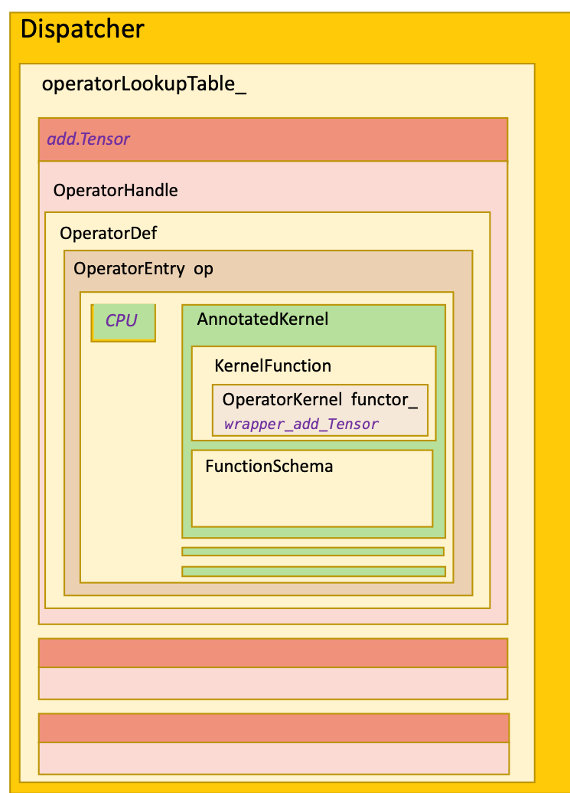

# 代码生成

- [为什么需要代码生成][#为什么需要代码生成]
- [依赖代码生成的文件](#依赖代码生成的文件)
- [算子的声明](#算子的声明)
- [ATen代码生成](#ATen代码生成)
- [算子注册代码生成](#算子注册代码生成)


## 为什么需要代码生成

依照Pytorch podcast上的说法，使用代码生成方式的好处有：
- 更好的语法表示，主要是指native_functions.yaml，JIT schema，derivatives.yaml这几个文件。实现算子时，除了算子本身的实现代码外，需要添加的内容很少并且很直观。
- 更好的错误信息。如果使用C++模板，哪里出错确实很难控制，而且错误信息怎么写也是个问题。
- 更容易组织复杂的代码。可能是因为PyTorch的架构设计的原因，从Python API到C++算子调用的路径确实很长，中间转换很多，不可避免的会有很多各种中间格式的封装，这种事本来就不适合开发者自己做。用模板也许也可以，但估计会比较繁琐。
- 更易于调试。这个真正调试过的小伙伴会深有感触。

当然代码生成也带来一些缺点：
- 一致性差点，没有模板好。
- 代码生成实现了一个简单版本的类型系统，但相比C++可能还是弱了一些。（这一点我也还不太理解）

当然，不管是代码生成还是用模板，最终目标还是为了减少整体的代码量，以及隐藏算子开发的细节，使开发者能够将精力放到算子本身的实现逻辑上。


### 代码生成的主要目标

对于每一个算子，为了算子能够可用，除了算子本身的实现逻辑外，我们还需要实现下面这些功能：
- 支持相应的Python API
- 支持C++的前端
- 支持自动微分
- 将算子注册到dispatcher
- 支持JIT
- 其他杂七杂八的功能

### PyTorch的Dispatcher机制



## 依赖代码生成的文件

大多数研究PyTorch实现机制的开发者会把重点放在算子的实现机制上，因此在浏览代码时，会特意关注算子的源码，但是在Python的API和C++的算子实现直接，我们很难找到一条清晰的调用路径，原因一方面在于PyTorch通过dispatching机制分发算子的调用，另一方面也在与有大量的代码是在编译器阶段生成的，当然从设计上来讲这两部分也是息息相关的。

如果我们比较编译前后的文件，会发现除了普通的编译生成的目标文件之外，另外生成了很多新的源文件，主要生成的文件在以下这些目录：

```Bash
./torch/csrc/autograd/generated
./torch/csrc/lazy/generated
./torch/include/torch/csrc/autograd/generated
./torch/include/torch/csrc/lazy/generated
./torch/testing/_internal/generated
./torch/lib/python3.7/site-packages/caffe2/CMakeFiles/torch_cpu.dir/__/torch/csrc/autograd/generated
./torch/lib/python3.7/site-packages/caffe2/CMakeFiles/torch_cpu.dir/__/torch/csrc/lazy/generated
./torch/lib/python3.7/site-packages/caffe2/torch/CMakeFiles/torch_python.dir/csrc/autograd/generated
./build/aten/src/ATen
./build/aten/src/ATen/core
./build/aten/src/ATen/native
./build/aten/src/ATen/native/cpu
./build/aten/src/ATen/native/quantized/cpu
./build/caffe2/CMakeFiles/torch_cpu.dir/__/torch/csrc/autograd/generated
./build/caffe2/CMakeFiles/torch_cpu.dir/__/torch/csrc/lazy/generated
./build/caffe2/torch/CMakeFiles/torch_python.dir/csrc/autograd/generated
./build/third_party/benchmark/src/generated
./build/third_party/ideep/mkl-dnn/third_party/oneDNN/src/generated
./build/lib.linux-x86_64-3.7/torch/include/torch/csrc/autograd/generated
./build/lib.linux-x86_64-3.7/torch/testing/_internal/generated
```
后面我们会对其中关键的文件及生成过程进行介绍。


## ATen代码生成

ATen的native函数是PyTorch目前主推的operator机制，作为对比，老旧的TH/THC函数（使用cwrap定义）将逐渐被ATen的native替代。ATen的native函数声明在native_functions.yaml文件中，然后实现在ATen/native目录下。移植AdaptiveMaxPooling2d op需要修改这个yaml文件。

### 工具代码
这部分生成的工具位于torchgen下
```Bash
├── api
│   ├── autograd.py
│   ├── cpp.py
│   ├── dispatcher.py
│   ├── functionalization.py
│   ├── __init__.py
│   ├── lazy.py
│   ├── meta.py
│   ├── native.py
│   ├── python.py
│   ├── structured.py
│   ├── translate.py
│   ├── types.py
│   ├── ufunc.py
│   └── unboxing.py
├── BUILD.bazel
├── BUILD.buck
├── build.bzl
├── code_template.py
├── context.py
├── decompositions
│   └── gen_jit_decompositions.py
├── dest
│   ├── __init__.py
│   ├── lazy_ir.py
│   ├── lazy_ts_lowering.py
│   ├── native_functions.py
│   ├── register_dispatch_key.py
│   └── ufunc.py
├── gen_backend_stubs.py
├── gen_functionalization_type.py
├── gen_lazy_tensor.py
├── gen.py
├── __init__.py
├── local.py
├── model.py
├── native_function_generation.py
├── operator_versions
│   ├── gen_mobile_upgraders_constant.py
│   ├── gen_mobile_upgraders.py
│   └── __init__.py
├── packaged
│   └── ATen
│       ├── native
│       │   ├── native_functions.yaml
│       │   └── tags.yaml
│       └── templates
│           ├── aten_interned_strings.h
│           ├── ATenOpList.cpp
│           ├── CompositeViewCopyKernels.cpp
│           ├── DispatchKeyFunction.h
│           ├── DispatchKeyFunctions.h
│           ├── DispatchKeyFunctions_inl.h
│           ├── DispatchKeyNativeFunctions.cpp
│           ├── DispatchKeyNativeFunctions.h
│           ├── FunctionalInverses.h
│           ├── Function.h
│           ├── Functions.cpp
│           ├── Functions.h
│           ├── LazyIr.h
│           ├── MethodOperators.h
│           ├── NativeFunction.h
│           ├── NativeFunctions.h
│           ├── NativeMetaFunction.h
│           ├── NativeMetaFunctions.h
│           ├── Operator.h
│           ├── Operators.cpp
│           ├── Operators.h
│           ├── RedispatchFunctions.cpp
│           ├── RedispatchFunctions.h
│           ├── RegisterBackendSelect.cpp
│           ├── RegisterCodegenUnboxedKernels.cpp
│           ├── RegisterDispatchKey.cpp
│           ├── RegisterFunctionalization.cpp
│           ├── RegisterSchema.cpp
│           ├── RegistrationDeclarations.h
│           ├── TensorBody.h
│           ├── TensorMethods.cpp
│           ├── UfuncCPU.cpp
│           ├── UfuncCPUKernel.cpp
│           ├── UfuncCUDA.cu
│           ├── UnboxingFunctions.cpp
│           └── UnboxingFunctions.h
├── selective_build
│   ├── __init__.py
│   ├── operator.py
│   └── selector.py
├── shape_functions
│   └── gen_jit_shape_functions.py
├── static_runtime
│   ├── config.py
│   ├── generator.py
│   ├── gen_static_runtime_ops.py
│   └── __init__.py
└── utils.py

```

这部分代码生成的入口在gen.py中，调用的时候直接调用torchgen.main()即可。其主要参数包括：
- source-path: 缺省为aten/src/ATen，代表ATen源代码的路径
- install_dir: 缺省为build/aten/src/ATen，代表输出的路径

### 生成的文件
最终生成的文件如下：
```Bash

#build/aten/src/ATen
CompositeExplicitAutogradFunctions.h      MetaFunctions.h          RegisterBackendSelect.cpp                RegisterQuantizedCPU.cpp
CompositeExplicitAutogradFunctions_inl.h  MetaFunctions_inl.h      RegisterCompositeExplicitAutograd.cpp    RegisterQuantizedCUDA.cpp
CompositeImplicitAutogradFunctions.h      MethodOperators.h        RegisterCompositeImplicitAutograd.cpp    RegisterSchema.cpp
CompositeImplicitAutogradFunctions_inl.h  NativeFunctions.h        RegisterCPU.cpp                          RegisterSparseCPU.cpp
CompositeViewCopyKernels.cpp              NativeMetaFunctions.h    RegisterCUDA.cpp                         RegisterSparseCsrCPU.cpp
core                                      Operators_0.cpp          RegisterFunctionalization_0.cpp          RegisterSparseCsrCUDA.cpp
CPUFunctions.h                            Operators_1.cpp          RegisterFunctionalization_1.cpp          RegisterSparseCUDA.cpp
CPUFunctions_inl.h                        Operators_2.cpp          RegisterFunctionalization_2.cpp          RegisterZeroTensor.cpp
CUDAFunctions.h                           Operators_3.cpp          RegisterFunctionalization_3.cpp          RegistrationDeclarations.h
CUDAFunctions_inl.h                       Operators_4.cpp          RegisterFunctionalizationEverything.cpp  UfuncCPU_add.cpp
Declarations.yaml                         OperatorsEverything.cpp  RegisterMeta.cpp                         UfuncCPUKernel_add.cpp
FunctionalInverses.h                      Operators.h              RegisterMkldnnCPU.cpp                    UfuncCUDA_add.cu
Functions.cpp                             ops                      RegisterNestedTensorCPU.cpp
Functions.h                               RedispatchFunctions.h    RegisterNestedTensorCUDA.cpp

#build/aten/src/ATen/core
aten_interned_strings.h  ATenOpList.cpp  TensorBody.h  TensorMethods.cpp

```

### 生成代码与自定义代码的关系


#### 算子声明

代码生成的核心是算子的声明，PyTorch中所有的算子都定义在native_functions.yaml中，以算子torch.add(a, b, out=c)为例，其声明如下：
```yaml
- func: add.out(Tensor self, Tensor other, *, Scalar alpha=1, Tensor(a!) out) -> Tensor(a!)
  device_check: NoCheck   # TensorIterator
  structured: True
  structured_inherits: TensorIteratorBase
  dispatch:
    CPU, CUDA: add_out
    SparseCPU: add_out_sparse_cpu
    SparseCUDA: add_out_sparse_cuda
    SparseCsrCPU: add_out_sparse_csr_cpu
    SparseCsrCUDA: add_out_sparse_csr_cuda
    MkldnnCPU: mkldnn_add_out
```


每个算子都有自己的Schema（如"func"所定义的），Schema有三种类型：
- functional。输出结果是一个新创建的对象
- inplace。操作直接在self上进行，不会创建新的对象。
- out。调用者提供名为out的输出参数，输出结果保存在该参数内。

在PyTorch中有一些算子和另一个算子功能完全相同，只是名称不同，例如arctanh和atanh，absolute和abs，对于这种情况，可以用alias来指明。

```yaml
# Note [Adding an alias]
# To add an alias do the following:
#
# 1) Copy the original functions native_functions.yaml entry, but replace the
#      original function's name with their own and delete any dispatch
#      keys for the aliases. Specifying a dispatch key will prevent
#      autograd from recording the operations the alias performs, which
#      will stop it from "inheriting" the original operation's autograd behavior.
# 2) Implement the corresponding functions and have them redispatch to the
#      original function.
# 3) Add docstrings to the new function that reference the original function,
#      and document the method as usual (if it exists.)
#    (See torch/_torch_docs.py and docs/source/torch.rst if adding a function,
#     torch/_tensor_docs.py and docs/source/tensors.rst if adding a method,
#     or module-specific doc bindings (like torch/linalg/__init__.py) if
#     adding an alias in a namespace.)
# 4) Update torch/overrides.py consistent with the original function.
# 5) Update the alias_map in torch/csrc/jit/passes/normalize_ops.cpp.
# 6) Add aliases argument to existing OpInfo/UnaryUfuncInfo or create new OpInfo/UnaryUfuncInfo entry
# in op_db list in torch/testing/_internal/common_methods_invocations.py
#
# See torch.absolute, an alias for torch.abs, as an example.
```

### Structured Kernel
Structured Kernel 是一类特殊的函数，这类函数一定有基础形式和出参(out)两种形式，也可能会支持inplace变体

### 算子实现

ATen算子的核心代码也是在aten/src/ATen下，


### 生成过程

#### 生成Register<DispatchKey>.cpp
我们可以看到生成的文件中有很多RegisterXXX.cpp，其中XXX代表每一种PyTorch所支持的Backend。这些文件使用的模板可以在生成器目录下找到，下面代码忽略了头文件的部分：
```C++
// torchgen/packaged/ATen/templates/RegisterDispatchKey.cpp

$extra_cuda_headers
$external_backend_headers
$dispatch_headers
$ops_headers
// 这几项是头文件部分，生成器根据需要放置必要的头文件，例如对于backend为CPU的情况，就不用生成CUDA的头文件。 $ops_headers是每个算子所需要的头文件，所以占了所有头文件的绝大部分。
namespace at {

// NB: TORCH_LIBRARY_IMPL must be in an anonymous namespace to avoid
// ambiguity with conflicting identifiers that may have been defined in
// at namespace already.
namespace {

${dispatch_helpers}
// 这里会放置一些和dispatch相关的工具函数，如对输出参数的创建，调整大小等。

${dispatch_anonymous_definitions}

${static_init_dispatch_registrations}

} // anonymous namespace

${deferred_dispatch_registrations}

namespace ${dispatch_namespace} {

// 所有的算子都声明在当前的namespace中。
${dispatch_namespaced_definitions}

} // namespace ${dispatch_namespace}

} // namespace at
```


相应的，我们看一下生成后的代码，以RegisterCPU.cpp为例，为了方便阅读，这里忽略头文件部分，并且只保留了一种算子：

```C++ 
// build/aten/src/ATen/RegisterCPU.cpp

namespace at {

// NB: TORCH_LIBRARY_IMPL must be in an anonymous namespace to avoid
// ambiguity with conflicting identifiers that may have been defined in
// at namespace already.
namespace {

${dispatch_helpers}

struct structured_sgn_out_functional final : public at::native::structured_sgn_out {
    void set_output_strided...
    void set_output_raw_strided...
    const Tensor& maybe_get_output...
    std::array<c10::ExclusivelyOwned<Tensor>, 1> outputs_;
};

at::Tensor wrapper_sgn(const at::Tensor & self) {
structured_sgn_out_functional op;
op.meta(self);
op.impl(self, *op.outputs_[0]);
return std::move(op.outputs_[0]).take();
}

${static_init_dispatch_registrations}

} // anonymous namespace

${deferred_dispatch_registrations}

namespace ${dispatch_namespace} {

${dispatch_namespaced_definitions}

} // namespace ${dispatch_namespace}

} // namespace at
```


##### C++ API
##### Python API
##### 基于device的dispatcher注册
##### 基于算子名称的dispatcher注册

在core/ATenOpList.cpp中，生成了所有op的OperatorName列表。
```C++
// core/core.h
bool is_custom_op(const c10::OperatorName& opName) {
  static std::unordered_set<std::pair<const char*, const char*>, OpNameHash, OpNameEquals> ops {
    {"aten::_cast_Byte", ""},

```

在core/TensorBody.h中，生成了算子的定义：
```C++
// core/TensorBody.h
namespace at {

class TORCH_API Tensor: public TensorBase {

  at::Tensor abc(const at::Scalar & other, const at::Scalar & alpha=1) const;
  at::Tensor add(const at::Scalar & other, const at::Scalar & alpha=1) const;
};

namespace at {

// aten::abc.Scalar(Tensor self, Scalar other, Scalar alpha=1) -> Tensor
inline at::Tensor Tensor::abc(const at::Scalar & other, const at::Scalar & alpha) const {
    return at::_ops::abc_Scalar::call(const_cast<Tensor&>(*this), other, alpha);
}

// aten::add.Scalar(Tensor self, Scalar other, Scalar alpha=1) -> Tensor
inline at::Tensor Tensor::add(const at::Scalar & other, const at::Scalar & alpha) const {
    return at::_ops::add_Scalar::call(const_cast<Tensor&>(*this), other, alpha);
}
}
```
在Operators_2.cpp中，生成了处理算子分发后调用实际算子实现的代码：

```C++
// Operators_2.cpp

STATIC_CONST_STR_OUT_OF_LINE_FOR_WIN_CUDA(abc_Scalar, name, "aten::abc")
STATIC_CONST_STR_OUT_OF_LINE_FOR_WIN_CUDA(abc_Scalar, overload_name, "Scalar")
STATIC_CONST_STR_OUT_OF_LINE_FOR_WIN_CUDA(abc_Scalar, schema_str, "abc.Scalar(Tensor self, Scalar other, Scalar alpha=1) -> Tensor")

// aten::abc.Scalar(Tensor self, Scalar other, Scalar alpha=1) -> Tensor
static C10_NOINLINE c10::TypedOperatorHandle<abc_Scalar::schema> create_abc_Scalar_typed_handle() {
  return c10::Dispatcher::singleton()
      .findSchemaOrThrow(abc_Scalar::name, abc_Scalar::overload_name)
      .typed<abc_Scalar::schema>();
}

// aten::abc.Scalar(Tensor self, Scalar other, Scalar alpha=1) -> Tensor
at::Tensor abc_Scalar::call(const at::Tensor & self, const at::Scalar & other, const at::Scalar & alpha) {
    
    static auto op = create_abc_Scalar_typed_handle();
    return op.call(self, other, alpha);
}

// aten::abc.Scalar(Tensor self, Scalar other, Scalar alpha=1) -> Tensor
at::Tensor abc_Scalar::redispatch(c10::DispatchKeySet dispatchKeySet, const at::Tensor & self, const at::Scalar & other, const at::Scalar & alpha) {
    
    static auto op = create_abc_Scalar_typed_handle();
    return op.redispatch(dispatchKeySet, self, other, alpha);
}

STATIC_CONST_STR_OUT_OF_LINE_FOR_WIN_CUDA(add_Scalar, name, "aten::add")
STATIC_CONST_STR_OUT_OF_LINE_FOR_WIN_CUDA(add_Scalar, overload_name, "Scalar")
STATIC_CONST_STR_OUT_OF_LINE_FOR_WIN_CUDA(add_Scalar, schema_str, "add.Scalar(Tensor self, Scalar other, Scalar alpha=1) -> Tensor")

// aten::add.Scalar(Tensor self, Scalar other, Scalar alpha=1) -> Tensor
static C10_NOINLINE c10::TypedOperatorHandle<add_Scalar::schema> create_add_Scalar_typed_handle() {
  return c10::Dispatcher::singleton()
      .findSchemaOrThrow(add_Scalar::name, add_Scalar::overload_name)
      .typed<add_Scalar::schema>();
}

// aten::add.Scalar(Tensor self, Scalar other, Scalar alpha=1) -> Tensor
at::Tensor add_Scalar::call(const at::Tensor & self, const at::Scalar & other, const at::Scalar & alpha) {
    
    static auto op = create_add_Scalar_typed_handle();
    return op.call(self, other, alpha);
}

// aten::add.Scalar(Tensor self, Scalar other, Scalar alpha=1) -> Tensor
at::Tensor add_Scalar::redispatch(c10::DispatchKeySet dispatchKeySet, const at::Tensor & self, const at::Scalar & other, const at::Scalar & alpha) {
    
    static auto op = create_add_Scalar_typed_handle();
    return op.redispatch(dispatchKeySet, self, other, alpha);
}
```
在RedispatchFunctions.h中，生成了处理算子分发后调用实际算子实现的代码：

```C++
// RedispatchFunctions.h

namespace at {
namespace redispatch {

    // aten::abc.Scalar(Tensor self, Scalar other, Scalar alpha=1) -> Tensor
    TORCH_API inline at::Tensor abc(c10::DispatchKeySet dispatchKeySet, const at::Tensor & self, const at::Scalar & other, const at::Scalar & alpha=1) {
        return at::_ops::abc_Scalar::redispatch(dispatchKeySet, self, other, alpha);
    }
    
    // aten::add.Scalar(Tensor self, Scalar other, Scalar alpha=1) -> Tensor
    TORCH_API inline at::Tensor add(c10::DispatchKeySet dispatchKeySet, const at::Tensor & self, const at::Scalar & other, const at::Scalar & alpha=1) {
        return at::_ops::add_Scalar::redispatch(dispatchKeySet, self, other, alpha);
    }
}
}
```

在RegisterSchema.cpp中，生成了注册算子schema的代码：

```C++
// RegisterSchema.cpp

namespace at {
TORCH_LIBRARY(aten, m) {

  m.def("abc.Scalar(Tensor self, Scalar other, Scalar alpha=1) -> Tensor");
  m.def("add.Scalar(Tensor self, Scalar other, Scalar alpha=1) -> Tensor");

}
}  // namespace at

```

RegistrationDeclarations.h中，生成了待注册算子的定义及其schema：
```C++
// RegistrationDeclarations.h

Tensor abc(const Tensor & self, const Scalar & other, const Scalar & alpha); // {"schema": "aten::abc.Scalar(Tensor self, Scalar other, Scalar alpha=1) -> Tensor", "dispatch": "True", "default": "True"}
Tensor add(const Tensor & self, const Scalar & other, const Scalar & alpha); // {"schema": "aten::add.Scalar(Tensor self, Scalar other, Scalar alpha=1) -> Tensor", "dispatch": "True", "default": "True"}

```

RegisterCompositeExplicitAutograd.cpp.h中，生成了算子函数的封装对象：
```C++
// RegisterCompositeExplicitAutograd.cpp.h

namespace {

at::Tensor wrapper_Scalar_abc_Scalar(const at::Tensor & self, const at::Scalar & other, const at::Scalar & alpha) {
    // No device check

  // DeviceGuard omitted
  return at::native::abc(self, other, alpha);
}

} // anonymous namespace
namespace {

at::Tensor wrapper_Scalar_add_Scalar(const at::Tensor & self, const at::Scalar & other, const at::Scalar & alpha) {
    // No device check

  // DeviceGuard omitted
  return at::native::add(self, other, alpha);
}

} // anonymous namespace

TORCH_LIBRARY_IMPL(aten, CompositeExplicitAutograd, m) {

    m.impl("abc.Scalar",
    TORCH_FN(wrapper_Scalar_abc_Scalar));
    
    m.impl("add.Scalar",
    TORCH_FN(wrapper_Scalar_add_Scalar));
}

namespace compositeexplicitautograd {

at::Tensor abc(const at::Tensor & self, const at::Scalar & other, const at::Scalar & alpha) {
return wrapper_Scalar_abc_Scalar(self, other, alpha);
}

at::Tensor add(const at::Tensor & self, const at::Scalar & other, const at::Scalar & alpha) {
return wrapper_Scalar_add_Scalar(self, other, alpha);
}

}
```


``` Python
# Welcome to the ATen code generator v2!  The ATen code generator is
# responsible for parsing native_functions.yaml and then generating
# various generated files (e.g., TypeDefault.cpp) based on the operators
# defined in this file.  This means that the code generator knows how to
# parse function schema, and then translate this into various C++ types
# and boilerplate code.
#
# Some things to know about this file when you modify it:
#
# - This file has STRICT mypy typechecking.  Typecheck it with
#   `mypy --config mypy-strict.ini` in the root source directory
#
# - Most of the heavy lifting lives in external modules:
#   - 'model' has the data model for native_functions.yaml.  The classes
#     in those file represent what you see when you look at
#     a native_functions.yaml
#   - 'api' has conversions for how to translate JIT schema into
#     the various C++ APIs that the codegen interacts with.  There
#     are in fact THREE different C++ APIs: the public C++ API,
#     the dispatcher API, and the legacy disaptcher API.  See each
#     of these respective files for more information
```

### 相关代码
代码生成相关的工具在tools目录下：
```Bash
├── autograd
│   ├── gen_annotated_fn_args.py
│   ├── gen_autograd_functions.py
│   ├── gen_autograd.py
│   ├── gen_inplace_or_view_type.py
│   ├── gen_python_functions.py
│   ├── gen_trace_type.py
│   ├── gen_variable_factories.py
│   ├── gen_variable_type.py
│   └── templates
│       ├── ADInplaceOrViewType.cpp
│       ├── annotated_fn_args.py.in
│       ├── Functions.cpp
│       ├── Functions.h
│       ├── python_fft_functions.cpp
│       ├── python_functions.cpp
│       ├── python_functions.h
│       ├── python_linalg_functions.cpp
│       ├── python_nn_functions.cpp
│       ├── python_return_types.cpp
│       ├── python_sparse_functions.cpp
│       ├── python_special_functions.cpp
│       ├── python_torch_functions.cpp
│       ├── python_variable_methods.cpp
│       ├── TraceType.cpp
│       ├── variable_factories.h
│       ├── VariableType.cpp
│       └── VariableType.h
├── code_analyzer
│   ├── gen_operators_yaml.py
│   ├── gen_oplist.py
│   └── gen_op_registration_allowlist.py
├── generated_dirs.txt
├── jit
│   ├── gen_unboxing.py
│   └── templates
│       ├── aten_schema_declarations.cpp
│       └── external_functions_codegen_template.cpp
├── setup_helpers
│   ├── generate_code.py
│   ├── gen.py
│   ├── gen_unboxing.py
│   ├── gen_version_header.py

```

我们先看几个重要的文件：

- generated_dirs.txt： 这个文件里列举了编译过程中自动生成的代码所在的路径，当前版本中该文件的内容如下：
``` Python
torch/csrc/autograd/generated/      # 自动微分相关的代码
torch/csrc/jit/generated/           # JIT相关的代码
build/aten/src/ATen                 # aten算子相关的代码
```
- setup_helpers/generate_code.py: 这个文件中函数generate_code()是代码生成的入口。等下我们会沿着这个入口梳理代码生成的逻辑。
- 

### 代码生成的流程

generate_code.py主要做三件事情：
- 生成pybindings，也就是算子的Python接口
- 生成libtorch
- 生成annotated


#### 生成pybindings
代码生成沿着以下的流程进行：
<ol>
<li> 调用tools/autograd/gen_autograd.py中的函数gen_autograd_python，这个函数输入参数
NATIVE_FUNCTIONS_PATH = "aten/src/ATen/native/native_functions.yaml"
TAGS_PATH = "aten/src/ATen/native/tags.yaml"
    <ol>
    <li> native_functions_path: native functions的定义
    <li> derivatives.yaml: 这里定义了算子及其相应微分算子的关系
    <li> templates: 
    <li> deprecated.yaml: 定义了哪些是已经过时，不再建议使用的算子
    </ol>
    之后会调用函数gen_python_functions.gen()执行代码生成的操作。这个函数用于生成ATen算子的Python接口，包括torch._C下nn、_fft、_linalg、_sparse以及_special下对象的方法。这个函数的工作流程如下：
    <ol>
    <li>解析native_functions.yaml和tags.yaml的内容，生成native函数列表
    <li>根据函数定义生成函数的签名
    <li>读取deprecated.yaml，得到过时的函数及相应签名
    <li>调用FileManager.write_with_template()生成对应函数的代码，生成的过程中要用到模板文件 python_variable_methods.cpp。


native_functions.yaml文件中，


在模板文件python_variable_methods中，包含了很多手写的代码，包括头文件定义和函数定义，中间留了一些位置，用于放置生成的代码。比如如下的片段：
```C++
#define TORCH_ASSERT_ONLY_METHOD_OPERATORS
// ${generated_comment}

// ...
#include <stdexcept>

#ifndef AT_PER_OPERATOR_HEADERS
#include <ATen/Functions.h>
#else
$ops_headers
#endif

//...

// generated methods start here

${py_methods}

static PyObject * THPVariable_bool_scalar(PyObject* self, PyObject* args) {

//...

  {"tolist", THPVariable_tolist, METH_NOARGS, NULL},
  {"type", castPyCFunctionWithKeywords(THPVariable_type), METH_VARARGS | METH_KEYWORDS, NULL},
  ${py_method_defs}
  {NULL}
};
```

其中的关键变量是py_methods，这个变量包含了很多函数的定义，其中每个函数是根据模板字符串生成的，如下是其中一种模板：
```C++
// tools/autograd/gen_python_functions.py

PY_VARIABLE_METHOD_VARARGS = CodeTemplate(
    r"""\
// ${name}
static PyObject * ${pycname}(PyObject* self_, PyObject* args, PyObject* kwargs)
{
  ${method_header}
  static PythonArgParser parser({
    ${signatures}
  }, /*traceable=*/${traceable});

  ParsedArgs<${max_args}> parsed_args;
  auto _r = parser.parse(${self_}, args, kwargs, parsed_args);
  ${check_has_torch_function}
  switch (_r.idx) {
    ${dispatch}
  }
  ${method_footer}
}

"""
)
```

其中每个变量都是根据原始的native_functions.yaml中的函数定义生成的，例如对于
```Python
def get_pycname(name: BaseOperatorName) -> str:
    return f"THPVariable_{name}"
```

根据这个模板生成的函数代码大概是下面这样：
```C++
//torch/csrc/autograd/generated/python_variable_methods.cpp

static PyObject * THPVariable_add(PyObject* self_, PyObject* args, PyObject* kwargs)
{
  HANDLE_TH_ERRORS
  const Tensor& self = THPVariable_Unpack(self_);
  static PythonArgParser parser({
    "add(Scalar alpha, Tensor other)|deprecated",
    "add(Tensor other, *, Scalar alpha=1)",
  }, /*traceable=*/true);

  ParsedArgs<2> parsed_args;
  auto _r = parser.parse(self_, args, kwargs, parsed_args);
  if(_r.has_torch_function()) {
    return handle_torch_function(_r, self_, args, kwargs, THPVariableClass, "torch.Tensor");
  }
  switch (_r.idx) {
    case 0: {
      // [deprecated] aten::add.Tensor(Tensor self, Tensor other, *, Scalar alpha=1) -> Tensor

      auto dispatch_add = [](const at::Tensor & self, const at::Scalar & alpha, const at::Tensor & other) -> at::Tensor {
        pybind11::gil_scoped_release no_gil;
        return self.add(other, alpha);
      };
      return wrap(dispatch_add(self, _r.scalar(0), _r.tensor(1)));
    }
    case 1: {
      // aten::add.Tensor(Tensor self, Tensor other, *, Scalar alpha=1) -> Tensor

      auto dispatch_add = [](const at::Tensor & self, const at::Tensor & other, const at::Scalar & alpha) -> at::Tensor {
        pybind11::gil_scoped_release no_gil;
        return self.add(other, alpha);
      };
      return wrap(dispatch_add(self, _r.tensor(0), _r.scalar(1)));
    }
  }
  Py_RETURN_NONE;
  END_HANDLE_TH_ERRORS
}
```

#### 生成libtorch
#### 生成annotated


自动微分一直被视为深度学习框架的核心能力，在训练深度学习神经网络的时候，网络的参数需要根据输出端的梯度不断的调整，如果没有自动微分，我们必须为每个算子指定一个根据梯度调节参数的计算方法，由于这种计算方法不像前向转播中算子的公式那样直接明了，手工实现就成为了几乎不可能完成的任务。最早的深度学习框架Theano吸引人的一个主要优点就是支持自动微分，因此在现今流行的深度学习框架中，自动微分已经成为了必不可少的内置功能。
