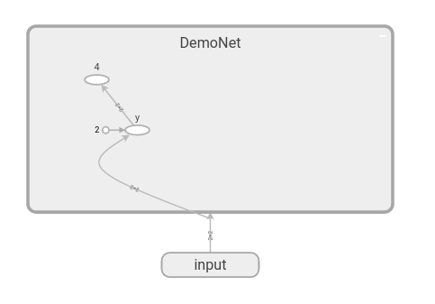
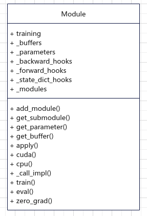

# 基于C++的算子实现

## 基本内容
本章内容主要回答以下几个问题：
<ol>
<li>神经网络的基本结构</li>
<li>深度学习框架时如何执行计算图的</li>
<li>计算图执行过程中的基本数据结构</li>
<li>PyTorch中的具体实现</li>
</ol>

    - 一个简单的例子
    - 算子调用的过程
    - Dispatcher机制
    - 如何注册新的算子
    - 参考：在PyTorch中实现新的算子

## 实现原生的算子


## 神经网络的基本结构
深度学习解决的是深度神经网络的优化问题，虽然深度神经网络的模型种类繁多，从最简单的MLP模型到近年流行的Transformer模型，其计算模式可以统一表示成有向无环图(DAG)的形式，比如


```python
import torch
from torch import nn

class DemoNet(nn.Module):
    def __init__(self):
        super(DemoNet, self).__init__()
        self.w = torch.rand(2,2)
    def forward(self, x):
        y = self.w * x
        return y * y

input = torch.rand(2, 2)
model = DemoNet()
```
使用TensorBoard查看该网络的可视化，如下图：


其中y处是一个算子”Operation: aten::mul“

虽然上面只是最简单的一个例子，但也包括了神经网络作为有向无环图的基本结构：
- 顶点：代表一个输入数据、算子、或者输出数据
- 边：代表数据和算子、算子和算子之间的输入输出关系。

深度神经网络包括结果的前向计算过程和梯度的反向传播过程，显而易见的是，深度学习框架需要事先构造计算图，然后再执行计算。这里有两个选择：
- 根据代码逻辑，构造好一个计算图，之后这个计算图可以反复执行
- 每次在执行时，都重新构造好计算图

PyTorch选择的是第二种方式，也就是动态图的方式。动态图的好处是可以在代码逻辑中使用各种条件判断。

## PyTorch中计算图的实现

虽然不是所有的计算图都通过上面的例子中的nn.Module来实现，但nn.Module确实是PyTorch中神经网络的基础结构，因此我们可以先看一下nn.Module的具体实现，然后在深入到PyTorch的底层进行探查。

```Python
# torch/nn/modules/module.py

class Module:
    r"""Base class for all neural network modules.
    ...
    """

     training: bool
    _is_full_backward_hook: Optional[bool]

    def __init__(self) -> None:
        """
        Initializes internal Module state, shared by both nn.Module and ScriptModule.
        """
        torch._C._log_api_usage_once("python.nn_module")

        self.training = True
        self._parameters: Dict[str, Optional[Parameter]] = OrderedDict()
        self._buffers: Dict[str, Optional[Tensor]] = OrderedDict()
        self._non_persistent_buffers_set: Set[str] = set()
        self._backward_hooks: Dict[int, Callable] = OrderedDict()
        self._is_full_backward_hook = None
        self._forward_hooks: Dict[int, Callable] = OrderedDict()
        self._forward_pre_hooks: Dict[int, Callable] = OrderedDict()
        self._state_dict_hooks: Dict[int, Callable] = OrderedDict()
        self._load_state_dict_pre_hooks: Dict[int, Callable] = OrderedDict()
        self._load_state_dict_post_hooks: Dict[int, Callable] = OrderedDict()
        self._modules: Dict[str, Optional['Module']] = OrderedDict()

    forward: Callable[..., Any] = _forward_unimplemented

```

Module类的主要属性及方法如下：



一个神经网络，最重要的是其内部的参数，在Module中有两个属性和参数相关：_parameters和_buffers，它们的类型都是Dict，区别在于_parameters是可以更新的参数，而_buffers不需要更新。

从定义上看，_buffers中存放的是Tensor类型的数据，而_parameters中存放的是Parameter类型的数据，在构造时参数requires_grad缺省为True

```Python
# torch/nn/parameter.py

class Parameter(torch.Tensor, metaclass=_ParameterMeta):
    def __new__(cls, data=None, requires_grad=True):
        # ......
```

当构造好Parameter并且赋值给nn.Module时，会自动调用nn.Module的register_parameter()方法进行注册。

```Python
# torch/nn/modules/module.py

class Module:

    def __setattr__(self, name: str, value: Union[Tensor, 'Module']) -> None:

        params = self.__dict__.get('_parameters')
        if isinstance(value, Parameter):
            self.register_parameter(name, value)
        # handle value with other types

```

为了看的更清楚一些，我们看一下PyTorch中内置的网络组件，例如：

```Python
# torch/nn/modules/conv.py

class _ConvNd(Module):

    __constants__ = ['stride', 'padding', 'dilation', 'groups',
                     'padding_mode', 'output_padding', 'in_channels',
                     'out_channels', 'kernel_size']
    __annotations__ = {'bias': Optional[torch.Tensor]}

    def _conv_forward(self, input: Tensor, weight: Tensor, bias: Optional[Tensor]) -> Tensor:
        ...

    _in_channels: int
    _reversed_padding_repeated_twice: List[int]
    out_channels: int
    kernel_size: Tuple[int, ...]
    stride: Tuple[int, ...]
    padding: Union[str, Tuple[int, ...]]
    dilation: Tuple[int, ...]
    transposed: bool
    output_padding: Tuple[int, ...]
    groups: int
    padding_mode: str
    weight: Tensor
    bias: Optional[Tensor]

    def __init__(self,
                 in_channels: int,
                 out_channels: int,
                 kernel_size: Tuple[int, ...],
                 stride: Tuple[int, ...],
                 padding: Tuple[int, ...],
                 dilation: Tuple[int, ...],
                 transposed: bool,
                 output_padding: Tuple[int, ...],
                 groups: int,
                 bias: bool,
                 padding_mode: str,
                 device=None,
                 dtype=None) -> None:
        super(_ConvNd, self).__init__()
        
        # check and handle padding and other parameter...

        if transposed:
            self.weight = Parameter(torch.empty(
                (in_channels, out_channels // groups, *kernel_size), **factory_kwargs))
        else:
            self.weight = Parameter(torch.empty(
                (out_channels, in_channels // groups, *kernel_size), **factory_kwargs))
        if bias:
            self.bias = Parameter(torch.empty(out_channels, **factory_kwargs))
        else:
            self.register_parameter('bias', None)

        self.reset_parameters()
```

## 计算图的执行过程

在深度学习中，我们的神经网络一般是基于nn.Module实现的，典型的调用方式是：
```Python
    y = DemoNet(x)
    loss = compute_loss(y, label)
```

可见计算图的执行其实就是nn.Module的调用过程，从下面的实现中可以看出，主要的工作就是调用forward()方法进行计算，这也是我们在实现自己的神经网络时所要实现的。

```Python
# torch/nn/modules/module.py

class Module:

    def _call_impl(self, *input, **kwargs):
        forward_call = (self._slow_forward if torch._C._get_tracing_state() else self.forward)

        # YL: handle pre-forward hooks, you can change input here
        # ...

        result = forward_call(*input, **kwargs)
        # YL: handle forward hooks
        # ...

        # Handle the non-full backward hooks
        # ...

        return result

    __call__ : Callable[..., Any] = _call_impl

```

相应的，我们可以看一下卷积操作的实现：

```Python
# torch/nn/modules/conv.py

from .. import functional as F

class Conv2d(_ConvNd):

    ## YL： __init__() implemetation here


    def _conv_forward(self, input: Tensor, weight: Tensor, bias: Optional[Tensor]):
        if self.padding_mode != 'zeros':
            return F.conv2d(F.pad(input, self._reversed_padding_repeated_twice, mode=self.padding_mode),
                            weight, bias, self.stride,
                            _pair(0), self.dilation, self.groups)
        return F.conv2d(input, weight, bias, self.stride,
                        self.padding, self.dilation, self.groups)

    def forward(self, input: Tensor) -> Tensor:
        return self._conv_forward(input, self.weight, self.bias)

```

由此可见，卷积算子的实现调用了functional模块中的卷积函数。这也说明，在PyTorch中，神经网络的定义和算子的执行是解耦的，这样做的好处很明显，我们可以很容易的替换或者复用各种定义好的网络及算子。


Dispatch


## 参考
- https://zhuanlan.zhihu.com/p/89442276
