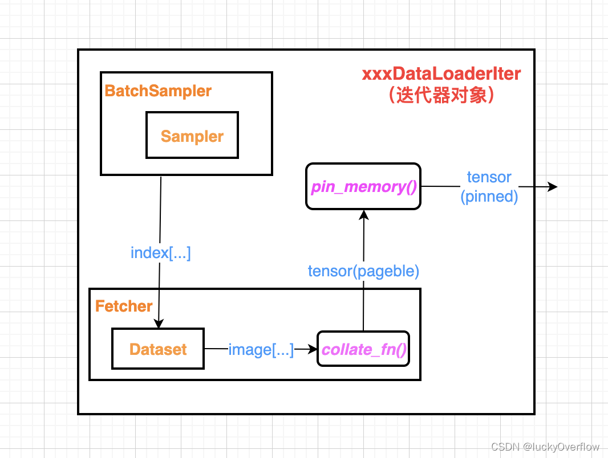
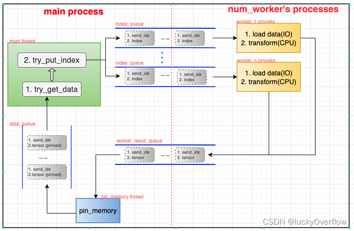
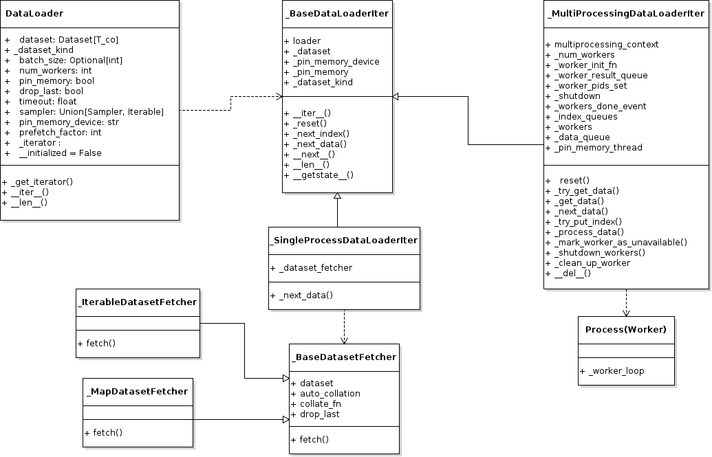

# 数据加载

## 主要内容

数据的加载主要包括以下几个方面：
- 数据集的格式转换，需要支持各种类型各种格式的数据，如图片、语音、文本、表格等
- 数据的采样和shuffle，可能面临分布式的挑战。
- 数据增强，会产生额外的数据
- 数据预处理，如图片事先进行黑白二值化等
- 数据分batch
- 数据加载到内存，并且进入锁页内存
- 数据加载到GPU
- 数据分发给不同的计算单元，并且不会重复，且支持分布式训练

## 相关的源代码

DistributedSampler

torch/utils/dataset.py

## 模型训练中的数据集

下面我们先看一个利用CIFAR10数据集进行模型训练的例子：

```Python

transform_train = transforms.Compose([
    transforms.RandomCrop(32, padding=4),
    transforms.RandomHorizontalFlip(),
    transforms.ToTensor(),
    transforms.Normalize((0.4914, 0.4822, 0.4465), (0.2023, 0.1994, 0.2010)),
])

transform_test = transforms.Compose([
    transforms.ToTensor(),
    transforms.Normalize((0.4914, 0.4822, 0.4465), (0.2023, 0.1994, 0.2010)),
])

trainset = torchvision.datasets.CIFAR10(
    root='./data', train=True, download=True, transform=transform_train)
trainloader = torch.utils.data.DataLoader(
    trainset, batch_size=128, shuffle=True, num_workers=2)

# Model
print('==> Building model..')
net = SENet18()
net = net.to(device)
if device == 'cuda':
    net = torch.nn.DataParallel(net)
    cudnn.benchmark = True

criterion = nn.CrossEntropyLoss()
optimizer = optim.SGD(net.parameters(), lr=args.lr,
                      momentum=0.9, weight_decay=5e-4)
scheduler = torch.optim.lr_scheduler.CosineAnnealingLR(optimizer, T_max=200)

# Training
def train(epoch):
    print('\nEpoch: %d' % epoch)
    net.train()
    train_loss = 0
    correct = 0
    total = 0
    for batch_idx, (inputs, targets) in enumerate(trainloader):
        inputs, targets = inputs.to(device), targets.to(device)
        optimizer.zero_grad()
        outputs = net(inputs)
        loss = criterion(outputs, targets)
        loss.backward()
        optimizer.step()


for epoch in range(start_epoch, start_epoch+200):
    train(epoch)
    scheduler.step()

```

在这个例子中，训练使用的是torch.utils.data.DataLoader，我们先从DataLoader入手，看看PyTorch是如何管理数据的。

当前业界普遍使用GPU进行模型训练，GPU的吞吐率很高，很容易导致数据的加载成为瓶颈。因此PyTorch的DataLoader支持多个worker同时加载数据。相应地，DataLoader的迭代器有两类：_SingleProcessDataLoaderIter处理单个worker的情况，而_MultiProcessingDataLoaderIter处理多个worker的情况。

因为是单进程处理，_SingleProcessDataLoaderIter的处理逻辑相对清晰，主要的工作是读取数据的Fetcher和pin_memory()这两部分。


在多进程的情况下，最耗费时间的Fetcher部分和pin_memory()部分改成了多进程，如下图：





```Python
#Harry  torch/utils/data/dataloader.py

class DataLoader(Generic[T_co]):
    dataset: Dataset[T_co]
    batch_size: Optional[int]
    num_workers: int
    pin_memory: bool
    drop_last: bool
    timeout: float
    sampler: Union[Sampler, Iterable]
    pin_memory_device: str
    prefetch_factor: int
    _iterator : Optional['_BaseDataLoaderIter']
    __initialized = False

    def _get_iterator(self) -> '_BaseDataLoaderIter':
        if self.num_workers == 0:
            return _SingleProcessDataLoaderIter(self)
        else:
            self.check_worker_number_rationality()
            return _MultiProcessingDataLoaderIter(self)


```

我们在训练模型的时候，一般是把DataLoader当作迭代器来使用，缺省情况下DataLoader只使用一个进程来读取数据，所返回的迭代器
称为_SingleProcessDataLoaderIter，但是当计算速度比较快，比如使用GPU或者多卡进行训练时，为了加快数据加载的速度，我们可
以设置DataLoader使用多进程进行读取，此时DataLoader返回的迭代器称为_MultiProcessingDataLoaderIter。由于要协调进程间
数据的读取，其实现略微复杂一些。

```Python
# torch/utils/data/dataloader.py

class _MultiProcessingDataLoaderIter(_BaseDataLoaderIter):
    def __init__(self, loader):
        super(_MultiProcessingDataLoaderIter, self).__init__(loader)

        assert self._num_workers > 0
        assert self._prefetch_factor > 0

        if loader.multiprocessing_context is None:
            multiprocessing_context = multiprocessing
        else:
            multiprocessing_context = loader.multiprocessing_context

        self._worker_init_fn = loader.worker_init_fn
        # No certainty which module multiprocessing_context is
        self._worker_result_queue = multiprocessing_context.Queue()  # type: ignore[var-annotated]
        self._worker_pids_set = False
        self._shutdown = False
        self._workers_done_event = multiprocessing_context.Event()

        self._index_queues = []
        self._workers = []
        for i in range(self._num_workers):
            # No certainty which module multiprocessing_context is
            index_queue = multiprocessing_context.Queue()  # type: ignore[var-annotated]
            # Need to `cancel_join_thread` here!
            # See sections (2) and (3b) above.
            index_queue.cancel_join_thread()
            w = multiprocessing_context.Process(
                target=_utils.worker._worker_loop,
                args=(self._dataset_kind, self._dataset, index_queue,
                      self._worker_result_queue, self._workers_done_event,
                      self._auto_collation, self._collate_fn, self._drop_last,
                      self._base_seed, self._worker_init_fn, i, self._num_workers,
                      self._persistent_workers, self._shared_seed))
            w.daemon = True
            # NB: Process.start() actually take some time as it needs to
            #     start a process and pass the arguments over via a pipe.
            #     Therefore, we only add a worker to self._workers list after
            #     it started, so that we do not call .join() if program dies
            #     before it starts, and __del__ tries to join but will get:
            #     AssertionError: can only join a started process.
            w.start()
            self._index_queues.append(index_queue)
            self._workers.append(w)

        if self._pin_memory:
            self._pin_memory_thread_done_event = threading.Event()

            # Queue is not type-annotated
            self._data_queue = queue.Queue()  # type: ignore[var-annotated]
            pin_memory_thread = threading.Thread(
                target=_utils.pin_memory._pin_memory_loop,
                args=(self._worker_result_queue, self._data_queue,
                      torch.cuda.current_device(),
                      self._pin_memory_thread_done_event, self._pin_memory_device))
            pin_memory_thread.daemon = True
            pin_memory_thread.start()
            # Similar to workers (see comment above), we only register
            # pin_memory_thread once it is started.
            self._pin_memory_thread = pin_memory_thread
        else:
            self._data_queue = self._worker_result_queue

        # In some rare cases, persistent workers (daemonic processes)
        # would be terminated before `__del__` of iterator is invoked
        # when main process exits
        # It would cause failure when pin_memory_thread tries to read
        # corrupted data from worker_result_queue
        # atexit is used to shutdown thread and child processes in the
        # right sequence before main process exits
        if self._persistent_workers and self._pin_memory:
            import atexit
            for w in self._workers:
                atexit.register(_MultiProcessingDataLoaderIter._clean_up_worker, w)

        # .pid can be None only before process is spawned (not the case, so ignore)
        _utils.signal_handling._set_worker_pids(id(self), tuple(w.pid for w in self._workers))  # type: ignore[misc]
        _utils.signal_handling._set_SIGCHLD_handler()
        self._worker_pids_set = True
        self._reset(loader, first_iter=True)

```

在_MultiProcessingDataLoaderIter初始化的时候，就会同python multiprocessing库创建多个子进程，每个子进程都在执行_worker_loop()函数。


在多进程中环境中，不能使用Python标准库中的Queue。需要使用进程安全的multiprocessing.Queue，和其他语言的多进程队列类似，multiprocessing.Queue提供可能阻塞的get方法，以及不会阻塞的get_nowait()方法。在队列为空的时候，get_nowait()方法会抛一个Empty异常。

进程安全的Queue是_MultiProcessDataLoaderIter中主进程及各个worker子进程之间传递消息的通道，包括以下几种：
- index_queue。存放数据为(send_idx, index)，由main_thread生产，worker_1～n_process消费。其中send_idx是main_thread维护的记录任务顺序和数量的计数器，每发送一个index到index_queue中，send_idx便会加一，具体用途后续解释。
- worker_result_queue。存放数据为(send_idx, pageble tensor)，由worker_1~n_process产生，pin_memory_thread消费。
- data_queue。存放数据为(send_idx, pinned tensor)，由- pin_memory_thread产生，main_thread消费。


—

### 设计原则1. DataLoader -> Dataset


## 参考

- 万字综述，核心开发者全面解读PyTorch内部机制 https://zhuanlan.zhihu.com/p/67834038
- https://blog.csdn.net/u013608424/article/details/123782284