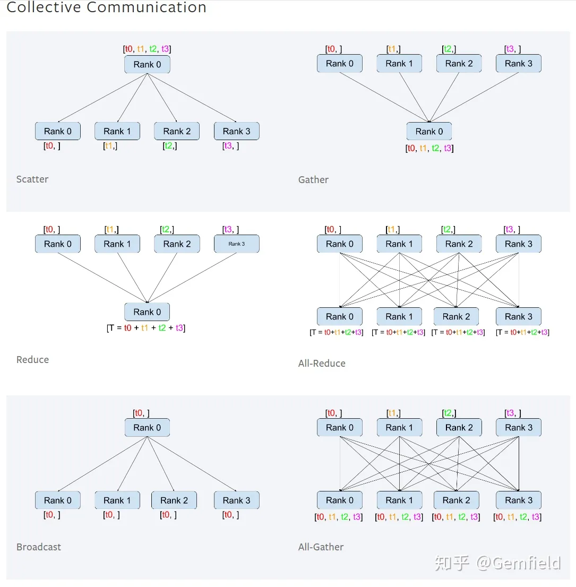

# 分布式

- [为什么需要分布式训练？](#为什么需要分布式训练？)
- [数据并行与模型并行](#数据并行与模型并行)
- [Horovod](#Horovod)
- [NCCL](#NCCL)
- [PyTorch中的分布式训练](#PyTorch中的分布式训练)
    - [torch.multiprocessing](#torch.multiprocessing)
    - [torch.distributedDataParallel（DP）](#torch.distributedDataParallel（DP）)
    - [DistributedDataParallel（DDP）](#DistributedDataParallel（DDP）)
    - [torch.distributed.rpc](#torch.distributed.rpc)
- [参考](#参考)

## 为什么需要分布式训练？

### 分布式计算
由于单个节点的计算能力有限，对于计算密集型的任务，只在单个节点上运行，可能会花费非常多的时间，此时充分利用多个节点协作完成任务是最合适的选择。
将任务从单节点转化为分布式任务，需要考虑不同节点间的通信，包括输入数据的拆分，临时数据的分发与归并，计算结果的合并，以及计算过程中的同步控制等等，而这些因素由于任务类型的多样化，也会变得非常复杂，没有完美的方案可以处理不同的情况，因此在特定类型的任务下采用不同的解决方案也是必然的。

为了简化算法开发的复杂度，将分布式计算中的数据分发和网络通信与具体的算法应用分开，先驱们开发了不同的分布式计算框架，应用较广的包括MPI、MapReduce、Spark等，在科学研究领域的高性能计算、互联网时代的海量数据处理和分析场景中，这些框架已经成为不可替代的基础软件。

在深度学习领域，模型的效果主要来自于两个方面：海量的数据和精心设计的复杂网络结构，这两点使得深度学习模型训练的计算复杂度很高，而且随着近些年超大模型取得了令人惊叹的效果，这个趋势也随之愈演愈烈，如下图：


<font size=2 style='italic'>来源：Compute Trends Across Three Eras of Machine Learning</font>

## 数据并行与模型并行

### 数据并行

### 模型并行

## Horovod

## NCCL

## PyTorch中的分布式训练

### torch.multiprocessing

对于分布式训练来说，不可避免的要在多个进程（本地或远程）之间传递数据，对PyTorch来说，传递的主要是Tensor。因此事先分布式训练的基础之一就是对Tensor的序列化。

torch.multiprocessing模块是对Python的multiprocessing模块的简单封装，并且定义了新的reducer，基于共享内存提供了不同进程对同一份数据的访问。如果某个Tensor被移动到了共享内存，其他的进程就可以直接访问而不需要任何的拷贝操作。

从设计上讲，torch.multiprocessing完全兼容python的multiprocessing模块。

```Python
import torch.multiprocessing as mp
from model import MyModel

def train(model):
    for data, labels in data_loader:
        optimizer.zero_grad()
        loss_fn(model(data), labels).backward()
        optimizer.step()  #会更新共享内存中的权重

if __name__ == '__main__':
    num_processes = 4
    model = MyModel()
    #在下面fork新进程之前必须做share_memory的调用
    model.share_memory()
    processes = []
    for rank in range(num_processes):
        p = mp.Process(target=train, args=(model,))
        p.start()
        processes.append(p)
    for p in processes:
        p.join()
```

Python本身的multiprocessing库是支持对象的序列化的，但并不是所有对象都可以，Tensor有自己的特殊的storage_成员变量，因此PyTorch需要针对Tensor实现自定义的reduce处理。在multiprocessing模块的初始化过程中，调用了init_reductions()函数，注册了Cuda Event、Tensor，Tensor Storage等序列化方法，

PyTorch中有很多Tensor的子类型，可以通过torch._tensor_classes查看，如下：

```Python
import torch
print(torch._tensor_classes)
{<class 'torch.cuda.ShortTensor'>, <class 'torch.cuda.sparse.DoubleTensor'>, <class 'torch.cuda.sparse.ShortTensor'>, <class 'torch.BFloat16Tensor'>, <class 'torch.cuda.FloatTensor'>, <class 'torch.cuda.HalfTensor'>, <class 'torch.LongTensor'>, <class 'torch.sparse.CharTensor'>, <class 'torch.sparse.LongTensor'>, <class 'torch.cuda.sparse.ByteTensor'>, <class 'torch.cuda.sparse.IntTensor'>, <class 'torch.cuda.sparse.BFloat16Tensor'>, <class 'torch.sparse.IntTensor'>, <class 'torch.sparse.BFloat16Tensor'>, <class 'torch.cuda.sparse.FloatTensor'>, <class 'torch.cuda.sparse.HalfTensor'>, <class 'torch.cuda.ByteTensor'>, <class 'torch.cuda.IntTensor'>, <class 'torch.cuda.BoolTensor'>, <class 'torch.ShortTensor'>, <class 'torch.sparse.DoubleTensor'>, <class 'torch.sparse.ShortTensor'>, <class 'torch.cuda.sparse.CharTensor'>, <class 'torch.cuda.sparse.LongTensor'>, <class 'torch.cuda.CharTensor'>, <class 'torch.cuda.LongTensor'>, <class 'torch.cuda.BFloat16Tensor'>, <class 'torch.FloatTensor'>, <class 'torch.ByteTensor'>, <class 'torch.HalfTensor'>, <class 'torch.sparse.FloatTensor'>, <class 'torch.sparse.HalfTensor'>, <class 'torch.sparse.ByteTensor'>, <class 'torch.CharTensor'>, <class 'torch.DoubleTensor'>, <class 'torch.cuda.DoubleTensor'>, <class 'torch.IntTensor'>, <class 'torch.BoolTensor'>}
>>> print(torch._storage_classes)
{<class 'torch.IntStorage'>, <class 'torch.cuda.ComplexFloatStorage'>, <class 'torch.QUInt4x2Storage'>, <class 'torch.HalfStorage'>, <class 'torch.cuda.BFloat16Storage'>, <class 'torch.QInt8Storage'>, <class 'torch.cuda.HalfStorage'>, <class 'torch.ComplexFloatStorage'>, <class 'torch.cuda.ShortStorage'>, <class 'torch.FloatStorage'>, <class 'torch.BFloat16Storage'>, <class 'torch.cuda.LongStorage'>, <class 'torch.ByteStorage'>, <class 'torch.cuda.DoubleStorage'>, <class 'torch.ShortStorage'>, <class 'torch.LongStorage'>, <class 'torch.cuda.ComplexDoubleStorage'>, <class 'torch.QInt32Storage'>, <class 'torch.cuda.BoolStorage'>, <class 'torch.QUInt8Storage'>, <class 'torch.cuda.CharStorage'>, <class 'torch.cuda.ByteStorage'>, <class 'torch.ComplexDoubleStorage'>, <class 'torch.cuda.IntStorage'>, <class 'torch.DoubleStorage'>, <class 'torch.BoolStorage'>, <class 'torch.cuda.FloatStorage'>, <class 'torch.CharStorage'>}
```

```Python
# torch/multiprocessing/reductions.py

def init_reductions():
    ForkingPickler.register(torch.cuda.Event, reduce_event)

    for t in torch._storage_classes:
        if t.__name__ == '_UntypedStorage':
            ForkingPickler.register(t, reduce_storage)
        else:
            ForkingPickler.register(t, reduce_typed_storage_child)

    ForkingPickler.register(torch.storage._TypedStorage, reduce_typed_storage)

    for t in torch._tensor_classes:
        ForkingPickler.register(t, reduce_tensor)

    # TODO: Maybe this should be in tensor_classes? :)
    ForkingPickler.register(torch.Tensor, reduce_tensor)
    ForkingPickler.register(torch.nn.parameter.Parameter, reduce_tensor)
```

下面我们看一下对于storage的序列化过程。
```Python
def reduce_storage(storage):
    from . import get_sharing_strategy
    if storage.is_cuda:
        raise RuntimeError("Cannot pickle CUDA storage; try pickling a CUDA tensor instead")
    elif get_sharing_strategy() == 'file_system':
        metadata = storage._share_filename_cpu_()
        cache_key = metadata[1]
        rebuild = rebuild_storage_filename
        if isinstance(storage, torch._TypedStorage):
            metadata += (storage.dtype,)
        storage._shared_incref()
    elif storage.size() == 0:
        # This is special cased because Empty tensors
        # (with size 0) cannot be mmapped.
        return (rebuild_storage_empty, (type(storage),))
    else:
        fd, size = storage._share_fd_cpu_()
        df = multiprocessing.reduction.DupFd(fd)
        cache_key = fd_id(fd)
        metadata = (df, size)
        rebuild = rebuild_storage_fd  # type: ignore[assignment]

    shared_cache[cache_key] = StorageWeakRef(storage)
    return (rebuild, (type(storage),) + metadata)
```

> 但是这种多进程的工作方式在遇到CUDA时有很多局限性，这导致了很多比较突兀的使用限制和代码编写方式：它规定了发送tensor的进程必须怎么怎么样、规定了接收tensor的进程必须怎么怎么样、规定了生产tensor的进程的生命周期必须怎么怎么样、限制不能转发收到的tensor......以至于这些条件只要有一个没有遵守，在CUDA上的multiprocessing就会出现预期之外的行为。为了突破这些限制和掣肘，DataParallel到来了。


### DataParallel（DP）

```Python
#数据集的长度为100，batch size为32，fc层的输入是5，输出是2
input_size = 5
output_size = 2

batch_size = 32
data_size = 100

model = Model(input_size, output_size)
if torch.cuda.device_count() > 1:
    print("Gemfield have ", torch.cuda.device_count(), "GPUs!")
    model = nn.DataParallel(model)

device = torch.device("cuda:0" if torch.cuda.is_available() else "cpu")
model.to(device)
rand_loader = DataLoader(dataset=RandomDataset(input_size, data_size),batch_size=batch_size, shuffle=True)

for data in rand_loader:
    input = data.to(device)
    output = model(input)
    print("Outside: input size", input.size(),"output_size", output.size())
```
本来batch_size是32，但是由于使用了DataParallel，而Gemfield有2个GPU，因此一个batch被划分成了2份，也就是tensor.split(16)，分别送往两个GPU上。值得注意的是：在第一次调用

model.to(device)

的时候，模型被加载到了第一个GPU设备上，而在第一次调用

output = model(input)

的时候（也就是在进行forward的时候），模型被复制到了其余的GPU上，这里是第2个GPU。程序输出如下（可见大小为32的batch被拆分成了大小为16的batch）

我们来总结下DataParallel一次迭代的过程:

    DataLoader把数据通过多个worker读到主进程的内存中；通过tensor的split语义，将一个batch的数据切分成多个更小的batch，然后分别送往不同的CUDA设备；在不同的cuda设备上完成前向计算，网络的输出被gather到主CUDA设备上（初始化时使用的设备），loss而后在这里被计算出来；loss然后被scatter到每个CUDA设备上，每个CUDA设备通过BP计算得到梯度；然后每个CUDA设备上的梯度被reduce到主CUDA设备上，然后模型权重在主CUDA设备上获得更新；在下一次迭代之前，主CUDA设备将模型参数broadcast到其它CUDA设备上，完成权重参数值的同步。

上述步骤提到的gather、reduce、scatter、broadcast都是来自MPI为代表的并行计算世界的概念，其中broadcast是主进程将相同的数据分发给组里的每一个其它进程；scatter是主进程将数据的每一小部分给组里的其它进程；gather是将其它进程的数据收集过来；reduce是将其它进程的数据收集过来并应用某种操作（比如SUM），在gather和reduce概念前面还可以加上all，如all_gather，all_reduce，那就是多对多的关系了，如下图所示（注意reduce的操作不一定是SUM，PyTorch目前实现了SUM、PRODUCT、MAX、MIN这四种）：



DataParallel通过复制一个网络到多个cuda设备，然后再split一个batch的data到多个cuda设备，通过这种并行计算的方式解决了batch很大的问题，但也有自身的不足：

    它无法跨越机器，DataParallel是单进程多线程的，无法在多个机器上工作；它基于多线程的方式，确实方便了信息的交换，但受困于GIL；数据集先拷贝到主进程，然后再split到每个CUDA设备上；权重参数只在主CUDA上更新，需要每次迭代前向所有的CUDA设备做一次同步；每次迭代的网络输出需要gather到主的CUDA设备上；如果模型太大需要使用model parallel的时候，DataParallel目前还不支持；

这个时候，DistributedDataParallel来了，并且自此之后，不管是单机还是多机，我们都推荐使用DDP来代替DP（DataParallel）。


### DistributedDataParallel（DDP）
### torch.distributed.rpc

## 参考
- PyTorch的分布式 https://zhuanlan.zhihu.com/p/136372142
- 周末漫谈——Pytorch MultiProcessing的Custom Reduction https://zhuanlan.zhihu.com/p/397498221

