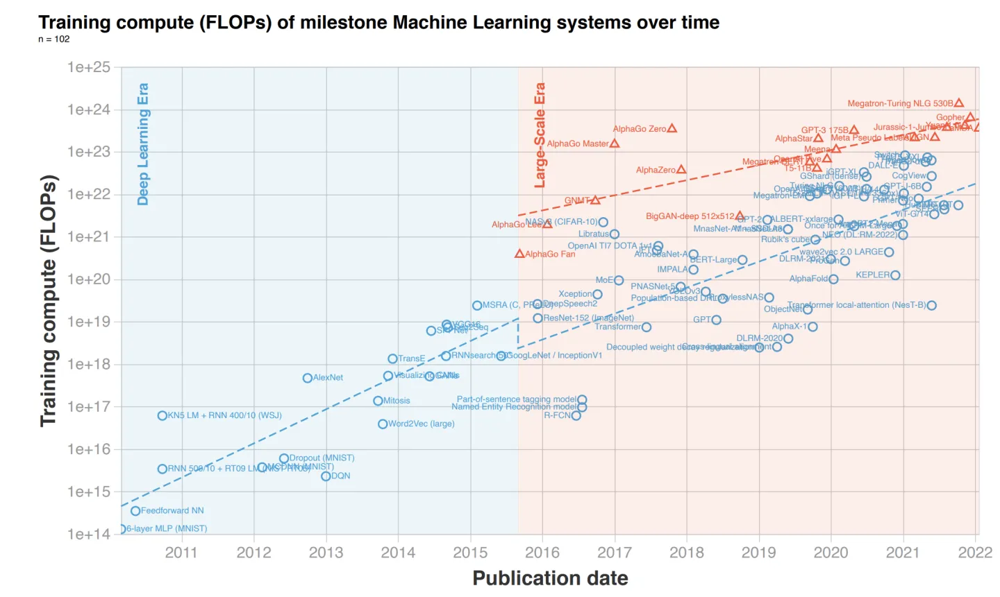
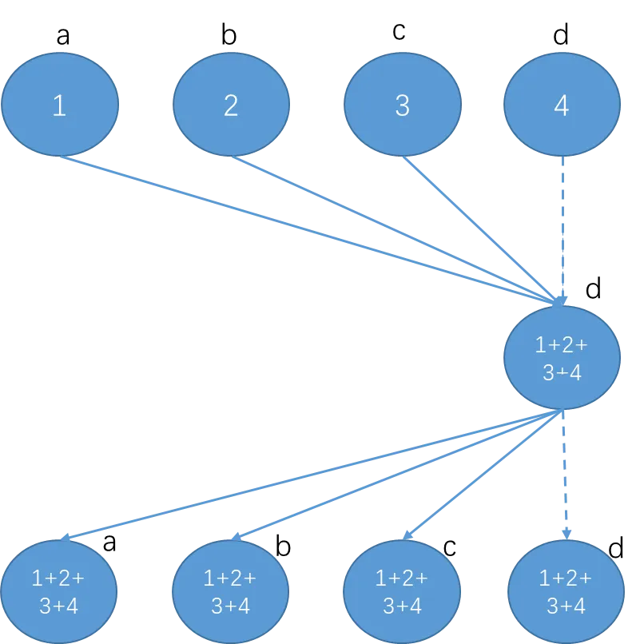
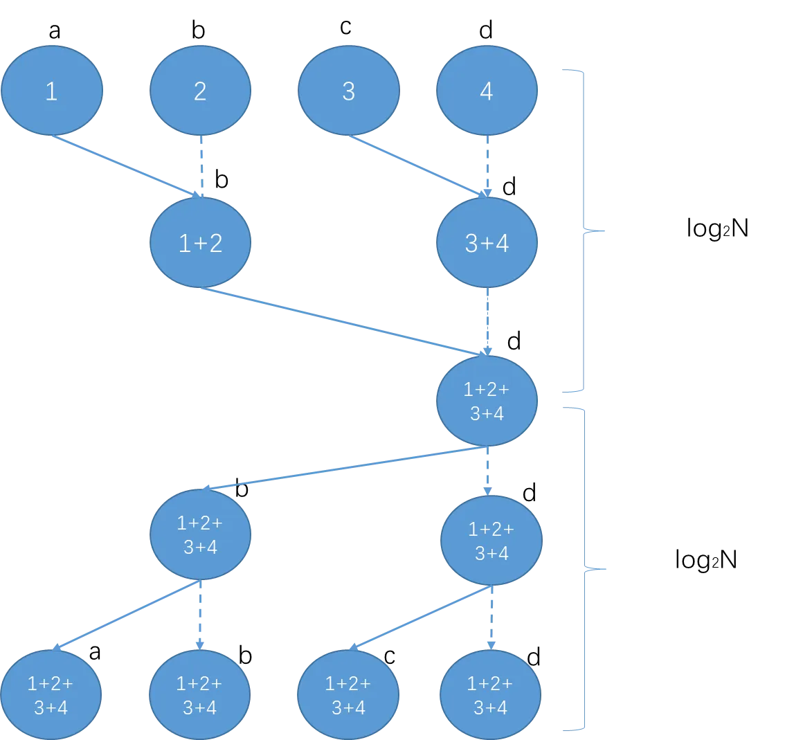
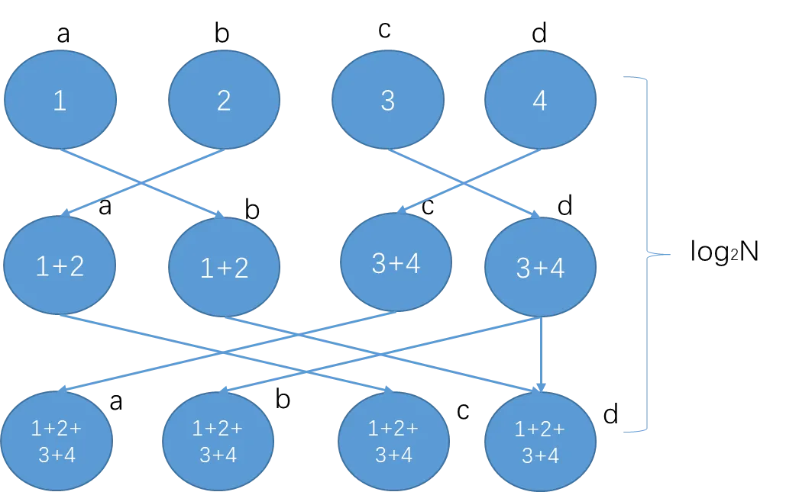
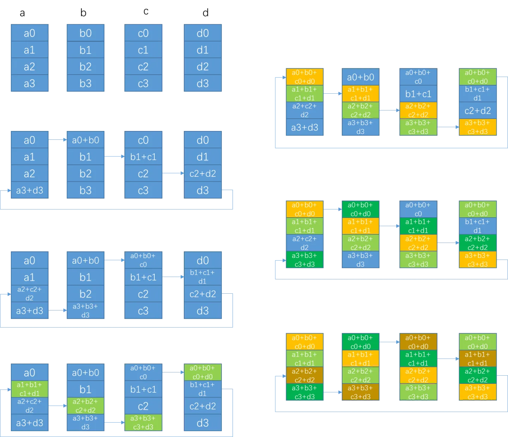

# 分布式

- [为什么需要分布式训练？](#为什么需要分布式训练？)
- [数据并行与模型并行](#数据并行与模型并行)
    - [MPI通信标准](#MPI通信标准)
    - [AllReduce](#AllReduce)
- [NCCL](#NCCL)
- [Gloo](#Gloo)
- [Horovod](#Horovod)
- [PyTorch中的分布式训练](#PyTorch中的分布式训练)
    - [torch.multiprocessing](#torch.multiprocessing)
    - [torch.distributedDataParallel（DP）](#torch.distributedDataParallel（DP）)
    - [DistributedDataParallel（DDP）](#DistributedDataParallel（DDP）)
    - [torch.distributed.rpc](#torch.distributed.rpc)
- [参考](#参考)

## 为什么需要分布式训练？

### 分布式计算
由于单个节点的计算能力有限，对于计算密集型的任务，只在单个节点上运行，可能会花费非常多的时间，此时充分利用多个节点协作完成任务是最合适的选择。
将任务从单节点转化为分布式任务，需要考虑不同节点间的通信，包括输入数据的拆分，临时数据的分发与归并，计算结果的合并，以及计算过程中的同步控制等等，而这些因素由于任务类型的多样化，也会变得非常复杂，没有完美的方案可以处理不同的情况，因此在特定类型的任务下采用不同的解决方案也是必然的。

为了简化算法开发的复杂度，将分布式计算中的数据分发和网络通信与具体的算法应用分开，先驱们开发了不同的分布式计算框架，应用较广的包括MPI、MapReduce、Spark等，在科学研究领域的高性能计算、互联网时代的海量数据处理和分析场景中，这些框架已经成为不可替代的基础软件。

在深度学习领域，模型的效果主要来自于两个方面：海量的数据和精心设计的复杂网络结构，这两点使得深度学习模型训练的计算复杂度很高，而且随着近些年超大模型取得了令人惊叹的效果，这个趋势也随之愈演愈烈，如下图：


<font size=2 style='italic'>来源：Compute Trends Across Three Eras of Machine Learning</font>

业界流行的训练方法是使用mini-batch SGD，每一次迭代包括以下几个步骤：
- 从数据集中读取一个mini-batch，batch-size可以根据数据集、模型、GPU卡的显存容量等自行设置。
- 使用模型进行前向计算得到输出。
- 根据损失函数和数据集的label，计算损失。
- 根据损失进行反向传播，得到各个参数的梯度。
- 利用优化算法对参数进行梯度更新。

这个过程对于单机单卡训练来说是很自然的，但是很多场景下数据集都比较大，需要使用多卡甚至多机并行来加速。

## 数据并行训练
数据并行是为应对数据集过大而提出的很自然的一种加速方法，其思想是将数据集拆分成多份，分发给不同的计算单元，每个计算单元根据自己的数据分别进行模型的训练。从数据集的消耗上看，加速是很明显的。

但是对于深度学习模型来说，我们要训练的是一个最终的高精度模型，而不是多个不同的低精度模型，因此在训练过程中，需要在不同的计算单元间进行模型参数的同步，由此会带来额外的通信负担，从而影响性能。另外由于深度学习模型训练的特殊性，不同的同步方式也会影响到收敛的速度及模型的精度，因此产生了多种多样的数据并行的模式。

### MPI通信标准

虽然深度学习模型的训练不一定要基于MPI来实现，但是作为几十年来最为流行的数据通信标准，MPI定义的很多概念仍然被新的框架广泛使用，因此有必要在这里再简要回顾一下。

MPI由MPI Forum创建并维护，截至目前成熟的版本是4.0，但MPI Forum正在讨论5.0的标准，5.0的重点预计是在持久化通信及Buffered Pool上。

MPI定义了一系列与语言无关、平台无关的API接口，用于跨节点跨进程的不同地址空间之间的消息传递。但MPI标准也定义了一些相关的扩展，例如集合操作、远程内存访问操作、动态进程创建、并行I/O等，所有的操作都被定义为函数、子例程或方法。由于C语言和Fortran语言在科学计算领域的广泛使用，MPI标准也定义了相关的C语言及Fortran语言的接口。

MPI支持多种通信模式，比较重要的是点到点通信(Point-to-Point)和集合通信(Collective)，每种通信的支持阻塞式和非阻塞式两种操作模型。

在MPI中，一般在每个进程上启动的都是同一份程序（当然也可以不同），但是不同节点被分配了不同的标识（rank），这样不同的节点实际的运行逻辑是不同的。

点到点通信，主要是指两个对应的通信端点之间的数据传输，例如下面是阻塞式的数据发送和接收的函数定义（C语言）：
int MPI_Send(const void *buf, int count, MPI_Datatype datatype, int dest,int tag, MPI_Comm comm)
int MPI_Recv(void *buf, int count, MPI_Datatype datatype, int source, int tag, MPI_Comm comm, MPI_Status *status)

集合通信，指的是一组进程之间的数据发送和接收，包括以下几种操作：
- 进程之间的屏障同步（Barrier synchronization）
int MPI_Barrier(MPI_Comm comm);
- 将数据从一个进程广播给组内所有进程(Broadcast)
int MPI_Bcast(void* buffer, int count, MPI_Datatype datatype, int root, MPI_Comm comm);
- 将数据从组内进程收集到一个进程中(Gather)
int MPI_Gather(void* sendbuf, int sendcount, MPI_Datatype sendtype, void* recvbuf, int recvcount, MPI_Datatype recvtype, int root,  MPI_Comm comm);
int MPI_Gatherv(void* sendbuf, int sendcount, MPI_Datatype sendtype, void* recvbuf, int recvcounts, int *displs, MPI_Datatype recvtype, int root,  MPI_Comm comm);
- 将数据从一个进程分给组内所有进程(Scatter)
int MPI_Scatter(void* sendbuf, int sendcount, MPI_Datatype sendtype, void* recvbuf, int recvcount, MPI_Datatype recvtype, int root, MPI_Comm comm);
- 从组内进程收集数据，并发给所有的进程（AllGather)
int MPI_Allgather(void* sendbuf, int sendcount, MPI_Datatype, sendtype, void* recvbuf, int recvcount, MPI_Datatype recvtype, MPI_Comm comm);
- 从组内进程分发/收集（Scatter/Gather ）数据，并发给所有组内进程(AlltoAll)
int MPI_AlltoAll(void* sendbuf, int sendcount, MPI_Datatype, sendtype, void* recvbuf, int recvcount, MPI_Datatype recvtype, MPI_Comm comm);
- 全局归约（sum/max/min等），并把结果发给所有进程或其中一个进程(Reduce)
int MPI_Reduce(void* sendbuf, void* recvbuf, int count, MPI_Datatype, datatype, MPI_Op op, int root, MPI_Comm comm);
int MPI_Allreduce(void* sendbuf, void* recvbuf, int count, MPI_Datatype, datatype, MPI_Op op, int root, MPI_Comm comm);

- 归约和分发的组合操作(Reduce and Scatter)
int MPI_Reduce_scatter(void* sendbuf, void* recvbuf, int recvcounts, MPI_Datatype, datatype, MPI_Op op, int root, MPI_Comm comm);


### AllReduce

在MPI标准定义的多个操作中，AllReduce操作是Allgather的一种，并且AllReduce操作也是深度学习中非常重要的通信原语。如果要支持数据并行，回顾前面模型训练的几个基本步骤可以看出：
- 不同节点处理的数据不同，因此前向计算后得到的结果是不同的
- 可以有多种计算最终模型的方式，例如将所有结果收集到一个节点后统一计算梯度，
- 或者在不同节点上分别计算梯度，再将梯度统一收集到一个节点
- 在一个节点上更新参数后，需要向其他节点同步更新后的模型参数

这个过程和AllReduce的语义非常吻合，因此在分布式深度学习模型训练的场景下，大家更多时候会关注如何高效实现AllReduce操作，尤其是在数据量很大、模型很大的同时保证迭代的效率。

#### reduce+broadcast
AllReduce最直观的一种实现方式如下图所示，parameter server作为中心节点，先全局reduce接收所有其他节点的数据，经过本地计算后，再broadcast回所有其他节点。其中实线表示真实发生了的通信；而虚线表示只是示意，并没有实际通信。


为了比较不同实现的效率，业界有一个通用的计算方法，用α表示2个通信节点间的latency， S(ize)表示要allreduce的数据块大小， B(andwidth)表示2个通信节点间的带宽， C(omputation)表示每字节数据的计算耗时。另外以N(umber)表示节点个数。据此对于reduce+broadcast的实现方式，总的耗时为：
$$T = 2*(α + S/B) + N*S*C$$
很明显，因为数据都汇总到第四个节点上，该节点的带宽将成为瓶颈。

#### recursive halving and doubling
reduce+broadcast的方式中，大量的数据传输发生在最后一个节点上，在传输过程中，其余节点的带宽并没有被利用起来，因此为了避免单节点的带宽瓶颈，可以采用recursive halving and doubling的算法，这是经典的树形算法，过程如下图：


在这种情况下，如果节点数是2的幂，所需通信步数是$2*log_2N$，我们假设在传输后会马上在目标节点进行计算，那么总体的耗时为：

$$ T = 2*log_2N*(α + S/B + S*C ) $$

#### Butterfly
上一个算法虽然改进了单个节点的带宽瓶颈，但在halving阶段仍然有一半的节点没有进行数据传输，Butterfly算法则弥补了这一点。通信的每步中，所有节点的send和recv带宽都被利用起来了。



如果节点数是2的幂，所需通信步数只要$log_2N$，总的耗时为：

$$ T = log_2N*(α + S/B + S*C ) $$

#### RingAllReduce

在数据量很大的情况下，ButterFly直接传输所有的数据，可能会带来网络的抖动，2017年百度将Ring算法应用到了深度学习领域。Ring AllReduce的思路是：将每个节点的数据切成1/N份，各个节点首尾相连形成一个环，每次只向相邻节点传输1/N的数据，如下图所示：


第一阶段通过(N-1)步，让每个节点都得到1/N的完整数据块。每一步的通信耗时是$α+S/(NB)$，计算耗时是$(S/N)*C$。 这一阶段也可视为scatter-reduce。

第二阶段通过(N-1)步，让所有节点的每个1/N数据块都变得完整。每一步的通信耗时也是α+S/(NB)，没有计算。这一阶段也可视为allgather。

整体耗时约为：
$$ T = 2*(N-1)*[α+S/(NB)] + (N-1)*[(S/N)*C]$$

#### Segmented Ring算法

在数据量非常大的情况下，直接按照进程数来切分数据，可能导致单次要传输的数据依然过大，影响性能，所以改成分段执行ring。

其所需步数以及耗时和选定的切分size大小有关。切分后的过程和ring类似，此处不再赘述。

另外由于不同的硬件环境的差异，传统的平等对待所有节点的算法不能充分发挥硬件能力，在之后出现了多种Ring算法的改良，如2018年下半年腾讯提出的分层Ring AllReduce，2018年11月索尼公司提出2D-Torus算法，2018年12月谷歌提出2D-Mesh算法，2018年7月IBM提出3D-Torus算法，2019年上半年NCCL2.4提出double binary tree算法等等，其思想大都是通过分层，先进行组内数据同步，再进行组间的通信。

## NCCL

NCCL是Nvidia2015年推出的通信库，支持集合通信和点到点通信原语，主要目标是对应用的GPU间通信提供支持。

除了点到点send/receive的支持外，NCCL支持以下几种集合通信的原语：
- AllReduce
- Broadcast
- Reduce
- AllGather
- ReduceScatter

在通信方式上，NCCL支持PCIe, NVLINK, InfiniBand Verbs以及 IP sockets等。

## Gloo

Gloo是facebook开源的用于机器学习任务中的集合通信库，其实现了一些常见的Allreduce算法：

    allreduce_ring
    allreduce_ring_chunked
    allreduce_halving_doubling
    allreducube_bcube

除此之外，Gloo还有一系列基于CUDA-aware为目的的Allreduce实现：

    cuda_allreduce_ring
    cuda_allreduce_ring_chunked
    cuda_allreduce_halving_doubling
    cuda_allreduce_halving_doubling_pipelined

## Horovod

## PyTorch中的分布式训练

### torch.multiprocessing

对于分布式训练来说，不可避免的要在多个进程（本地或远程）之间传递数据，对PyTorch来说，传递的主要是Tensor。因此事先分布式训练的基础之一就是对Tensor的序列化。

torch.multiprocessing模块是对Python的multiprocessing模块的简单封装，并且定义了新的reducer，基于共享内存提供了不同进程对同一份数据的访问。如果某个Tensor被移动到了共享内存，其他的进程就可以直接访问而不需要任何的拷贝操作。

从设计上讲，torch.multiprocessing完全兼容python的multiprocessing模块。

```Python
import torch.multiprocessing as mp
from model import MyModel

def train(model):
    for data, labels in data_loader:
        optimizer.zero_grad()
        loss_fn(model(data), labels).backward()
        optimizer.step()  #会更新共享内存中的权重

if __name__ == '__main__':
    num_processes = 4
    model = MyModel()
    #在下面fork新进程之前必须做share_memory的调用
    model.share_memory()
    processes = []
    for rank in range(num_processes):
        p = mp.Process(target=train, args=(model,))
        p.start()
        processes.append(p)
    for p in processes:
        p.join()
```

Python本身的multiprocessing库是支持对象的序列化的，但并不是所有对象都可以，Tensor有自己的特殊的storage_成员变量，因此PyTorch需要针对Tensor实现自定义的reduce处理。在multiprocessing模块的初始化过程中，调用了init_reductions()函数，注册了Cuda Event、Tensor，Tensor Storage等序列化方法，

PyTorch中有很多Tensor的子类型，可以通过torch._tensor_classes查看，如下：

```Python
import torch
print(torch._tensor_classes)
{<class 'torch.cuda.ShortTensor'>, <class 'torch.cuda.sparse.DoubleTensor'>, <class 'torch.cuda.sparse.ShortTensor'>, <class 'torch.BFloat16Tensor'>, <class 'torch.cuda.FloatTensor'>, <class 'torch.cuda.HalfTensor'>, <class 'torch.LongTensor'>, <class 'torch.sparse.CharTensor'>, <class 'torch.sparse.LongTensor'>, <class 'torch.cuda.sparse.ByteTensor'>, <class 'torch.cuda.sparse.IntTensor'>, <class 'torch.cuda.sparse.BFloat16Tensor'>, <class 'torch.sparse.IntTensor'>, <class 'torch.sparse.BFloat16Tensor'>, <class 'torch.cuda.sparse.FloatTensor'>, <class 'torch.cuda.sparse.HalfTensor'>, <class 'torch.cuda.ByteTensor'>, <class 'torch.cuda.IntTensor'>, <class 'torch.cuda.BoolTensor'>, <class 'torch.ShortTensor'>, <class 'torch.sparse.DoubleTensor'>, <class 'torch.sparse.ShortTensor'>, <class 'torch.cuda.sparse.CharTensor'>, <class 'torch.cuda.sparse.LongTensor'>, <class 'torch.cuda.CharTensor'>, <class 'torch.cuda.LongTensor'>, <class 'torch.cuda.BFloat16Tensor'>, <class 'torch.FloatTensor'>, <class 'torch.ByteTensor'>, <class 'torch.HalfTensor'>, <class 'torch.sparse.FloatTensor'>, <class 'torch.sparse.HalfTensor'>, <class 'torch.sparse.ByteTensor'>, <class 'torch.CharTensor'>, <class 'torch.DoubleTensor'>, <class 'torch.cuda.DoubleTensor'>, <class 'torch.IntTensor'>, <class 'torch.BoolTensor'>}
>>> print(torch._storage_classes)
{<class 'torch.IntStorage'>, <class 'torch.cuda.ComplexFloatStorage'>, <class 'torch.QUInt4x2Storage'>, <class 'torch.HalfStorage'>, <class 'torch.cuda.BFloat16Storage'>, <class 'torch.QInt8Storage'>, <class 'torch.cuda.HalfStorage'>, <class 'torch.ComplexFloatStorage'>, <class 'torch.cuda.ShortStorage'>, <class 'torch.FloatStorage'>, <class 'torch.BFloat16Storage'>, <class 'torch.cuda.LongStorage'>, <class 'torch.ByteStorage'>, <class 'torch.cuda.DoubleStorage'>, <class 'torch.ShortStorage'>, <class 'torch.LongStorage'>, <class 'torch.cuda.ComplexDoubleStorage'>, <class 'torch.QInt32Storage'>, <class 'torch.cuda.BoolStorage'>, <class 'torch.QUInt8Storage'>, <class 'torch.cuda.CharStorage'>, <class 'torch.cuda.ByteStorage'>, <class 'torch.ComplexDoubleStorage'>, <class 'torch.cuda.IntStorage'>, <class 'torch.DoubleStorage'>, <class 'torch.BoolStorage'>, <class 'torch.cuda.FloatStorage'>, <class 'torch.CharStorage'>}
```

```Python
# torch/multiprocessing/reductions.py

def init_reductions():
    ForkingPickler.register(torch.cuda.Event, reduce_event)

    for t in torch._storage_classes:
        if t.__name__ == '_UntypedStorage':
            ForkingPickler.register(t, reduce_storage)
        else:
            ForkingPickler.register(t, reduce_typed_storage_child)

    ForkingPickler.register(torch.storage._TypedStorage, reduce_typed_storage)

    for t in torch._tensor_classes:
        ForkingPickler.register(t, reduce_tensor)

    # TODO: Maybe this should be in tensor_classes? :)
    ForkingPickler.register(torch.Tensor, reduce_tensor)
    ForkingPickler.register(torch.nn.parameter.Parameter, reduce_tensor)
```

下面我们看一下对于storage的序列化过程。
```Python
def reduce_storage(storage):
    from . import get_sharing_strategy
    if storage.is_cuda:
        raise RuntimeError("Cannot pickle CUDA storage; try pickling a CUDA tensor instead")
    elif get_sharing_strategy() == 'file_system':
        metadata = storage._share_filename_cpu_()
        cache_key = metadata[1]
        rebuild = rebuild_storage_filename
        if isinstance(storage, torch._TypedStorage):
            metadata += (storage.dtype,)
        storage._shared_incref()
    elif storage.size() == 0:
        # This is special cased because Empty tensors
        # (with size 0) cannot be mmapped.
        return (rebuild_storage_empty, (type(storage),))
    else:
        fd, size = storage._share_fd_cpu_()
        df = multiprocessing.reduction.DupFd(fd)
        cache_key = fd_id(fd)
        metadata = (df, size)
        rebuild = rebuild_storage_fd  # type: ignore[assignment]

    shared_cache[cache_key] = StorageWeakRef(storage)
    return (rebuild, (type(storage),) + metadata)
```

> 但是这种多进程的工作方式在遇到CUDA时有很多局限性，这导致了很多比较突兀的使用限制和代码编写方式：它规定了发送tensor的进程必须怎么怎么样、规定了接收tensor的进程必须怎么怎么样、规定了生产tensor的进程的生命周期必须怎么怎么样、限制不能转发收到的tensor......以至于这些条件只要有一个没有遵守，在CUDA上的multiprocessing就会出现预期之外的行为。为了突破这些限制和掣肘，DataParallel到来了。


### DataParallel（DP）

如果我们用于训练模型的机器有多个GPU卡，并且也不需要同时训练多个模型，这时我们可以使用DataParallel来进行单机多卡训练。

DataParallel基于数据并行进行训练，在每块卡上都保存模型的一个副本，但是各个GPU卡上处理的数据是不同的，因此是一个典型的数据并行的实现，下面是基于DataParallel的基本训练过程：

<ol>
<li> <font color=red>模型参数从主GPU卡以"broadcast"的方式复制到其他GPU卡上</font>
<li> <font color=red>数据则拆分成不同的块送给不同的GPU卡</font>
<li> 在GPU卡上分别完成前向计算
<li> <font color=red>网络的输出以"gather"的方式收集到主GPU卡上</font>
<li> 在主GPU卡上完成loss的计算
<li> <font color=red>主GPU卡再将loss"scatter"到其余GPU卡上</font>
<li> 各个GPU卡各自通过反向传播计算梯度
<li> <font color=red>每个GPU卡上的梯度被"reduce"到主GPU卡上</font>
<li> 主GPU卡上更新模型参数
<li> 回到第一步，开始下一轮模型迭代
</ol>

下面我们看看PyTorch是怎样实现这个过程的。

```Python
#数据集的长度为100，batch size为32，fc层的输入是5，输出是2
input_size = 5
output_size = 2

batch_size = 32
data_size = 100

model = Model(input_size, output_size)
optimizer = torch.optim.SGD(model.parameters(), lr=lr)
if torch.cuda.device_count() > 1:
    model = nn.DataParallel(model)
    optimizer = nn.DataParallel(optimizer)

rand_loader = DataLoader(dataset=RandomDataset(input_size, data_size),batch_size=batch_size, shuffle=True)


for data in rand_loader:
    input = data.to(device)
    output = model(input)
    print("Outside: input size", input.size(),"output_size", output.size())
```

Pytorch使用nn.DataParallel对用户的Model进行了封装，并指明需要并行训练的设备id列表，如果不传递设备id的列表，则使用主机上可用的所有GPU。当然也可以指定哪个卡作为主GPU卡，缺省情况下第一个卡作为主GPU卡。

相应实现的代码如下，注意此时只是把模型放到了第一个卡上。

```Python
# torch/nn/parallel/data_parallel.py

class DataParallel(Module):
    def __init__(self, module, device_ids=None, output_device=None, dim=0):
        super(DataParallel, self).__init__()
        torch._C._log_api_usage_once("torch.nn.parallel.DataParallel")
        device_type = _get_available_device_type()
        if device_type is None:
            self.module = module
            self.device_ids = []
            return

        if device_ids is None:
            device_ids = _get_all_device_indices()

        if output_device is None:
            output_device = device_ids[0]

        self.dim = dim
        self.module = module
        self.device_ids = [_get_device_index(x, True) for x in device_ids]
        self.output_device = _get_device_index(output_device, True)
        self.src_device_obj = torch.device(device_type, self.device_ids[0])

        _check_balance(self.device_ids)

        if len(self.device_ids) == 1:
            self.module.to(self.src_device_obj)

```

之后数据仍然是按照正常的batch_size加载，直到开始进行前向计算，步骤2,3,4都是在forward()方法中完成的，其中可以看到DataParallel实现了了replicate、scatter、parallel_apply、gather等方法来实现不同GPU卡之间的数据通信。

```Python
# torch/nn/parallel/data_parallel.py

class DataParallel(Module):

    def forward(self, *inputs, **kwargs):
        with torch.autograd.profiler.record_function("DataParallel.forward"):
            if not self.device_ids:
                return self.module(*inputs, **kwargs)

            for t in chain(self.module.parameters(), self.module.buffers()):
                if t.device != self.src_device_obj:
                    raise RuntimeError("module must have its parameters and buffers "
                                       "on device {} (device_ids[0]) but found one of "
                                       "them on device: {}".format(self.src_device_obj, t.device))

            inputs, kwargs = self.scatter(inputs, kwargs, self.device_ids)

            if not inputs and not kwargs:
                inputs = ((),)
                kwargs = ({},)

            if len(self.device_ids) == 1:
                return self.module(*inputs[0], **kwargs[0])
            replicas = self.replicate(self.module, self.device_ids[:len(inputs)])
            outputs = self.parallel_apply(replicas, inputs, kwargs)
            return self.gather(outputs, self.output_device)

    def replicate(self, module, device_ids):
        return replicate(module, device_ids, not torch.is_grad_enabled())

    def scatter(self, inputs, kwargs, device_ids):
        return scatter_kwargs(inputs, kwargs, device_ids, dim=self.dim)

    def parallel_apply(self, replicas, inputs, kwargs):
        return parallel_apply(replicas, inputs, kwargs, self.device_ids[:len(replicas)])

    def gather(self, outputs, output_device):
        return gather(outputs, output_device, dim=self.dim)
```

真正的通信实现在C++中，例如broadcast, 我们可以追踪到comm.py中：
```Python
# torch/nn/parallel/comm.py

def broadcast_coalesced(tensors, devices, buffer_size=10485760):
    devices = [_get_device_index(d) for d in devices]
    tensors = [_handle_complex(t) for t in tensors]
    return torch._C._broadcast_coalesced(tensors, devices, buffer_size)

```

在C++中，对于broadcast操作，会调用到tensor::copy()方法。如果有nccl的支持，PyTorch会调用nccl库来发送和接收Tensor的数据。

```C++
// torch/csrc/cuda/comm.cpp

static inline std::vector<Tensor>& _broadcast_out_impl(
    const Tensor& tensor,
    std::vector<Tensor>& out_tensors) {
#ifdef USE_NCCL
  std::vector<Tensor> nccl_list;
  nccl_list.reserve(out_tensors.size() + 1);
  nccl_list.push_back(tensor);
  for (auto& out_tensor : out_tensors) {
    nccl_list.push_back(out_tensor);
  }
  if (nccl::is_available(nccl_list)) {
    nccl::broadcast(nccl_list);
  } else {
#else
  {
#endif
    for (auto& out_tensor : out_tensors) {
      out_tensor.copy_(tensor, /*non_blocking=*/true);
    }
  }
  return out_tensors;
}
```

对于DataParallel，在保存模型的时候，需要通过.module成员来访问真实的模型。

```Python
#保存模型：
torch.save(model.module.state_dict(), path)
#加载模型：
net=nn.DataParallel(Resnet18())
net.load_state_dict(torch.load(path))
net=net.module
#优化器使用：
optimizer.step() --> optimizer.module.step()
```

DataParallel只支持数据并行，并且只限于单机上的多卡训练，因此加速效果有限，也不能处理更大的模型。如果需要更好的扩展性，可以使用DistributedDataParallel（DDP)。

### DistributedDataParallel（DDP）


### torch.distributed.rpc

## 参考
- PyTorch的分布式 https://zhuanlan.zhihu.com/p/136372142
- 周末漫谈——Pytorch MultiProcessing的Custom Reduction https://zhuanlan.zhihu.com/p/397498221
- Pytorch的nn.DataParallel https://zhuanlan.zhihu.com/p/102697821
- https://zhuanlan.zhihu.com/p/358974461
- https://zhuanlan.zhihu.com/p/79030485
- https://www.sohu.com/a/467324131_115128#:~:text=%E7%9B%AE%E5%89%8D%EF%BC%8C%E5%BC%80%E6%BA%90%E7%9A%84%20GPT%20%E6%A8%A1%E5%9E%8B%E5%BA%93%E4%B8%BB%E8%A6%81%E6%98%AF%20NVIDIA%E5%BC%80%E5%8F%91%E7%9A%84%20Megatron-LM%20%E5%92%8C%E7%BB%8F%E8%BF%87%E5%BE%AE%E8%BD%AF%E6%B7%B1%E5%BA%A6%E5%AE%9A%E5%88%B6%E5%BC%80%E5%8F%91%E7%9A%84%20DeepSpeed%EF%BC%8C%E5%85%B6%E4%B8%AD%EF%BC%8CDeepSpeed%20%E7%9A%84%E6%A8%A1%E5%9E%8B%E5%B9%B6%E8%A1%8C%E7%AD%89%E5%86%85%E6%A0%B8%E5%8F%96%E8%87%AA,PyTorch%20%E5%88%86%E5%B8%83%E5%BC%8F%E8%AE%AD%E7%BB%83%20GPT%20%E8%80%8C%E8%AE%BE%E8%AE%A1%E3%80%82%20%E4%B8%8D%E8%BF%87%E5%9C%A8%E5%AE%9E%E9%99%85%E8%AE%AD%E7%BB%83%E4%B8%AD%EF%BC%8CPyTorch%20%E3%80%81%20Megatron%E3%80%81DeepSpeed%20%E9%83%BD%E8%B5%B0%E4%BA%86%E4%B8%80%E6%9D%A1%E9%9D%9E%E5%B8%B8%E9%95%BF%E7%9A%84%E5%BC%AF%E8%B7%AF%E3%80%82
