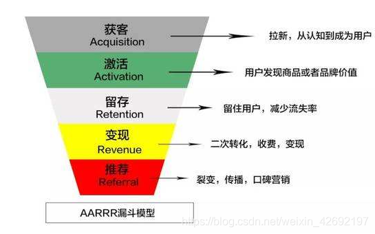
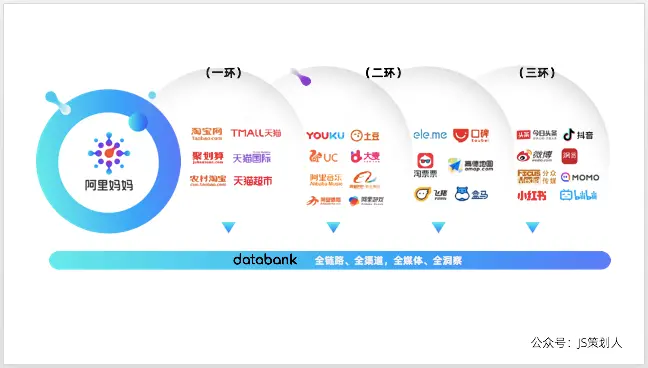
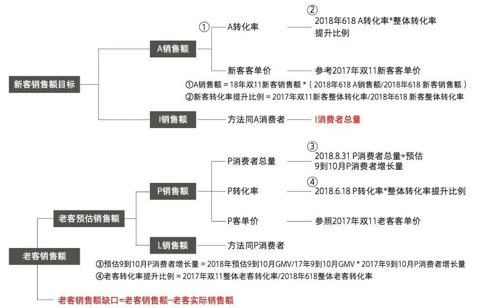
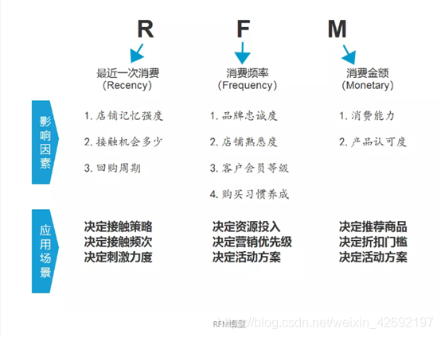
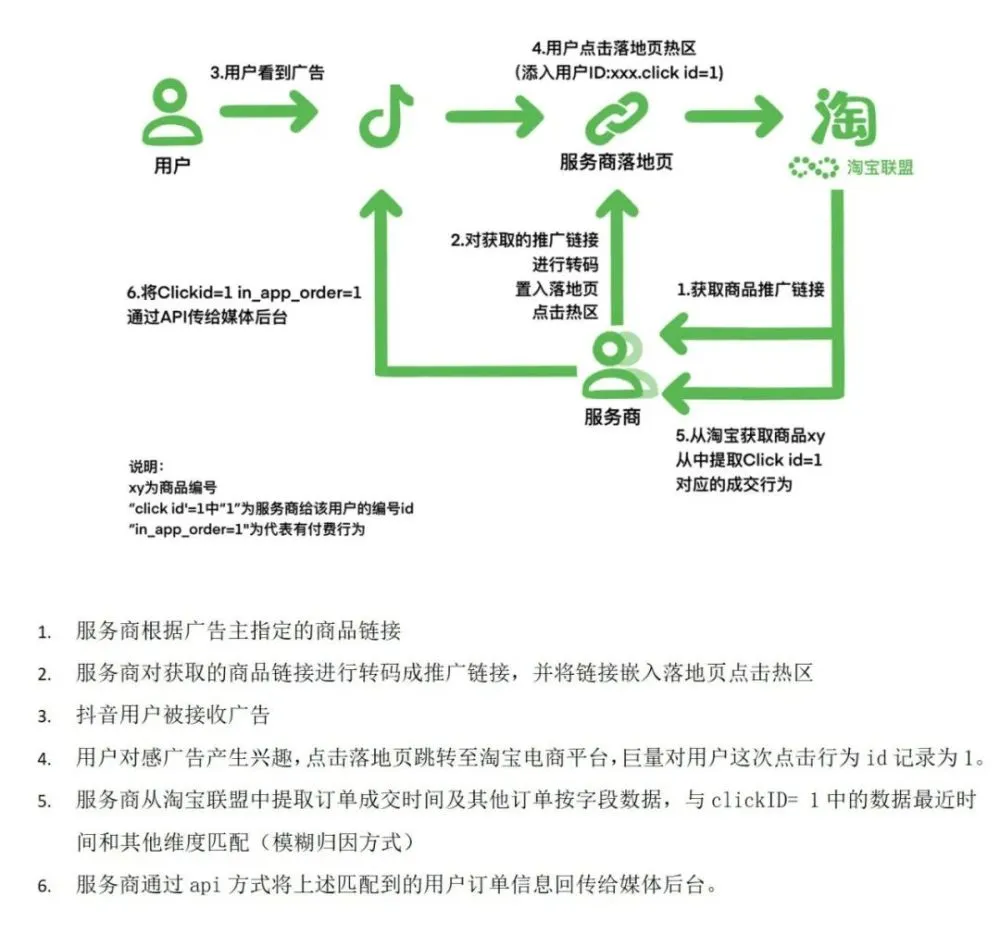
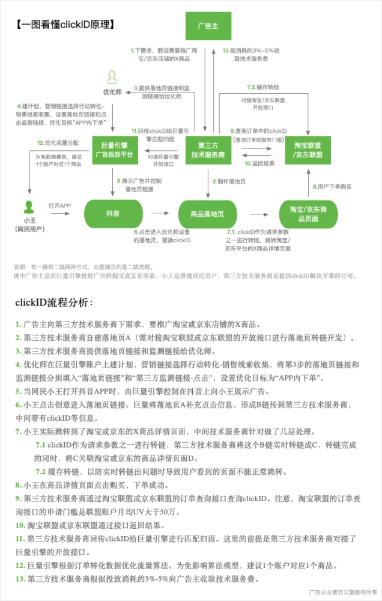

# 常见术语

## 主要内容
- [声明](#声明)
- [生命周期模型](#生命周期模型)
    - [AARRR模型](#AARRR模型)
- [用户价值模型](#用户价值模型)
    - [RFM模型](#RFM模型)
- [广告计费方式](#广告计费方式)
- [计费方式选择](#计费方式选择)
- [程序化营销](#程序化营销)
- [UniID][#UniID]

## 声明

这里的内容大部分直接搬运过来的，原文链接在最后参考部分，如有侵权请告知，会尽快删除，谢谢。

## 生命周期模型

### AARRR模型

1、定义
AARRR模型因其掠夺式的增长方式也被称为海盗模型，是Dave McClure 2007提出的，核心就是AARRR漏斗模型，对应客户生命周期帮助大家更好地理解获客和维护客户的原理。
2、模型内容
AARRR分别代表了五个单词，又分别对应了产品生命周期中的五个阶段：

- Acquisition [获取] : 用户从不同渠道来到你的产品
- Activation [激活] :用户在你的产品.上完成了一个核心任务(并有良好体验)
- Retention [存留] :用户回来继续不断的使用你的产品
- Revenue [收益] :用户在你的产品.上发生了可使你收益的行为
- Referral [推荐] : 用户通过你的产品，推荐引导他人来使用你的产品

### AIPL模型

阿里就推出了一个可以把品牌在阿里系的人群资产定量化运营的模型，这也是支撑它全域营销概念落地的关键一环，这个模型叫做：A-I-P-L。

    A（Awareness），品牌认知人群。包括被品牌广告触达和品类词搜索的人；
    I（Interest），品牌兴趣人群。包括广告点击、浏览品牌/店铺主页、参与品牌互动、浏览产品详情页、品牌词搜索、领取试用、订阅/关注/入会、加购收藏的人；
    P（Purchase），品牌购买人群，指购买过品牌商品的人；
    L（Loyalty），品牌忠诚人群，包括复购、评论、分享的人。

品牌所有AIPL资产数据都可以被存在数据银行（Data Bank）中，靠的是用户在阿里体系那个共通的身份（UNI-ID）。

这里需要再补充一个：阿里体系可以用三环来表示：

最里面一环的当然是大家都知道的天猫、淘宝、聚划算、猫超这些域内频道；

第二环是阿里收购或投资的一些域外媒体或平台，比如优酷、UC浏览器、高德地图、饿了么、盒马等，甚至还包括一些线下资源，比如互动吧派样机、银泰商业大屏等。

而这些还不够，阿里妈妈现在还大力在合作域外更多的媒体平台，比如：微博、抖音、小红书、B站等，通过阿里Uni Desk投放工作台在这些媒体上投放，收获的AIPL人群资产也可以回流到数据银行。

好了，介绍完AIPL模型，以及背后大致运作机制后，接着就来说说这个“仪表盘”对于精细化运营最重要的一个作用：让品牌人群资产链路化运营。

简而言之就是，对于所处链路中不同位置的人群，品牌采用对应的沟通内容和渠道，最终的目的累积人群资产，并实现链路高效流转：让“A人群“尽快转化成”I人群“，以此类推，试想一下你的品牌拥有数不完的“L“人群，你应该再也不用愁生意做不好了吧。

那么，具体怎么执行呢？

首先，需要通过数据银行账号分析：品牌当前的“A-I-P-L“人群资产存在什么问题？

比如是相对于竞品“A人群”量太少了、或者“I人群”到“P人群”流转率太低了、亦或者品牌旗舰店自身的“A-I-P-L“人群占比相对于其他C店、经销店太少了……

然后，就可以针对链路中具体问题采用对应的解决策略了。

比如：针对“A人群”量太少这个问题，除了在站内可以通过“一夜霸屏”资源投放品牌广告外，还可以整合品牌市场部的资源来做投放拉新。传统媒介投放都是媒体投完之后，媒介公司给到甲方一些传播层面的数据，比如有多少曝光、多少点击这样，但是如果这些媒体用Uni Desk做投放，这些触达的用户数据还可以通过阿里的Uni ID匹配沉淀到数据银行，成为新增“A人群”。

再比如：针对链路中“I人群”到“P人群”流转率太低的问题，说明店铺目前缺少销售转化机制，做法是先把“I人群”根据标签分成不同的群组，有的可能是对促销折扣敏感，那就可以通过钻展给他们推送店铺折扣信息来做收割；而有的是通过明星活动拉进来的，那或许可以通过一些明星周边货品来吸引他们做下一步的购买动作。

## 用户价值模型

### FAST模型
FAST模型也是阿里提出的，某品牌通过对双11 GMV目标拆解，反推出各层级人群体量需求。

如果说AIPL是帮助商家了解品牌人群资产总量，以及各链路人群的多少，那么FAST就是在此基础上，又从数量和质量两个维度，来衡量品牌在人群资产运营是否健康的模型。

该指标主要帮助品牌了解自身的可运营消费者总量情况， 首先利用 GMV 预测算法，预估品牌消费者总量缺口，然后基于缺口情况优化营销预算投入，站内外多渠道种草拉新，为品牌进行消费者资产扩充;并指导品牌进行未来的货品规划和市场拓展，多方位拓展消费者；

    A （Advancing），指AIPL人群转化率。多场景提高消费者活跃度，促进人群链路正向流转；多渠道种草人群沉淀后，进一步筛选优质人群，通过钻展渠道进行广告触达；品牌内沉淀人群细分，对消费者进行分层运营，差异化营销，促进整体消费者的流转与转化；

    S（Superiority），高价值人群总量-会员总量。会员/粉丝人群对于品牌而言价值巨大，能够为品牌大 促提供惊人的爆发力；通过线上线下联动、联合品牌营销，以及借助平台的新零售等场景如天猫 U 先、淘宝彩蛋、智能母婴室扩大品牌的会员/粉丝量级，为后续的会员/粉丝运营打下基础；

    T（Thriving），高价值人群活跃率-会员活跃率。借势大促，提高会员/粉丝活跃度，激发会员/粉丝 潜在价值，为品牌 GMV目标完成提供助力；对会员/粉丝按照 RFM 指标进行分层运营，优化激活效率，千人千权触达惩戒，公私域结合，赋能会员/粉丝运营；

FAST体系在数量指标层面，提供全网消费人群总量（Fertility）和高价值人群-会员总量 （Superiority）；在质量指标层面，提供了人群转化率 （Advancing）和会员活跃率 （Thriving）。

那么，对于FAST模型，具体有什么用呢？我们可以通过一些案例来了解。

应用案例1:

    某品牌通过对双11 GMV目标拆解，反推出各层级人群体量需求

它的思路是先把总的GMV目标拆解成新客销售目标和老客销售目标，然后新客销售目标又拆解到A的销售额和I的销售额，再根据以往对等量级的大促活动A的销售转化率和客单价，就可以推算出这次需要的A人群的体量需求。同理也可以分别反推出I、P、L的人群体量需求。具体拆解思路如下图：

按照上述步骤进行预估后，发现认知兴趣（A、I）链路有一定的缺口。后续通过优化营销预算投入，追加一定的营销费用，最终在双11期间的新老客成交额均超额完成，并且对比去年双11 GMV增长超过2倍。

### RFM模型

RFM模型是衡量客户价值和客户创利能力的重要工具和手段。RFM是Rencency（最近一次消费），Frequency（消费频率），Monetary（消费金额）组合而成，此模型对于运营、销售、财务、市场来说都比较重要。

RFM模型包括：
- R(Recency)：最近一次消费(最近一次消费是多久以前)
消费指的是客户在店铺消费最近一次和上一次的时间间隔，理论上R值越小的客户是价值越高的客户，即对店铺的回购几次最有可能产生回应。目前网购便利，顾客已经有了更多的购买选择和更低的购买成本，去除地域的限制因素，客户非常容易流失，因此CRM操盘手想要提高回购率和留存率，需要时刻警惕R值。

- F(Frequency)：消费频率
消费频率是客户在固定时间内的购买次数（一般是1年）。但是如果实操中实际店铺由于受品类宽度的原因，比如卖3C产品，耐用品等即使是忠实粉丝用户也很难在1年内购买多次。所以，一般店铺在运营RFM模型时，会把F值的时间范围去掉，替换成累计购买次数。

- M(Monetary)：消费金额(设定时间内客户的总消费金额)
M值是RFM模型中相对于R值和F值最难使用，但最具有价值的指标。理论上M值和F值是一样的，都带有时间范围，指的是一段时间（通常是1年）内的消费金额，在工作中我认为对于一般店铺的类目而言，产品的价格带都是比较单一的，比如：同一品牌美妆类，价格浮动范围基本在某个特定消费群的可接受范围内，加上单一品类购买频次不高，所以对于一般店铺而言，M值对客户细分的作用相对较弱。

## 广告计费方式

关于CPC，CPM，CPD，CPT等等，其实都是常见竞价广告计费模式的缩写，也是广告中我们最常遇到的，面对各种广告计费模式名词，很多人经常会记不住或者记混了，今天就带大家彻底了解下这些基础广告知识。

| 术语 | 含义 | 示例 |
|-----|------|-----|
| CPT | Cost Per Time，按时长付费 | CPT是一种以时间来计费的广告（被称作最省心的投放方式）。按时长计费是包时段投放广告的一种形式，广告主选择广告位和投放时间，费用与广告点击量无关。常见案例为APP开屏广告 |
| CPM|Cost Per Mille，千人展现成本。|为广告每展现给一千个人所需花费的成本。网络广告中，视频贴片、门户banner等非常优质的广告位通常采用CPM收费模式。此类广告以曝光展示为目的，不强调获客效果，在大型品牌广告中尤为常见。常见案例为视频门户网站广告
|CPC | Cost Per Click，每次点击成本。|根据广告被点击的次数为指标收费，关键词竞价、信息流广告大多是这种模式。这是理论上来说，最适合效果广告的收费模式，平台方负责广告创意从曝光到点击率预估，而广告主负责衡量点击后到自己页面的后续价值的预估。比如：百度竞价、今日头条信息流等等，
|CPA | Cost Per Action， 按照每次行为作为指标计费。|这个行为可以是下载、安装、注册、放入购物车等等。CPD(CostPer Download)每次下载成本、CPI(Cost Per Install)每次安装成本、CPS(Cost Per Sales)每次销售成本都可以被称作CPA。
|CPS|Cost Per Sale，按照每次销售额作为指标计费。|CPS是一种以实际销售额来计算广告费用的广告，可以理解为销售额提成。比如你的销售额是1000000万，CPS比例是2%，那么广告费就等于20000，也就是说广告主投放的广告销售额达到1000000万时，按照比例提成付费给平台。

## 计费方式选择

关于广告投放，不管是线下广告还是线上广告，其中有六个要素是最关键的：目标、受众、媒体、创意、预算、ROI。当然广告主最关心的往往都是ROI，而在其他要素稳定前提下，不同计费方式，对于ROI的影响是比较大的，所以下面我们来看下计费方式该如何选择：

针对品牌广告，看重曝光。ROI=曝光量/费用

针对效果广告，看重转化。ROI=转化数/费用

品牌广告场景下，roi波动性：cpt > cpm。

效果广告场景下，roi波动性：cpt > cpm > cpc > ocpc > cpa >= cps。

## 程序化营销

随着互联网的不断发展，人们的时间被越来越多的视频、新闻、娱乐APP所占据。如何在海量的营销资源中对目标客户进行精准定位是时下讨论的重点话题。传统的营销方式已难以满足当前的市场环境需求，而程序化购买以其资源利用率高，降低目标人群采买成本等特点，在新时代营销方式中脱颖而出。

根据买卖方诉求的不同，当前程序化营销可分为四种模式：PDB程序化直接购买、PD 优先交易、PMP私有交易市场、RTB实时竞价模式。

### PDB（Programmatic Direct Buying）程序化直接购买

PDB是程序化模式中，最广受好评的一种交易方式。尽管程序化已发展到相当的规模，但品牌主们普遍更加适应有保障的传统购买方式。而PDB的购买方式与传统的购买方式类似，品牌主事先与媒体确定好位置和价格后进行投放。与之不同的是，PDB这种程序化投放，可以把适当的产品提供给适当的用户。对品牌主而言，程序化购买更多的保障了投放效果。

PDB由于“保价保量”，又有第三方监测，极大的保证了市场声量。在此基础上，PDB基于大数据和程序化控制，能够帮助品牌主尽可能多的覆盖目标用户，降低采买成本，提升品牌主与用户的沟通效果。已成为大型品牌主的首选对象。

如今，我们服务的大型品牌主，如宝洁，欧莱雅，玛氏等，PDB已经成为他们主要的资源投放模式。而从目前的市场趋势来看，PDB模式将逐渐代替传统的媒体直投模式，成为品牌客户资源投放的主流模式。

### PD（Preferred Deals）优先交易

与PDB相比，采用PD模式，资源具有一定的不确定性。这个不确定性并不是指资源位或价格的不确定，而是展示量不能预先保证。尽管品牌主事先与媒体就某个资源位谈好了价格，但由于展示量没有预先被保证，品牌主无法确定自己的产品到底会被播放几次。但PD的好处是，作为品牌主，也无需向媒体承诺投放量。当用户访问媒体时，品牌主会根据用户标签进行选择是否向该用户展示自己的产品，如果该用户不符合产品定位，可以选择不投放，这样就避免了因投放过多而造成的浪费。

基于PD这种“保价不保量”的模式，交易双方的灵活度受到极大的满足。而且，PD模式的资源多为大型媒体自有资源，保证了媒体的质量，也不必进行竞价。

在实际执行过程中，我们发现PD模式不仅能帮助客户以完全按TA方式进行挑选投放，还能满足一些特定场景下的非确定需求，比如，临时补量，往往这个场景是在投放过程中才出现的，不仅时间紧，而且具备不确定性，PD的灵活性很好的弥补了这一点。

### PMP（Private Market Place）私有交易市场

私有交易市场，意味着这里的资源位都是私有的，已经被品牌主预定的。同PDB类似，PMP将传统的私有交易方式与程序化结合起来，让用户看到最适合他们的产品，达到最好的投放效果。与PDB模式稍有不同的是，PMP更具优先性，更加私人化。使用PMP模式，相当于买断资源，无需再与其他品牌主共享同个资源位。品牌主可以自主管理所购买的资源位，当一个用户访问媒体时，品牌主可根据不同的用户去有针对性的选择投放自己不同的产品。

由于PMP这种私有模式，与媒体的包剧模式有相似之处，在包剧投放中，尤其是针对优质资源的“前贴片”可以使用PMP模式进行程序化投放。

除了自身拥有众多品牌的集团公司，可以利用PMP方式，提高资源的利用效率外，品牌企业之间也可以利用PMP模式达成创新合作，例如两个品牌共同包剧，各占1/2流量，而品牌人群刚好是不冲突的，这时就可以通过PMP模式来相互挑选，提高资源利用率。

### RTB（Real Time Bidding）实时竞价

RTB是最早的程序化投放模式，采用了实时竞价的购买方式。当某用户访问到一个媒体网站时，各品牌主评估自己产品与该用户标签是否相符后进行竞价。这种不确定的资源位、不确定的价格，导致品牌主有可能失去某展示机会或者超出预算。除此之外，资源位的质量问题，也被品牌主诟病。由于来源多、种类复杂，RTB模式中隐含了不少虚假流量和低俗的网络页面，不但浪费预算，还可能对品牌形象造成隐患。因此，这种模式已无法满足大多数大型品牌主的需求。

对于一些预算有限的企业来说，RTB相对低的准入门槛和资源的灵活多样性，仍然具备一定的吸引力。但对于大型品牌主而言，该模式存在的弊端正在逐渐驱使这些企业削减该预算甚至直接放弃。

随着市场的发展，程序化购买模式日益完善，不同的程序化购买所针对的购买方也有所区别。品牌主在进行程序化投放时，根据自身需求选择一种或多种合适的程序化购买交易方式，可以达到利益最大化的效果。

## UniID

### ClickID

clickID 是媒体提供的一个宏参数，可间接解决电商平台订单数据的回传问题。

clickID 最早是给保险线索这类大客户用于跟踪用户数据使用，后续有广告主挖掘出电商引流这套用法，21年推广到部分广告主尝试投放，但随着今年字节的推广突然火了起来，无论是渠道群、优化群、电商群都在讨论 clickID 是什么？怎么回事？

据我所知，clickID 目前有两种归因方式，一种是模糊归因，通过采用查询订单成交时间，地址，手机，ip等字段参数，去匹配对应的属性和就近时间的 clickID 方式。另外一种是精准归因，是在落地页上将 pid + rid 和 clickID 进行绑定实现的。
模糊归因：

精准归因：

目前市场对 clickID 的效果反馈非常不错，对 ROI 的提升是基本可以肯定的，部分反馈是可以提高30%以上。所以很多引流电商的广告主纷纷去尝试 clickID ，据了解目前 clickID 头部供应商该部分消耗已经有300万一天。

但同时也有广告主反映目前该技术方案数据不稳定，供应商服务质量有待提高。
## 参考
- https://zhuanlan.zhihu.com/p/465529388
- https://blog.csdn.net/weixin_42692197/article/details/107090277
- https://www.woshipm.com/marketing/3321749.html
- https://zhuanlan.zhihu.com/p/42798085