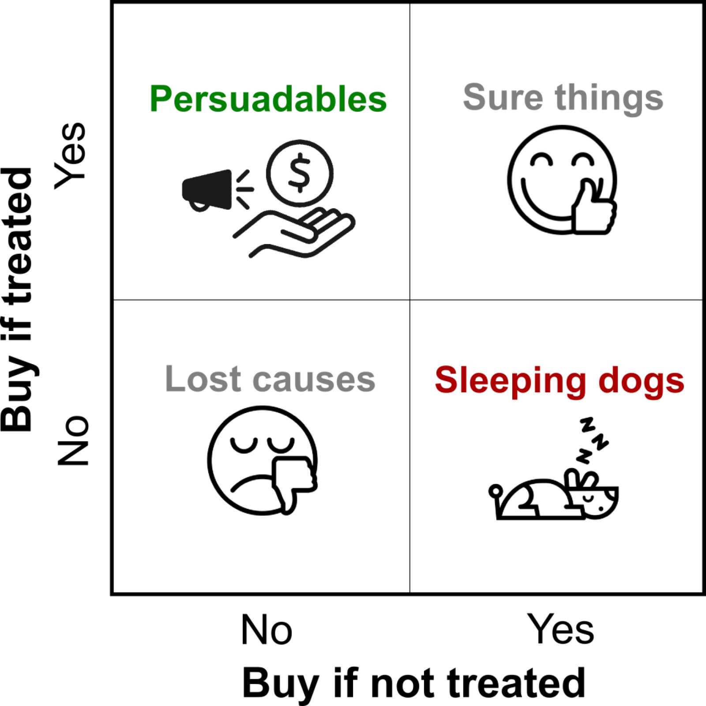
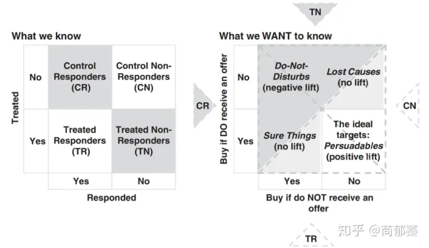
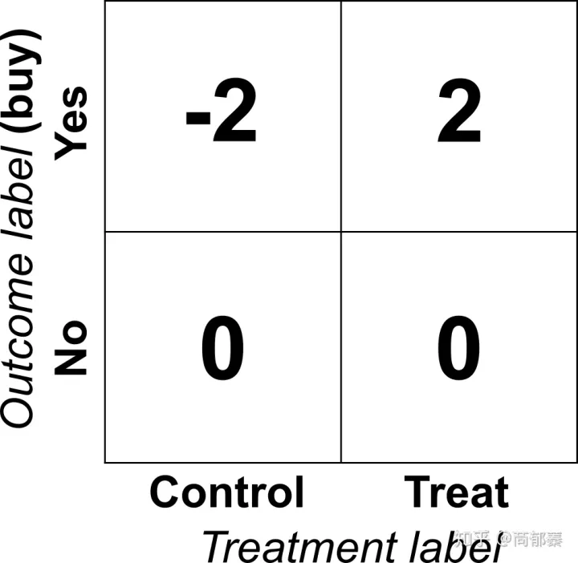

# Uplift模型

## 背景

在进行营销投放的时候，我们主要关注的是投放的转化率，但是这样过于粗糙，因为实际的人群中会包括不投放也会自然转化的人群，这部分人群的营销预算是被浪费的。

从营销的角度，理论上我们可以将人群分为四类：

- persuadables: 不发券就不购买、发券才会购买的人群，即优惠券敏感人群
- sure thing：无论是否发券，都会购买，自然转化
- lost causes：无论是否发券都不会购买，这类用户实在难以触达到，直接放弃
- sleeping dogs：与persuadables相反，对营销活动比较反感，不发券的时候会有购买行为，但发券后不会再购买。

很明显，为了最大化营销的效果并节省预算，建模的目标应该是针对persuadables进行，而尽量要避免sleeping dogs。尤其是当业务体量比较大的时候，sure things会很多, 精准触达到persuadables就显得尤为重要。

## Uplift模型概述

普通的预测转化率的模型我们成为outcome模型，Uplift模型预测的是增量价值，我们成为lift。

Uplift模型用于预测/估计某种干预对个体状态或者行为的因果效应，用公式表示：
$$\tau_i = p(Y_i|X_i, T_i = 1) - p(Y_i|X_i, T_i = 0)$$

其中，$Y_i$​表示潜在结果（比如转化率，点击率等）， $X_i$​表示用户的特征， $T_i=1$表示进行干预， $T_i=0$表示不进行干预，应用在广告营销中就可以形象的表示为某用户在经过广告投放行为之后，用户发生某种行为（点击或购买）增加的概率。

但是，对于一个用户，我们只能对他进行干预或者不干预，即只能观测到$T_i=1$或$T_i=0$，所以对于一个个体来说，增益$\tau_i$​是观测不到的。

如果我们使用A/B实验来进行测试，我可以得到下图中左半部分的数据：

右边这个图显示了将A/B实验得到的人群合并到第一个图（响应人群）中的结果：
- 给与Treatment并且转化了的人群，一部分在Sure Things里，另一部分在persuadables里
- 没有给与treatment并且没有转化的人群，一部分在persuadables，另一部分在Lost Causes里

因此我们希望能够通过A/B实验找出persuadables来。Uplift模型的核心是对每个用户建模，得到一个位于-1到1的lift score，用于指导人群的选择。

在A/B实验中，我们一般将转化的用户lable打上1，未转化的用户label打上0，uplift模型期望计算出营销效果的提升，也就是：
$$ Lift = E[y|t] - E[y|c] $$

假设有一群人，人数为$2n$，其中$n$个给了treatment，另外$n$个作为对照组不给treatment，对于每一个用户，原始的和转换后的outcomes分别为$y_i$和$z-i$，那么对于这群人购买行为的lift为：

$$\begin{aligned} 
Lift &= E[y|t] - E[y|c] \\ 
&= \frac{1}{n}\sum_{i=1}^{n}{y_i} - \frac{1}{n}\sum_{i=n+1}^{2n}{y_i} \\
\end{aligned}$$

如果是事后分析模型效果，用上面这个式子就可以计算了，但是现在我们希望建模并找出persuadbles的人群，我们又没有单个人可以打的label，所以目标就是转化为提升上面这两组人群的整体提升，也就是Lift。

因此，我们希望将整体Lift的提升转化为个体的提升，于是我们将Label转化为如下的形式：

Lift的计算相应的转化为：
$$\begin{aligned} 
Lift &= E[y|t] - E[y|c] \\ 
&=\frac{1}{2n}\bigg[ \sum_{i=1}^{n}{2y_i} - \sum_{i=n+1}^{2n} {2y_i}\bigg] \\
&= \frac{1}{2n} \sum_{i=1}^{2n}{z_i}
\end{aligned}$$

那么对于个体$x$来说：
$$uplift(x) = E[y|x, t] - E[y|x, c] = E[z|x]$$

## 评估指标
显然，根据以上的描述，我们能够给用户打上label，也可以选择合适的模型进行训练了，但是训练后的模型的效果怎么评估呢？ 准确率当然还可以计算的。

### Qini curve

其计算流程如下：

> (1)在测试集上，将实验组和对照组分别按照模型预测出的增量由高到底排序
> (2) 根据用户数量占实验组和对照组用户数量的比例，将实验组和对照组分别划分为十份，分别是 Top10%, 20%, . . . , 100%。
> (3) 计算Top10%,20%,…,100%的Qini系数，生成Qini曲线数据(Top10%,Q(Top10%)), (…,…), (Top100%, Q(Top100%))。

Qini 系数定义如下:
$$Q(i) = \frac{n_{t,1}(i)}{N_t} - \frac{n_{c,1}(i)}{N_c}, i = 10\%, 20\%, ..., 100\%$$

## 参考
- https://blog.csdn.net/TSzero/article/details/118495175
- https://zhuanlan.zhihu.com/p/100821498
- https://www.aboutwayfair.com/data-science/2018/10/pylift-a-fast-python-package-for-uplift-modeling/
